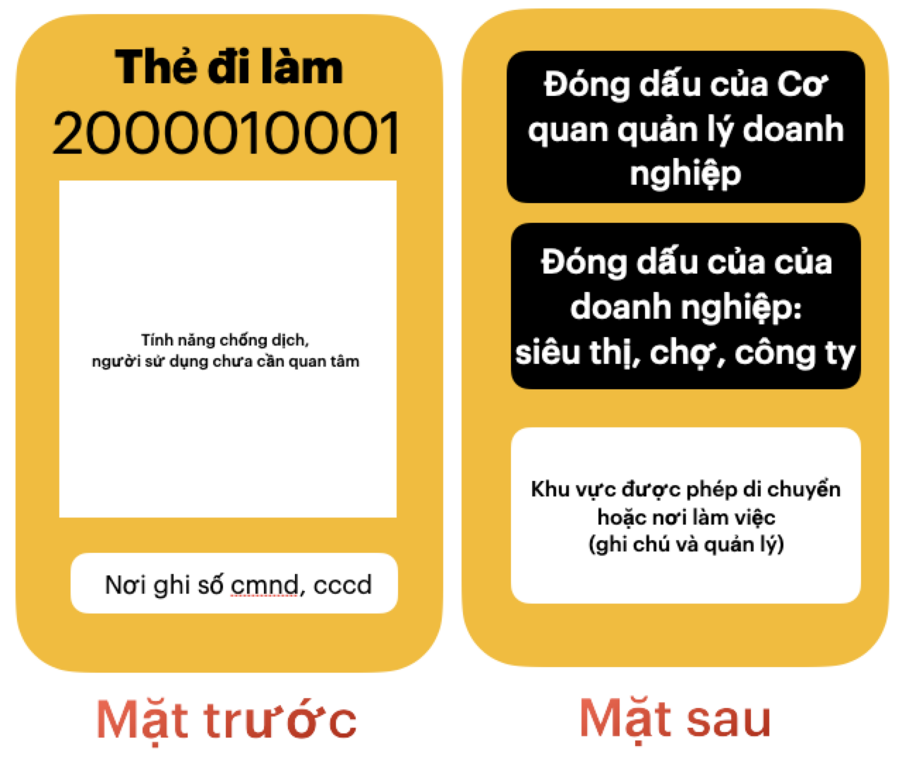

# "Hệ thống lệnh bài": thực hiện mục tiêu kép: chống dịch và phát triển kinh tế. 

"Lệnh bài" là một cấu trúc, nếu triển khai một cách hệ thống 
toàn vùng có dịch, hoặc cả nước, sẽ phân chia cả vùng thành nhiều khu vực lân cận nhau. Trong đó hầu hết hoạt động di chuyển, mua bán và cả làm việc sẽ hạn chế bên trong khu vực này. 

Quan trọng hơn, việc giới hạn hoạt động của mọi người bên trong khu vực sẽ dần dần một cách "vô thức", không phụ thuộc vào tinh thần tự giác của từng người. Tỉ lệ cố ý vi phạm, ra khỏi khu vực không có lý do sẽ ít đi nhiều, và dễ dàng bị phát hiện, bị xử phạt, càng khiến cho số lượng vi phạm dần về 0. 

Ngoài ra, "hệ thống lệnh bài" còn huy động mọi nguồn lực sẵn có, bảo đảm mọi gia đình đều tham gia xét nghiệm tập trung, định kỳ. 

Sau 1 thời gian triển khai, vùng dịch sẽ chia thành nhiều khu vực có mức độ an toàn khác nhau, cho phép áp dụng **mục tiêu kép** chống dịch và phát triển kinh tế

- **Tập trung chống dịch khu vực nguy cơ cao** : khoanh vùng chặt chẽ,  xét nghiệm toàn bộ liên tục để tách hết F0 để chuyển thành vùng an toàn. 

- **Giảm bớt giãn cách để phát triển kinh tế bên trong khu vực an toàn**: cho phép mở lại nhiều hoạt động hơn bên trong, và vẫn duy trì xét nghiệm 

- Hệ thống lệnh bài sẽ định kỳ xét nghiệm theo nhóm nguy cơ cao để hạn chế dịch bùng phát trong tương lai. 

Trước khi tìm hiểu 3 chức năng chính của "hệ thống lệnh bài" : 
chia vùng dịch thành các khu vực nội bộ, huy động mọi người bên trong khu vực cùng tham gia chống dịch và giám sát định kỳ các đối tượng nguy cơ cao, chúng ta cần tìm hiểu

### Thế nào là "hệ thống lệnh bài". 

"lệnh bài" là một cấu trúc, được gói gọn trong 1 tấm thẻ, nhằm bảo đảm rằng mệnh lệnh truyền tới các đối tượng liên quan tới thẻ này, sẽ được hiểu và thực hiện đúng. Cấu trúc cũng kèm luôn cơ chế kiểm tra, giám sát chéo. 

Ví dụ: *"mọi gia đình trong tp Hồ Chí mình cần được cấp 1 Thẻ gia đình trong vòng 5 ngày"* là 1 mệnh lệnh gửi tới tất cả các Phường / Xã. Làm thế nào để kiểm tra được việc thực hiện mệnh lệnh này với hơn 300 Phường / xã ở HCM?

Ta sử dụng 1 mệnh lệnh khác để kiểm soát chéo, là thông báo với mọi người rằng "từ ngày ..., toàn bộ siêu thị, chợ chỉ bán hàng cho người có Thẻ gia đình. *Gia đình nào chưa nhận được thẻ, cần liên hệ với Phường / xã đang sống. Nếu gặp trở ngại thì gọi tới số hotline để hỗ trợ,..."*

Và làm sao để bảo đảm, siêu thị, chợ chỉ bán hàng cho người có Thẻ gia đình? Ta dùng mệnh lệnh khác, như *"mọi đơn hàng phải có thêm ID của thẻ gia đình"*. Nếu phát hiện thiếu ID, sẽ bị xử phạt nghiêm. Tất nhiên còn nhiều cách khác nữa.

Thiết kế một cấu trúc tốt cho "lệnh bài" để thực hiện được mục tiêu kép là điều không hề đơn giản. Nó cần bảo đảm đầy đủ các yếu tố then chốt sau: 

1. **Mọi người đều sử dụng được**: 
    - Mọi người dân sử dụng để mua hàng tại siêu thị, đặt hàng tại nhà: người già, trẻ nhỏ, người không biết chữ (tiếng việt), ... 
    - nhân viên giữ xe, quản lý có thể sử dụng được.
    - tiểu thương ngoài chợ có thể sử dụng được 

2. **Nhận biết nhanh chóng, từ xa bởi con người và máy móc**: 
    - nhìn, phân biệt bởi từ màu sắc, thông tin ở mặt trước, và cả mặt sau.
    - quan sát từ xa qua dây deo, cung cấp kèm với thẻ. Yêu cầu đeo cổ (vài tình huống) hoặc móc trên kính xe máy, xe oto.
    - không chỉ công an, dân phòng, mà cả người dân, máy móc đề nhận biết được
    - Với các máy móc (smartphone, thiết bị checkpoint), chỉ cần quét thẻ, thiết bị sẽ hiện thông tin, hoặc phát ra âm thanh cảnh báo. 

4. **Duy nhất, toàn vẹn, không chấp nhận nhân bản, sao chép** 
    - ID là duy nhất
    - chỉ chấp nhận thẻ vật lý, không chấp nhận photo, hình ảnh trên điện thoại, thiếu con dấu hoặc có dấu hiệu làm giả,...
    - khoá thẻ từ xa qua ID
    - có địa chỉ để xử lý tình trạng cho mượn thẻ, 
    - giám sát số lượng hoạt động theo Phường, ... 

3. **Cho phép triển khai nhanh, đồng loạt tới mọi người**
    - phát hành tập trung, xuất file pdf.
    - in ấn tập trung hoặc bởi từng địa phương dựa trên file đã xuất

5. **kết nối với hệ thống tập trung để tối ưu hiệu quả, nhưng cho phép bổ sung trong tương lai**
    - mỗi ID là duy nhất trong hệ thống, phân nhóm theo khu vực,.. đơn vị, ...
    - phần màu trắng là qrcode và cả barcode, để mở rộng tính năng quản lý giám sát trong tương lai. 

Đây là 1 thiết kế cho Thẻ Gia đình, 1 loại "lệnh bài" dành cho gia đình. 

Các phần quan trọng giúp đảm bảo 5 yếu tố trên 

- **ID (1000010001)**: duy nhất và sinh ra bởi hệ thống tập trung. ID này là số, càng ngắn càng tốt (dưới 10 số) để dễ đọc dễ viết. 
- **Phường xã đang sống**, cố định, và dựa trên 6 số đầu của ID

- **Phần đóng dấu của Phường/ xã** để phục vụ cho việc triển khai nhanh chóng, cũng như dễ dàng nhận biết thật giả. Địa phương tự in ấn, và đóng dấu để đưa vào sử dụng.
- **Ngày mua hàng**: check vào để lưu ngày mua, giúp kiểm soát việc ra ngoài nhiều lần mua hàng. triển khai nhanh chóng, bổ sung hệ thống sau này dễ dàng. 
- phần trắng ở mặt trước là phần để kết nối với hệ thống, dễ dàng mở rộng sau. 

Ngoài ra, còn có các "lệnh bài" dành cho cá nhân, thoả mãn các yếu tố trên, chi tiết xem mục "lệnh bài cho cá nhân bên dưới. 

Khi các thẻ được cấp đến tay mọi người trong vùng dịch theo chỉ thị, ta có được hệ thống lệnh bài mạnh mẽ, cho phép thực hiện các việc sau: 

### Chia vùng dịch thành các khu vực nội bộ
#### giới hạn hoạt động của người dân trong khu vực  

Bằng cách triển khai các lệnh sau với Thẻ gia đình 
- mọi gia đình chỉ được cấp 1 Thẻ Gia đình
- người dân ra ngoài phải mang thẻ, và chỉ được mua hàng 1 lần / 1 ngày (có thể điều chỉnh). 
- Nếu ra ngoài không mang thẻ, hoặc ra ngoài khu vực phục vụ sẽ bị phạt 
- Siêu thị, chợ chỉ bán cho khách có Thẻ gia đình, theo khu vực đang sống. Khi bán, cần check vào thẻ của khách ngày mua hàng. 
- Nhân viên không tuân thủ, siêu thị, chợ sẽ bị phạt theo quy định. 

Khu vực có thể thay đổi theo nguy cơ dịch bệnh, nhỏ nhất là bên trong Phường / xã, và lớn nhất là cả vùng dịch. 

#### giám sát việc di chuyển ra, vào ngoài khu vực

- Thẻ đi làm

- Cá nhân không mang thẻ
### 2. huy động mọi người bên trong khu vực cùng tham gia chống dịch 

Nếu tấm thẻ này được cấp tới tất cả mọi người liên quan trong vùng dịch, chúng ta sẽ có một "hệ thống lệnh bài" 

Theo tinh thần chỉ thị 16, thì mỗi gia đình 1 người ra ngoài để mua nhu yếu phẩm. Trong thời gian đó, sẽ xét nghiệm tập trung, hoặc truy vết nhanh chóng điểm để tách F0 ra khỏi cộng đồng 

Nhưng có vài vấn đề lớn như sau: 

**Ra ngoài mua nhu yếu phẩm:**

1) 2 người tới gửi xe vào chợ, có dám chắc là đến từ 2 gia đình? 

2) 2 người đang xếp hàng cùng lúc tại 2 siêu thị khác nhau, có dám chắc là họ từ 2 gia đình?

3) làm sao giảm thời gian xử lý đơn hàng Online, và giảm số đơn hàng bị huỷ sau khi giao?

4) Phát hiện 1 người đang đi trên đường có biểu hiện lạ, làm sao để cảnh sát phát hiện nhanh nhất?

**Huy động người dân tham gia xét nghiệm, chống dịch**

5) Cán bộ Phường được yêu cầu tới từng gia đình để nhắc nhở chống dịch? Làm sao biết họ có đến từng nhà, gặp người trong gia đình ko? 
6) đồng loạt triển khai trên 300 phường ở tp HCM, làm sao đánh giá Phường nào làm tốt, phường nào chểnh mảng. 

7) Làm thế nào để chắc chắn mọi gia đình đều tham gia xét nghiệm 
 
8) Làm sao để nâng cao an toàn khi tổ chức 500 điểm lấy mẫu tập trung trong ngày, với nửa triệu (500,000) người tham gia.

Xin đề xuất giải pháp để thực hiện 2 mục tiêu trên như sau: 
### Mục tiêu 1: Hạn chế ra ngoài không có lý do

cách thực hiện như sau: 

- **cấp thẻ cho các nhu cầu chính đáng**:
  - ra ngoài mua nhu yếu phẩm: mỗi gia đình được cấp 1 Thẻ gia đình, xác nhận bởi Phường / xã 
  - ra ngoài làm việc: mỗi cá nhân 1 Thẻ, xác nhận bởi Cơ quan  và Doanh nghiệp quản lý 
  - ra ngoài chống dịch: mỗi cá nhân 1 Thẻ , bởi Ban chỉ đạo chống dịch 

- **Xử phạt các cá nhân không mang thẻ ra ngoài**
- **Không bán hàng cho cá nhân không mang thẻ, hoặc thẻ ngoài khu vực phục vụ**

### Mục tiêu 2: huy động mọi người tham gia chống dịch

- **Người dân tuân thủ theo lệnh** mà Ban chỉ huy chống dịch thông báo tới từng thẻ. 
  - tham gia xét nghiệm tập trung
  - tuân thủ các yêu cầu "quét thẻ" tại các điểm checkpoint 
  - tham gia chích vacxin tập trung

- **cán bộ địa phương** theo lệnh của Ban chỉ huy để đôn đốc, hỗ trợ người dân chống dịch 

- **Đội ngũ y tế, đơn vị chống dịch** theo lệnh của Ban chỉ huy để thực hiện tốt công việc 

Và để thực hiện 2 mục tiêu trên một các hiệu quả, đồng nhất, nhanh chóng cần 1 cấu trúc thẻ đặc biệt, đặt tên là **"Lệnh bài"**. Thẻ này có hai loại chính, cho gia đình và cho cá nhân. 

Bên dưới là thiết kế cho cấu trúc của Thẻ cho gia đình, Thẻ cá nhân thì tương tự (xem chi tiết các mục bên dưới)

5 đặc điểm trên của "lệnh bài" giúp giải đáp 4 câu hỏi đầu tiên bên trên, giúp tối ưu nguồn lực của xã hội trong việc phục vụ nhu yếu phẩm thời dịch.

“Lệnh bài” này sẽ vô thức giảm tổng số người (vô ý, cố tình) ra ngoài không đúng nhu cầu: mua nhu yếu phẩm. Việc dễ dàng bị từ chối, bị phạt sẽ tự động “truyền lệnh”, khiến các cá nhân không mang thẻ khác sẽ được “kiểm chức thực tế” và tự động giảm dần về 0.

Thẻ gia đình loại bỏ việc gom hàng kiếm lợi nhuận, tạo cảm giác khan hiếm “giả tạo”: hàng dài xếp hàng, đặt online quá tải, giao hàng lâu, và cả việc tích trữ quá mức của từng gia đình theo cơ chế “vô thức” như trên. 

Có 1 lý thuyết, đề cập tới sự thay đổi “vô thức” tới mọi đối tượng, gọi là “Cấu trúc hệ thống quyết định hành vi mọi đối tượng bên trong”, đọc thêm về trò chơi phân phối bia, trong sách Nguyên lý thứ 5

#### Cấu trúc hệ thống quyết định hành vi bên trong
  
**Dịch covid là 1 cấu  trúc hệ thống**
 
 Nếu phân tích kỹ, thì dịch covid là 1 cấu trúc hệ thống. 
 
 - “lây qua tiếp xúc, có khả năng lây sau 2,3 ngày và thời gian ủ bệnh tới 14-21 ngày,…” là 1 cấu trúc
 - hệ thống ở đây là việc tiếp xúc, di chuyển của mọi người trong việt nam và cả thế giới. 
 
 Cấu trúc hệ thống mới xuất hiện này, khiến chúng ta thay đổi hành vi rất nhiều như đeo khẩu trang khi tiếp xúc, hạn chế di chuyển, tụ tập,…

**Cấu trúc hệ thống đối kháng với covid**

- Tạo miễn dịch cộng đồng bằng cách tiêm Vacxin là 1 cấu trúc hệ thống đối kháng covid
- Xét nghiệm, tách F0 ra khỏi cộng đồng là 1 cấu trúc hệ thống đối kháng tương tự.

**Cấu trúc hạn chế lay lan Covid**

**Mọi người đeo khẩu trang khi ra ngoài, tiếp xúc** là 1 cấu trúc hệ thống hạn chế lây lan 

**Chỉ thị 16** cũng có thể xem là 1 cấu trúc, và khi áp dụng trên toàn hệ thống, như vùng dịch ở tp HCM, sẽ thay đổi hành vi của mọi người: hạn chế di chuyển nhất có thể, để hạn chế lây lan cuả covid. Điều này đã giúp Việt Nam chúng ta 3 lần chiến thắng covid. 

Tuy nhiên, với lần thứ 4 này, cấu trúc của biến thể Delta mạnh hơn, dẫn tới việc lây lan nhanh chóng hơn, khiến cho chỉ thị 16 gặp rất nhiều khó khăn để hạn chế việc lay lan. 

Chưa kể nguồn lực y tế bị phân chia cho cứu chữa F0, khiến nguồn lực truy quét, xét nghiệm bị hạn chế, và hiệu quả của việc đầy lùi covid bị giảm đi nhiều. 

“lệnh bài” là một cấu trúc, sau khi triển khai lên hệ thống (toàn vùng dịch), kết hợp với chỉ thị 16, tăng  khả năng hạn chế covid. Ngoài việc lây lan chậm hơn, việc khoanh vùng theo từng Phường / xã, sẽ tạo thành các “bậc thang liền kề”, hạn chế việc lây lan quá xa.  

Nhưng hệ thống “lệnh bài” còn có một vai trò khác, rất quan trọng mà ít có giải pháp khác thực hiện được, đó là có thể tổ chức một cách trật tự, liên tục cải thiện, tối ưu để xét nghiệm mọi cá nhân ra ngoài, phân theo nguy mức độ nguy cơ trong trong vùng dịch. 

### Lệnh bài cho cá nhân
> gồm 2 loại chính

- Thẻ đi làm: nhân viên siêu thị, chợ, nhân viên giao hàng, đi làm tại nhà máy, ...

- Thẻ chống dịch: 

### 2. Bảo đảm mọi gia đình, cá nhân hay di chuyển tham gia xét nghiệm.

Sau khi triển khai “lệnh bài”, các đối tượng di chuyển sẽ được chia thành 3 nhóm chính:
- Thẻ gia đình (màu xanh) cho người đi mua hàng
- Thẻ đi làm cho nhân viên siêu thị, giao hàng, đi làm,…
- Thẻ chống dịch màu đỏ: cho nhân viên y tế, cán bộ địa phương, tình nguyện viên chống dịch,..

Để truy quét Covid ra khỏi 3 triệu gia đình ở tp Hồ Chí Minh, cần tổ chức được việc xét nghiệm tập trung nhưng an toàn, hiệu quả, với quy mô nửa triệu (500,000) gia đình tham gia một ngày.
Đây có thể xem là “trận đánh” với nửa triệu người tham gia. 

Suốt lịch sử, không nhiều trận đánh diễn ra trong ngày với nửa triệu người. Đó là lý do hầu hết các nước không áp dụng các trận đánh xét nghiệm Covid với quy mô vậy, hoặc có thực hiện, công bố chiến thắng, nhưng thực tế là “thua”.

Nhưng nếu đưa Thẻ gia đình tới 3 triệu hộ này, cùng với Thẻ công vụ cho đội ngũ lấy mẫu, nhân lực địa phương, các thẻ này sẽ kết nối với nhau trong một hệ thống tập trung, mọi chuyện sẽ rất khác. 

Với việc kết nối tất cả vào một “hệ thống lệnh bài” tập trung, sẽ trả lời được các câu hỏi 5,6,7 bên trên, nhưng chi tiết hơn theo số liệu.

- Cán bộ Phường được yêu cầu tới từng gia đình để nhắc nhở chống dịch? Làm sao biết họ có đến từng nhà, gặp người trong gia đình ko?
  
  *=> khi cán bộ tới gia đình nào, thì sử dụng mobile app, quét Thẻ gia đình, và GPS toạ độ, gửi vền hệ thống. Một số tình huống, cần chụp hình thực tế, như biển số nhà, …**

- Và với 300 phường ở Hcm, thì cán bộ phường nào làm tốt, cán bộ phường nào chểnh mảng.
  
  *=> So sánh dựa vào thống kê theo tỉ lệ gửi lên / tổng số thẻ trong Phường.*

- 6)  Khi cần xét nghiệm cho tất cả gia đình trong 1 Phường / Xã, làm thế nào để biết các gia đình không tham gia?
     Và làm thế nào để báo cho Cán bộ Phường, hay Đội lấy mẫu cơ động tới đúng nhà để truy vét?

  *=> Khi tới xét nghiệm, cần quẹt Thẻ gia đình ở khu vực phân luồng, và cả sau khi xét nghiệm xong. Danh sách ID còn lại sẽ hiển thị ra, các cán bộ Phường sẽ được dựa vào danh sách này, địa chỉ để tới tận nơi.*
    
Riêng câu thứ 7, thì cần chia ra các câu hỏi chi tiết hơn
100% phường/xã cấp Thẻ gia đình tới 100% gia đình hay không ?
có lấy được xét nghiệm trong ngày của 100% Thẻ được “lệnh” không?
làm thế nào để huy động nguồn lực của toàn xã hội, tập trung nửa triệu (500,000) người một ngày để xét nghiệm covid trong an toàn, trật tự.

Bộ chỉ huy hệ thống lệnh bài (**Bộ chỉ huy**),  một đơn vị chuyên trách của ban chỉ đạo chống dịch, nếu vận dụng linh hoạt sẽ huy động được nguồn lực to lớn từ Thẻ gia đình, Thẻ công vụ và cả Thẻ đi làm và có thể thực hiện được các câu trả lời bên trên.

**Nguồn lực tại chỗ**: cán bộ Phường/Xã địa phương, mang Thẻ màu đỏ, sẽ trở thành “tay, chân” của bộ chỉ huy, chuẩn bị trước địa điểm tổ chức, và cải thiện theo thời gian
- Ví dụ: yêu cầu cán bộ gửi hình ảnh thực tế, video của địa điểm tổ chức xét nghiệm, cách bố trí phân luồng hướng dẫn bằng app chuyên dụng. Bộ chỉ huy sẽ phân tích, để hướng dẫn từ xa các Thẻ này, sắp xếp điều chỉnh. Từ đó hình thành tiêu chuẩn chung, cho 500 địa điểm lấy mẫu, cải thiện dần qua các đợt thực hiện. 
- yêu cầu Cán bộ địa phường đi tới từng nhà, đôn đốc nhắc nhở đi lấy mẫu. tại mỗi nhà, họ cập nhật vị trí GPS. Tỉ lệ cập nhật / tổng số thẻ trong Phường, sẽ đánh giá được công việc thực tế của từng địa phương. Bộ chỉ huy dễ dàng giám sát, đôn đốc các chủ tịch phường cải thiện. 

- Nhân sự địa phương cũng thực hiện việc xư lý F0, F1,… sau khi có kết quả xét nghiệm.

- Hướng dẫn đặt Checkpoint tại địa điểm lấy mẫu: là các điểm yêu cầu mỗi người mang thẻ đi qua, phải thực hiện quét mã qrcode, Bộ chỉ huy sẽ “nghe” các tín hiệu, biết được số người tham gia, lịch sử “hành quân” chi tiết của 500 đơn vị của đội quân nửa triệu người này. Từ đó điều chỉnh khoa học hơn luồng di chuyển, cân bằng số lượng Thẻ di chuyển trong luồng,…

- Ngoài ra, đặt Checkpoint đặt nhiều vị trí khác, đường khoanh vùng, siêu thị, chợ, … để tăng cường giám sát, cảnh bảo

**Nguồn lực tập trung:**

- Đội lấy mẫu (nhân viên y tế và tình nguyện viên), có thể gửi hình ảnh thực tế trước khi lấy mẫu của địa điểm đó, để Bộ chỉ huy đối chiếu với báo cáo từ địa phương gửi về. 
- Đội vận chuyển , hậu cần, 

**Đội hỗ trợ, huấn luyện từ xa tại Bộ chỉ huy**
- Mỗi người, nếu phát hiện người đối diện không có thẻ, hướng dẫn họ liên hệ với cấp địa phương để được phát hiện.
Cán bộ Phường / xã gây nhũng nhiễu khi đưa thẻ, hãy báo ngay cho ban chỉ huy để được hỗ trợ. 
Phân tích dữ liệu, hình ảnh hiện trường để đưa ra giải pháp điều chỉnh, tối ưu

Đây là vài ví dụ đơn giản về việc huy động nguồn lực từ các Thẻ. Các mục bên dưới sẽ mô tả thêm.

Nếu mọi người đồng lòng cùng chính phủ thực hiện được cho các câu hỏi trên, chúng ta sẽ xét nghiệm được 3 triệu gia đình, mỗi gia đình 2 lần trong 12 ngày. 

Lúc này Covid coi như đã được kiểm soát, và quét thêm 1,2 lần nữa gần như đẩy lùi covid ra khoỉ vùng dịch và xem như chiến thắng.

Nhưng thực tế sẽ khác với lý thuyết. Chúng ta sẽ không thể duy trì chỉ thị 16 quá lâu ở HCM, lúc này hệ thống lệnh bài sẽ trở thành radar cảnh báo sớm để có thể tự tin mở cửa theo khu vực.

#### Cho phép hoạt động tự do trong khu vực an toàn, có cảnh báo
Một số khu vực, dựa trên lượng F0 phát hiện sau khi truy quét, có thể cho phép các hoạt động các dịch vụ bên trong khu vưc, ví dụ: cho mọi người đi dạo, tập thể dục, cho các dịch vụ buôn bán và làm việc bên trong khu vực.
Khu vực có thể trải dài giữa vài quận huyện, hoặc nhóm Phường /xã liền kề

Lúc khoanh vùng vẫn được giữ nguyên, việc lấy mẫu vẫn tiến hành định kỳ nhưng tần suất khác nhau theo nhóm thẻ Nguy cơ.
Thẻ màu đỏ: có thể xét nghiệm 1,2 ngày 1 lần
Thẻ di làm (giao hàng,..) trong khu vực, tần suất thấp hơn 3 ngày lần
Thẻ đi làm ra ngoài khu vực: cần kiểm tra thường xuyên
Thẻ gia đình lấy mẫu định kỳ 1 tuần / 1 lần

#### Thực hiện mục tiêu kép

Tuỳ theo số lượng F0 phát hiện, mà giảm giãn cách, hay tăng cường việc khoanh vùng, truy quét.

Như vậy, toàn Việt Nam mới vừa chống dịch hiệu quả, vừa bảo đảm an toàn cho các khu vực bên trong tự do phát triển kinh tế. 

### Một số lưu ý khi triển khai quét mẫu toàn vùng

#### Đưa, cấp thẻ tới mọi người dưới 7 ngày
  - Cán bộ Phường/ Xã tới tận nhà đưa Thẻ gia đình
  - Đơn vị, siêu thị, chợ đưa Thẻ làm việc cho cá nhân mình quản lý, và liên tục cập nhật
  - Cấp thẻ cho giao hàng, lái xe phân phối hàng hoá liên tỉnh,… dựa trên giấy tờ hợp lệ cho việc di chuyển đang có,…
Việc phát triển, sản xuất và vận chuyển Thẻ cần linh hoạt, kết hợp nhiều giải pháp để có thể đưa tới tay hầu hết mọi người trong 7 ngày. Có như vậy mới đáp ứng được tình hình chống dịch

#### Xây dựng bản đồ chống dịch

Có khoảng 500 điểm lấy mẫu, rải rác khắp vùng dịch HCM.

Mỗi địa điểm cần bố trí theo tiêu chuẩn chung về an toàn 

Tiêu chuẩn này thiết lập ban đầu và dựa vào dữ liệu thu thập, cải thiện dần dần: gồm tổ chức khoa học các địa điểm tập trung lấy mẫu, địa điểm hậu cần, và tuyến đường di chuyển của đội lấy mẫu. 

Gợi ý về tiêu chuẩn: **Cố định, Theo luồng, CHECKPOINT.**

Cố định: địa điểm lấy mẫu và danh sách 1000 Thẻ cần lấy. Việc cố định sẽ tạo thói quen cho các lần lấy sau, hạn chế tối đa các Thẻ đi lộn địa điểm, gây khó khăn không đáng có.

Phân luồng thành 3 đợt: sáng , chiều, tối và các Thẻ đi đúng theo đợt, ví dụ sử dụng số cuối cùng trên ID của mỗi thẻ
  - nếu là 0,1,2,3 đi buổi sáng, 4,5,6,7 vào buổi chiều, 9,10 vào buổi tối. 
  - buổi tối cần ít thẻ nhất, để dự phòng các Thẻ đi trễ ở buổi sáng, chiều.

Thiết lập luồng di chuyển hợp lý, có hướng dẫn phân luồng từ xa, và các vị trí CHECKPOINT Thẻ trước khi vào trong. 

Ưu tiên việc đi bộ, hạn chế tập trung bãi giữ xe. 

Thiết lập các CHECKPOINT theo Thẻ, để tự động để thu thập dữ liệu, hoàn thiện các đợt sau.
  - CHECKPOINT là các điểm yêu cầu mỗi người đi qua cần quét qrcode trên Thẻ. Nếu không có smartphone, wifi, sử dụng thiết bị chung của ban tổ chức.

Chia các cá nhân mang “Thẻ công vụ” màu đỏ thành nhiều chức năng:

Đội lấy mẫu tập trung, Đội lấy mẫu tại nhà, Đội nhắc nhở các thẻ “quên”, …

Cập nhật hình ảnh thực Tế

Yêu cầu Thẻ công vụ là cán bộ địa phương, chụp hình thực tế địa điểm cách bố. trí phân luồng, gửi về hệ thống.
Đội phân tích tập trung ở Bộ chỉ huy, dựa trên hình ảnh, dữ liệu thu thập, tối ưu việc bố trí trận địa
“Ra lệnh” cho các Thẻ màu đỏ địa phương, điều chỉnh theo bố trí mới cũng như liên tục cập nhật bất cập thực tế.
Mọi thứ cần chuẩn bị 1,2 ngày trước khi tổ chức lấy mẫu tập trung. 

Việc xây bản đồ trận địa kết hợp với đưa thẻ tới 3 triệu gia đình sẽ diễn ra trong vòng 1 tuần. 
Có như vậy mới kịp với tinh hình hiện tại và bắt đầu trận đánh sớm nhất. 

Chia thành 3 khu vực: cao, trung, thấp trong đó,  vùng cao có số “lệnh bài” gấp đôi trung, thấp.

#### Duy trì chất lượng của đội y tế

Do việc lấy mẫu diễn ra liên tục trong ít nhất 12 ngày, cần dự phòng các nguồn lực để bảo đảm chất lượng.

Nhân sự lấy mẫu cần chia thành ca, luân phiên thực hiện nghỉ ngơi
Nhân sự lấy mẫu cần huấn luyện nội bộ để nâng cao kỹ năng
Tổ chức tuyến di chuyển hợp lý giữa các điểm lấy mẫu
Lập các điểm nghỉ ngơi gần nơi điểm lấy mẫu, và cho đội ngủ tập trung trước ngày thực hiện.

#### Sử dụng hết các năng lực truyền, nhận “lệnh”

có rất nhiều cơ chế truyền, nhận, đánh giá tỉ lệ nhận “lệnh” thông qua giác quan của mỗi người, và cả thiết bị công nghệ, nếu biết sử dụng sẽ là công cụ mạnh mẽ, hiệu quả.

**Truyền lệnh**
Tổng quát từ xa qua các kênh truyền thông đại chúng, hoặc sms, Zalo,…
Chi tiết lệnh tới từng khu vực: từ cấp quận huyện đến tổ dân phố cho Thẻ gia đình, thông qua đơn vị làm việc: Thẻ đi làm
Nhắc nhở, đôn đốc bởi cán bộ địa phương
gọi điện đến từng cá nhân
**Nhận lệnh**: cần báo chí, địa phương hướng dẫn các nhận biết
- dựa trên màu sắc, thông tin khu vực, hay đơn vị làm việc 
- dựa trên ID của thẻ để mỗi cá nhân
- dùng quét qrcode để tra cứu thông tin

**Xác định Tỉ lệ đã / chưa nhận lệnh**

ví dụ: truyền lệnh yêu cầu sẽ xét nghiệm tập trung, mọi cá nhân liên quan cần quét qrcode để xác nhận. Dựa vào tỉ lệ, sẽ biết việc thông báo có cần cải thiện hay không, như mọi người chưa biết thông báo, biết nhưng chưa hiểu, hiểu sai, …

Phản hồi dựa trên quét mã qrcode bởi mỗi cá nhân, hay tại điểm Checkpoint
dùng kiểm tra cheó bởi nhân sự khác để đánh giá phản hồi

**Phản ánh các vi phạm**
mỗi thẻ là một đơn vị giám sát, hỗ trợ, hướng dẫn

**Liên lạc trực tiếp, tập nơi:**
- tìm tới địa chỉ của từng thẻ: tốn công nhưng rất hiệu quả.
- gọi điện tới số điện thoại của thẻ: cho thẻ công vụ, 

#### Chiến thuật Quạt 3 cánh để khoanh vùng và truy quét toàn bộ

đây là 1 gợi ích, thực tế có nhiều cách hiệu quả, hợp lý hơn.

Tiêu chí để phân biệt thắng thua.

“trận đánh” trong ngày chỉ xem là thắng lợi khi có trên 99% Thẻ tham gia, và dưới <95% xem như thất bại. Số còn thiếu 1% sẽ có các Đội Cơ động kết hợp với địa phương để truy quét tận nhà.

“trận đánh gia đình” sẽ tiến hành xét nghiệm cho 500,000 Thẻ gia đình, tập trung tại 500 địa tại các phường / xã trên thành phố.

Dựa trên thông tin nhận biết trên Thẻ, mỗi người dân sẽ đến địa điểm vào khung giờ quy đi, và được phân luông từ xa.

Tại điểm đầu có đặt Checkpoint để quét qrcode trên thẻ, ngay khi quét ID của thẻ được gửi về hệ thống và cập nhật tới các bộ phận cần sử dụng.

Cán bộ Phường, tổ dân phố,.. sẽ nhắc nhở từng nhà trong danh sách đi xét nghiệm.
Số gia đình khó khăn trong di chuyển, sẽ có đội lấy mẫu cơ động tới xử lý.

“Phần chưa nhận lệnh” : rủi ro lây lan lớn nhất

Một công dụng khác của hệ thống lệnh bài, nhưng rất quan trọng là quét được “Phần chưa nhận lệnh”. 

Ở đây không chỉ là số Thẻ chưa tham gia, (1% còn lại cuối trận đánh), mà còn đánh giá được các Phường / Xã nào còn “gia đình bị bỏ sót”. 
Thẻ chưa tham gia, có thể lần theo Thẻ để truy quét, nhưng “gia đình bị bỏ sót” nằm ngoài hệ thống, dữ liệu, và rất dễ bỏ quên.

“Gia đình bị bỏ sót” có thể là: người thuê trọ, người lao động tự do, không thuộc diện “gia đình”,… cần hướng dẫn, đôn đốc Phường / xã chú ý để các đối tượng này, để nâng cao “Chất lượng của cấp đia phương”, trên toàn bộ khu vực.

Và với Thẻ đi làm” số lượng ít hơn, có thể xét nhiệm toàn bộ một lần, nhưng việc quan trọng vẫn là giám sát, phát hiện các “cá nhân di chuyển lén lút”

Ngoài việc có kết quả chiến lợi, khi đánh trận cần hạn chế tốn thất cho giữa những người tham gia, và rút ra bài học từ thu thập dữ liệu cho trận đánh tiếp theo.

Hạn chế tổn thất: 
là hạn chế lây lan covid giữa những người tham gia, hạn chế việc lấy mẫu không đúng, không đạt yêu cầu, đội lấy mẫu bị vét kiệt sức, chất lượng suy giảm cho trận đánh ngày mai. 

Có nhiều cách để làm điều này xoay quanh việc điều tiết Thẻ tham gia.

Thu thập dữ liệu trong trận đánh giúp cải thiện hiệu quả các trận đánh tiếp theo, hạn chế tổn thất và nhất là làm tăng niềm tin của người dân khi tham gia lấy mẫu lần sau.

Thu thập dữ liệu cần dựa trên tinh thần: hướng dẫn để mọi người dùng Thẻ để “tự động nhập liệu”. Thiết lập những cách thu thập đơn giản, những điểm nhập cố định, dễ nhận biết, và hướng dẫn dễ hiểu mang lại hiệu quả lớn với chi phí thấp. Không cần bày vẽ cách máy móc, công nghệ tân tiến, làm không đúng cách sẽ càng phản tác dụng. 

Cập nhật bản đồ kết quả, cải thiện cho các lần tiếp theo

Kết quả trận đánh cần công bố cho mọi người biết, ít nhất là những người tham gia.

 - tỉ lệ lấy mẫu trên tổng số tham gia, 
 - tỉ lệ bị sót, cần bổ sung ngày sau.
 - kết quả F0 phát hiện.

Theo tôi, mọi người cần biết thông tin này, tổng hợp theo khu vực trên Bản đồ trận địa. Việc này tạo ra tâm lý rất lớn với những người dân quan tâm về cuộc chiến.

Họ thường là người tuân thủ, nhưng dễ lo lắng với thông tin từ mạng xã hội chia sẻ,…
Còn số không quan tâm tới kết quả, đa phần là đối tượng nguy cơ cao.

Phân biệt được 2 nhóm này, sẽ dễ dàng rất nhiều trong việc quét sạch covid

Trên đây là những điểm chính, quan trọng của đề xuất. Có nhiều vấn đề rất khó thể diễn đạt bằng giấy, như vòng tròn tiến trình tăng cường, cân bằng trong tương tác. Đây là những khái niệm của một ngôn ngữ riêng, cần nhận biết bởi tư duy hệ thống và trao đổi trực tiếp.

Cảm ơn đã dành thời gian đọc tới đây. 

Và mong bạn gửi đề xuất này đến Ban chỉ đạo chống dịch, hoặc các lãnh đạo của Chính phủ. Tình hình thời chiến, xin hãy hành động ngay lập tức. 

Mọi góp ý gửi về quocbao.tn@gmail.com hoặc gọi điện tới số điện thoại: 076 784 7421

 

