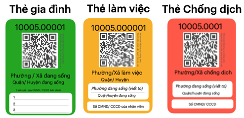
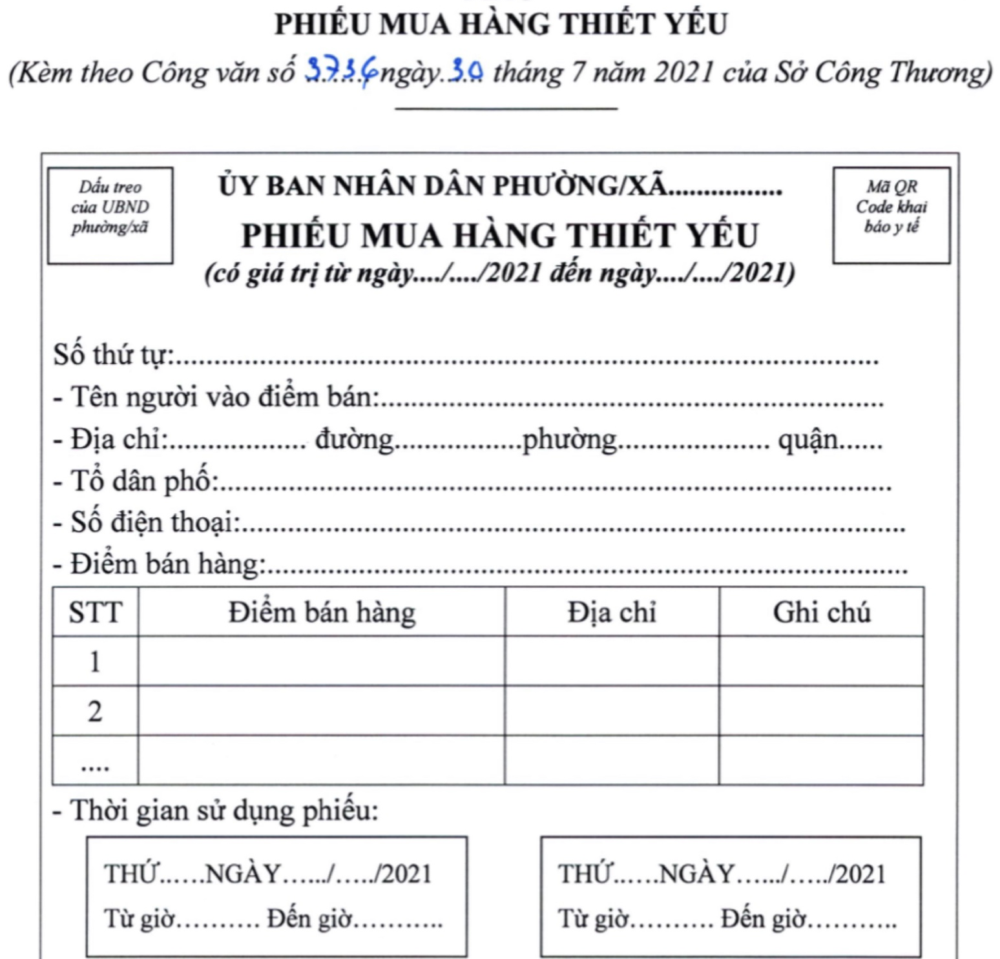
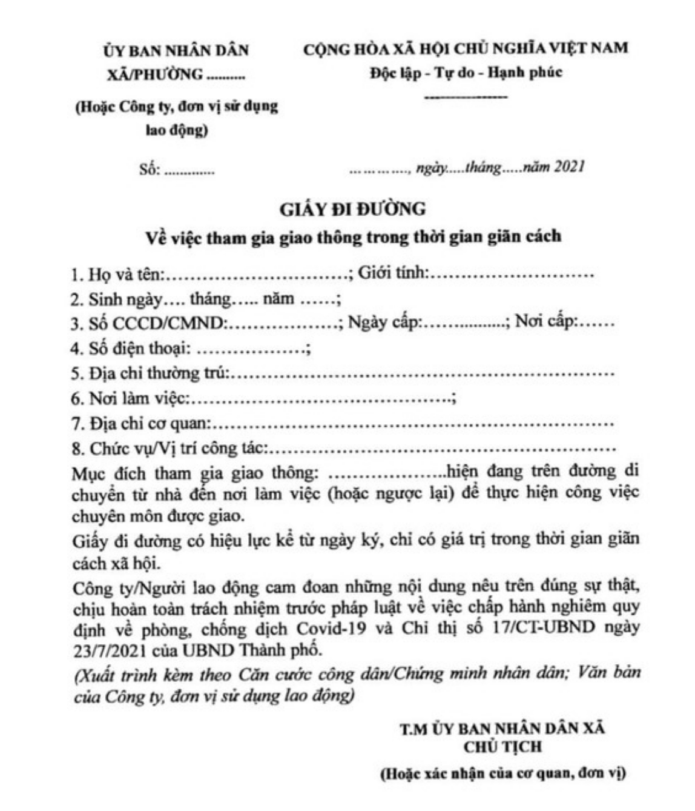
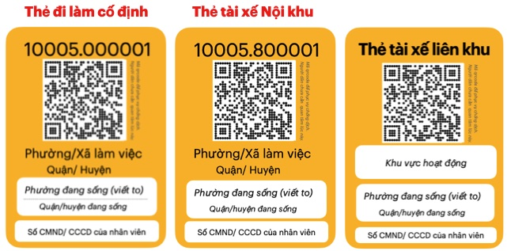
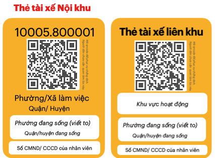
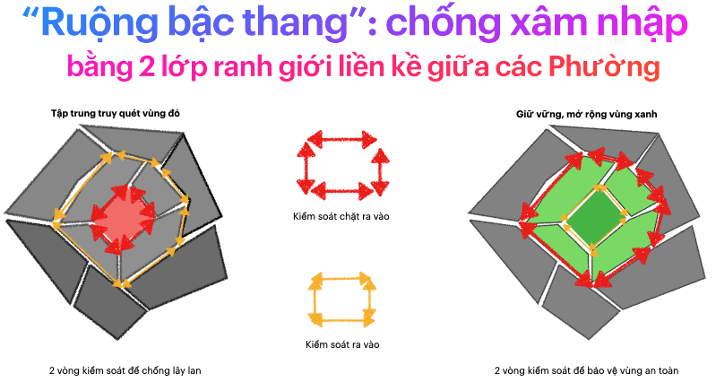

## Thẻ Lệnh: Chống dịch hiệu quả và phát triển kinh tế bên trong Phường/Xã an toàn.

Thẻ Lệnh là một chiến lược truy quét F0 theo Phường/Xã. 

Để thực hiện chiến lược này cần cấp **Thẻ** cho mọi đối tượng được phép ra ngoài: mua hàng, làm việc và chống dịch.

Sau khi phát hành Thẻ giấy và đưa tới từng Phường/Xã, Chính quyền tỉnh/Tp đưa ra các quy định hành chính, kèm nội dung xử phạt, (gọi tắt là **Lệnh**) cho các bên: 

Phường/Xã: đóng dấu và cấp Thẻ cho
  - mọi hộ gia đình, nhà trọ, phòng trọ, ... 
  - các doanh nghiệp, cơ quan được phép hoạt động
  - đội ngũ chống dịch: y tế, cán bộ, công an, dân phòng, tình nguyên viên, nhà báo,...

Chợ, siêu thị,.. chỉ bán hàng cho Thẻ gia đình, theo Phường/Xã cấp thẻ. 

Doanh nghiệp quản lý Thẻ làm việc đã cấp cho nhân viên 

Đơn vị chống dịch quản lý Thẻ chống dịch đã cấp. 

Công an, dân phòng kiểm tra và quét Thẻ. 

Riêng với cá nhân:
- đeo Thẻ khi ra đường và quét thẻ tại các điểm đến để lưu lịch sử đi lại. 
- Tuân thủ các Lệnh đưa ra khi tham gia lấy mẫu xét nghiệm 

Khi các bên tuân thủ các Lệnh đưa ra, người dân chỉ mua hàng theo Phường/Xã đang sống, việc ra vào Phường/Xã chỉ để làm việc, hoặc chống dịch. Số lượng này khá ít, và mỗi Phương/Xã có đủ nhân lực kiểm tra, phát hiện vi phạm để **kiểm soát tất cả ra vào mỗi ngày**. 

Khi tất cả Phường/Xã kiểm soát được di chuyển ra vào mỗi ngày, đồng nghĩa việc lây lan Covid giữa các Phường được kiểm soát. Tập trung lấy mẫu xét nghiệm toàn bộ Thẻ trong Phường để truy quét F0. 
Thẻ Lệnh giúp nâng cao hiệu quả việc truy quét: phân loại nguy cơ, tổ chức việc lấy mẫu khoa học, an toàn, và phát hiện sớm cá nhân cố tình tránh né, không tham gia. 

Khi F0 được bóc tách sạch sẽ, dần dần mở rộng các hoạt động kinh tế bên trong Phường/Xã. Việc kiểm soát ra vào được giảm bớt và chuyển sang tự giám sát. Định kỳ xét nghiệm các Thẻ có lịch sử ra vào, để phát hiện sớm xâm nhập. 

Nếu phát hiện F0 trong 1 Phường/ Xã từ xét nghiệm định kỳ, Thẻ Lệnh sẽ kích hoạt chế độ Ngăn chặn:
- Tổ chức 2 Lớp kiểm soát ra vào để ngăn chặn lây lan. 
- Xét nghiệm tất cả các Thẻ có lịch sử ra vào. Nếu 1 Thẻ là F0 thì Phường nơi F0 đến hoặc đi xem như có F0 cộng đồng. 
- Tập trung truy quét trong các Phường nguy cơ: có F0 cộng đồng

Ngoài ra Thẻ Lệnh giúp hỗ trợ đúng và kịp thời các gia đình khó khăn. Việc giao hàng tại nhà của siêu thị, chợ được giải quyết bằng đội shipper nội khu. Cũng như giúp doanh nghiệp bố trí lại nhân viên để hoạt động an toàn trong vùng dịch,...

Khi vùng dịch trở lại "bình thường mới", Thẻ Lệnh vẫn hiện diện như là Hệ thống phát hiện và ngăn chặn sớm nguy cơ: Covid và dịch bệnh tương tự khác. Nó hình thành một số thói quen tốt cho mọi người, để "sinh hoạt và làm việc trong một khu vực an toàn".

Các khác biệt chính của Thẻ Lệnh với với các chiến lược truy quét khác là: 

1. Phân chia theo Phường/Xã, chứ chia nhỏ hơn thành tổ dân phố, hẻm dân cư... hay lớn hơn theo Quận/Huyện.
    - Là khu vực nhỏ nhất, đủ khả năng đáp ứng nhu yếu phẩm cho người dân bên trong. 
    - Đủ chức năng và nhân lực để cấp Thẻ, kiểm soát mọi ra vào, và truy quét toàn bộ Thẻ trong 1 ngày. 
    
2. Kết hợp Thẻ với Lệnh để giám sát chéo, tăng tuân thủ và giảm vi phạm hiệu quả.

3. Dùng Thẻ giấy (vật lý) để phù hợp cho việc đeo, để đơn giản việc thu thập dữ liệu di chuyển. 

4. Dùng số liệu thực tế để phát hiện vi phạm và ngăn chặn sớm nguy cơ.

**Mục lục**
<!-- @import "[TOC]" {cmd="toc" depthFrom=3 depthTo=5 orderedList=true} -->

<!-- code_chunk_output -->

1. [Dữ liệu di chuyển quá ít, chưa sát với thực tế](#dữ-liệu-di-chuyển-quá-ít-chưa-sát-với-thực-tế)
    1. [Phiếu mua hàng](#phiếu-mua-hàng)
    2. [Giấy đi đường](#giấy-đi-đường)
    3. [Khai báo tại chốt kiểm tra, siêu thị, chợ](#khai-báo-tại-chốt-kiểm-tra-siêu-thị-chợ)
2. [Cấp Thẻ cho mọi đối tượng được phép di chuyển.](#cấp-thẻ-cho-mọi-đối-tượng-được-phép-di-chuyển)
3. [Thu thập số liệu di chuyển bằng quét Thẻ](#thu-thập-số-liệu-di-chuyển-bằng-quét-thẻ)
4. [Điều chỉnh việc di chuyển của mọi người bằng Lệnh](#điều-chỉnh-việc-di-chuyển-của-mọi-người-bằng-lệnh)
    1. [Lệnh cho người dân](#lệnh-cho-người-dân)
    2. [Lệnh cho siêu thị, chợ](#lệnh-cho-siêu-thị-chợ)
    3. [Lệnh cho Đơn vị chủ quản (Doanh nghiệp, cơ quan, ...)](#lệnh-cho-đơn-vị-chủ-quản-doanh-nghiệp-cơ-quan)
    4. [Lệnh cho Phường / Xã](#lệnh-cho-phường-xã)
    5. [Lệnh cho Công an, Dân phòng](#lệnh-cho-công-an-dân-phòng)
5. [Tăng tuân thủ, giảm vi phạm bằng Thẻ Lệnh](#tăng-tuân-thủ-giảm-vi-phạm-bằng-thẻ-lệnh)
    1. [Kiểm tra để phát hiện vi phạm](#kiểm-tra-để-phát-hiện-vi-phạm)
    2. [Dùng số liệu để dự báo, điều tiết và phát hiện nguy cơ.](#dùng-số-liệu-để-dự-báo-điều-tiết-và-phát-hiện-nguy-cơ)
6. [Truy quét hiệu quả F0 trong cộng đồng bằng Thẻ Lệnh](#truy-quét-hiệu-quả-f0-trong-cộng-đồng-bằng-thẻ-lệnh)
7. [Hỗ trợ đúng gia đình khó khăn qua Thẻ](#hỗ-trợ-đúng-gia-đình-khó-khăn-qua-thẻ)
8. [Giúp dân nghèo có thu nhập bằng Shipper Nội khu](#giúp-dân-nghèo-có-thu-nhập-bằng-shipper-nội-khu)
9. [Hệ thống phát hiện sớm F0 trong vùng "bình thường mới"](#hệ-thống-phát-hiện-sớm-f0-trong-vùng-bình-thường-mới)

<!-- /code_chunk_output -->
 

## Vấn đề: 

### Dữ liệu di chuyển quá ít, chưa sát với thực tế 

Hiện tại có nhiều biện pháp đang triển khai để hạn chế hoạt động của người dân theo Chỉ thị 16 của chính phủ, như Phiếu mua hàng để hạn chế ra ngoài mua hàng và Giấy đi đường để cấp phép cho cá nhân ra ngoài làm việc. 

#### Phiếu mua hàng 

Mỗi địa phương có mẫu phiếu riêng, nhưng cách làm thì khá giống nhau. Sau nhiều lần cải tiến, Tp Hồ Chí Minh đang áp dụng mẫu Phiếu bên dưới. 

Người dân phải điền nhiều thông tin tên, địa chỉ, số điện thoại,..., khiến việc số hoá chữ viết tay trên 1 Phiếu tốn không ít thời gian và dễ sai sót. 1 Phiếu được dùng 2 lần trong 6 ngày, khiến tổng số  Phiếu đã phát trong 1,2 tháng của Phường/Xã, Quận/Huyện và Thành phố là rất lớn.

Việc số hoá tất cả phiếu này là tốn rất nhiều nhân lực và cũng không phải bắt buộc, dẫn đến thực tế là số liệu về hoạt động mua hàng gần như không có, hoặc chỉ là phần nhỏ so với thực tế. 
#### Giấy đi đường

Sau vài lần điều chỉnh, việc cấp Giấy đi đường sẽ do Phường/Xã thực hiện, và đây là 1 mẫu mới nhất mà Tp Hà Nội đang áp dụng 

Giấy đi đường cũng có rất nhiều chỗ phải điền vào, và khá nhiều thông tin không thực sự cần thiết. Nhưng trên giấy lại không có ID hay QRCode riêng, dùng cho việc thu thập dữ liệu khi kiểm tra. Thực tế là tại các chốt, công an chỉ xem thông tin trên Giấy đi đường, **không lưu thông tin người ra chốt mỗi ngày**.

Để khắc phục việc thiếu số liệu thực tế, nhiều biện pháp khác được bổ sung để người dân tự nguyện khai báo.
#### Khai báo tại chốt kiểm tra, siêu thị, chợ  

Các giải pháp khác như "Di biến động dân cư", Tờ khai Y tế trên ứng dụng NCovi, Bluezone tốn khá nhiều thời gian để thực hiện. 
và thường gây tụ tập, tắc nghẽn tại các chốt. 

Chưa kể người dân chỉ khai báo khi phải qua một số chốt lớn, hoặc vào các siêu thị lớn, khiến số liệu thu thập vẫn là 1 phần nhỏ so với thực tế.

Tóm lại, mọi người tốn rất nhiều thời gian để điền thông tin, để khai báo nhưng số liệu cho 2 câu hỏi quan trọng bên dưới thì gần như không có.

1. Số lượng người **được phép** ra ngoài, theo từng Phường/Xã, Quận/Huyện hoặc cả Thành phố? 
2. Những người này **đã tới** những địa điểm, vào lúc nào mỗi ngày? 

Thiếu số liệu thực tế khiến việc đánh giá tác động của các biện pháp đã triển khai rất khó khăn. Thực tế là nhiều biện pháp kiểm soát từng hiệu quả trước đây, đã không mang lại kết quả như kỳ vọng trong lần Chống dịch thứ 4 này. 

Cần một cách làm mới để trả lời 2 câu hỏi trên, đó là cấp thẻ cho mọi cá nhân được phép ra ngoài và thu thập dữ liệu di chuyển của các Thẻ này. 

### Cấp Thẻ cho mọi đối tượng được phép di chuyển. 

Thẻ là 1 tấm giấy, kích thước bằng thẻ ngân hàng, kèm theo dây đeo. Nên dùng giấy (thay vì nhựa) để làm thẻ để in ấn dễ dàng và tiết kiệm chi phí.  

Có 3 loại thẻ chính cho 3 nhu cầu: ra ngoài mua hàng, làm việc hay tham gia chống dịch.

**Thẻ gia đình** (màu xanh)

- Phường/Xã cấp cho mỗi gia đình 1 Thẻ.
- Được sử dụng nhiều lần để mua nhu yếu phẩm, thay cho Phiếu mua hàng.
- Gia đình ở đây là hộ gia đình, nhà trọ, phòng trọ,... như nội dung "Gia đình cách ly với gia đình" của chỉ thị 16 

**Thẻ làm việc** (màu vàng)
- Dành cho cá nhân ra ngoài làm việc như : đi làm tại nhà máy, doanh nghiệp, bán hàng tại siêu thị, chợ hay giao hàng, vận chuyển hàng hoá 

- gồm 3 mẫu chi tiết hơn: Thẻ đi làm (cố định), Thẻ Giao hàng (nội khu vực) và Thẻ Vận chuyển (liên khu vực)

- Phường / Xã nơi làm việc sẽ cấp thẻ cho Đơn vị chủ quản. Đơn vị sẽ cấp cho nhân viên theo danh sách đã đăng ký. 

**Thẻ chống dịch** (màu đỏ)

- Dành cho cá nhân tham gia chống dịch như: cán bộ địa phương, công an dân phòng, đội ngũ y tế, tình nguyện viên, nhà báo,...
- Phường / Xã cấp Thẻ cho các đơn vị chống dịch. Các đơn vị này sẽ cấp cho cá nhân tham gia chống dịch.

**Đặc điểm chung** của các loại Thẻ này là 
- có ID duy nhất, thuộc Phường/ Xã cấp thẻ 
- có QRCode chứa ID, privateCode (8 số) chống giả. 
- được phát hành bởi 1 hệ thống, Hệ thống Thẻ lệnh 

**Quy trình cấp Thẻ** 

- Thẻ gia đình: Phôi Thẻ => Phường/ Xã đóng dấu => Cấp cho mọi gia đình
- Thẻ làm việc: Phôi Thẻ => Phường/ Xã đóng dấu => Đơn vị Chủ quản đóng dấu => Nhân viên
- Thẻ chống dịch: Phôi Thẻ => Phường/Xã đóng dấu => Đơn vị Chống dịch => người tham gia   

Phôi Thẻ được phát hành từ hệ thống và in thành Thẻ giấy. Chỉ cần 1,2 ngày là phát hành 5 triệu Thẻ, đủ cho toàn Tp HCM. 

Việc cấp Thẻ đồng loạt cho mọi Phường/Xã kéo dài tầm 3-4 ngày, sau đó Chính quyền sẽ biết được chính xác số lượng người được phép ra ngoài theo từng Phường/Xã, Quận / Huyện hay cả Tỉnh / TP. 

### Thu thập số liệu di chuyển bằng quét Thẻ 

Mọi cá nhân ra ngoài phải đeo thẻ và thực hiện quét thẻ 

- Tại lối vào, ra của Chợ, siêu thị do nhân viên dùng app thực hiện 

- Tại chốt kiểm tra, do công an, dân phòng dùng app thực hiện. 

- Tại lối vào, ra của địa điểm tổ chưc lấy mẫu xét nghiệm,tiêm vacxin: dùng app quét thẻ mọi cá nhân tham gia. 
- Các Thẻ vi phạm cũng được quét Thẻ để lưu vào hệ thống. 

Đặt nhiều Checkpoint (ID khác nhau) để người dân tự quét thẻ, giúp thu thập dữ liệu xếp hàng, di chuyển qua các điểm này. 
Các điểm tổ chức lấy mẫu xét nghiệm, hoặc các chốt đông người xếp hàng nên áp dụng cách này để phân luồng và bảo đảm 5K. 

Ngoài việc quét Thẻ, có thể áp dụng **cách thủ công, là ghi ID Thẻ vào mẫu giấy in sẵn**. Việc ghi chú cho 1 Thẻ diễn tầm 15 giây: viết 10 số và thời điểm (10:35) và việc số hoá cuối ngày cũng tầm 15 giây 1 Thẻ.  

Lịch sử đi lại, tụ tập của mọi người sẽ được thu thập một cách chi tiết, đầy đủ theo khu vực, và theo địa điểm, khung giờ,... như 

- Tại chốt kiểm tra, bao nhiêu người đã đi qua từ 8h-9h
- Một cá nhân (ID) đến bao nhiêu chợ, siêu thị để hoàn thành 1 lần mua hàng.
- Số lượng người đi làm của 1 Phường. Ngày nào trong tuần có đông người đi làm nhất. 
- Có bao nhiêu vi phạm trong 1 phường / xã
- Có bao nhiêu nhân viên vi phạm của 1 Đơn vị

Từ số liêụ trên, Chính quyền đánh giá được thực tế xã hội, và có các biện pháp điều chỉnh hành vi của mọi người để phục vụ chống dịch. 

### Điều chỉnh việc di chuyển của mọi người bằng Lệnh 

**Lệnh** là các quy định hành chính áp dụng cho các đối tượng liên quan tới Thẻ. Các quy định này là cụ thể hoá nội dung phòng chống dịch của chính quyền, như chỉ thị 16 của chính phủ hay chỉ thị 12 của tp HCM. 

Lệnh cũng bao gồm các quy định xử phạt khi vi phạm, để tạo tính răn đe, "mệnh lệnh" phải tuân thủ. 

Ví dụ: **"Ra ngoài phải mang thẻ. Không mang sẽ bị xử phạt từ 1-3 triệu đồng theo quy định ra ngoài không có lý do chính đáng"** là 1 Lệnh, trên nội dung quy định của chỉ thị 16.

Bên dưới là một số Lệnh tiêu biểu: 
#### Lệnh cho người dân

Ra ngoài phải đeo Thẻ, trình thẻ tại các chốt để quét

**Ra ngoài mua hàng**
- Phải đeo Thẻ gia đình.
- Mua hàng theo quy định về ngày, khung giờ theo ID trên Thẻ. 
- Trường hợp ra ngoài nhưng không mua hàng (hết hàng, không muốn mua, muốn đi chơi...) chỉ được ra ngoài tối đa 2 lần / 1 ngày. 
- Vi phạm sẽ bị xử lý như ra ngoài không có lý do chính đáng. 

**Đi làm**
- Phải đeo Thẻ làm việc
- Di chuyển không dừng giữa 2 Phường: đang sống và làm việc. 
- Nếu dừng lại, mua bán, tiếp xúc với người khác tại Phường/Xã khác, sẽ bị xử lý. và thông báo tới Đơn vị chủ quản (doanh nghiệp, cơ quan quản lý,...) ghi trên Thẻ. 

**Tham gia chống dịch**
- Tham gia chống dịch phải mang Thẻ chống dịch 
- Trình thẻ tại các chốt để check-in
- Chỉ được đi lại theo khu vực quy định trên thẻ.
- Nếu phát hiện vi phạm, sẽ xử lý và thông báo tới Đơn vị chủ quản ghi trên Thẻ 

Không chỉ với người dân, Lệnh còn áp dụng với Siêu thị, chợ, Đơn vị chủ quản, và cả Chính quyền địa phương.

#### Lệnh cho siêu thị, chợ 
- Bán hàng cho người không mang Thẻ gia đình sẽ bị xử phạt. 
- Bán hàng cho Thẻ gia đình trong Phường/ Xã đang sống.
- Đúng ngày theo 5 khung giờ mua bên dưới 
- Đơn hàng phải có ID của Thẻ gia đình.

Xử phạt cho từng tình huống vi phạm. Khung hình phạt cao hơn nếu tỉ lệ vi phạm chiếm > 1% số đơn hàng mỗi ngày. Tiếp diễn trên 3 lần sẽ bị đình chỉ hoạt động. 

**5 khung giờ mua hàng** : dựa trên số cuối cùng từ 0 tới 9 của ID Thẻ gia đình, đây là 1 ví dụ: 
- 7h-8h30: cho (1,2)
- 9h-1030: cho (3,4)
- 11h-12h30 cho (5,6)
- 13h-14h30 cho (7,8)
- 15h-16h30 cho (9,0)
- mỗi khung giờ cách nhau 30 phút để hạn chế tụ tập 

**Giới hạn 2 ngày 1 lần mua**: 
- Dựa trên tính chẵn lẻ của ID: ID chẵn mua ngày chẵn.
- 1 cách linh động hơn: một ID không được mua hàng 2 ngày liên tiếp. 

Lưu ý: 
- Giới hạn 3 ngày 1 lần mua trở lên sẽ gây tâm lý tích trữ cho người dân, và cố tình vi phạm gây áp lực lên chợ, siêu thị. 
- Ưu tiên **đặt hàng tại nhà theo ID** Thẻ gia đình, cho phép đặt mua mỗi ngày để hạn chế ra ngoài mua hàng. 

#### Lệnh cho Đơn vị chủ quản (Doanh nghiệp, cơ quan, ...)
- Chịu trách nhiệm quản lý Thẻ đi làm của nhân viên. 
- Nếu nhân viên vi phạm, Đơn vị sẽ liên đới bị xử phạt theo quy định....
- Nếu số vi phạm chiếm > 5% tổng số Thẻ đã cấp, Đơn vị sẽ bị xử phạt cao hơn theo quy định. 

#### Lệnh cho Phường / Xã
- Cấp cho mỗi hộ gia đình, nhà trọ, phòng trọ,... 1 Thẻ gia đình. Các bộ Phường sẽ bị xử lý nếu phát hiện tiêu cực trong Cấp Thẻ
- Hàng tuần tới từng nhà dân, đôn đốc hướng dẫn chống dịch, xác nhận bằng quét Thẻ gia đình. Phường nào có tỉ lệ xác nhận dưới 95%, xem như thiếu trách nhiệm trong công tác phòng dịch. 

#### Lệnh cho Công an, Dân phòng
- Quét thẻ mọi cá nhân qua Chốt kiểm tra.
- Trường hợp tập trung đông tại chốt, có thể để người dân tự quét theo theo hướng dẫn sau....

Trên đây là tổng quan về các Lệnh cho vùng dịch áp dụng chỉ thị 16. Để đưa vào thực tế, cần chi tiết hơn, cũng như liên tục cải thiện các lệnh này để bao quát mọi tình huống phát sinh.

Kết hợp các Lệnh này đồng thời, sẽ tạo cơ chế **giám sát chéo giữa các đối tượng**, khiến cho việc vi phạm rất dễ bị phát hiện.
Nhờ vậy Thẻ Lệnh có tính răn đe cao, khiến mọi người dẹp bỏ các tư tưởng tiêu cực như *"cứ vi phạm, xui lắm thì mới bị  phát hiện"*

Kết hợp Thẻ Lệnh vẫn là điều kiện cần. Muốn giải pháp mang lại hiệu quả thực tế, cần triển khai một cách "Hệ thống", đồng nhất và bao phủ mọi đối tượng liên quan. 

### Tăng tuân thủ, giảm vi phạm bằng Thẻ Lệnh 

**Tuân thủ là trách nhiệm của mọi đối tượng**

Người dân cần tuân thủ: đeo thẻ ra đường, tuân thủ các giới hạn mà Thẻ quy định, đưa thẻ để check-in hoặc tự check-in tại các điểm Checkpoint.

Siêu thị, chợ cần tuân thủ các Lệnh về phục vụ người dân. 

Với các cán bộ Phường/Xã, công an dân phòng: hoàn thành tốt các nhiệm vụ mà Lệnh đưa ra chính là tuân thủ. 

Ngoài ra cần nhắc nhở hỗ trợ lẫn nhau để **cùng tuân thủ**. 
- Cán bộ hướng dẫn về các lệnh cho người dân.
- Nhân viên siêu thị, chợ hướng dẫn cho khách hàng.
- Công an, dân phòng hướng dẫn người dân tự giác check-in.

Tăng cường sự tuân thủ trong cộng đồng theo thời gian, là sức mạnh vô hình của Hệ thống Thẻ lệnh. Bên cạnh đó, việc giảm vi phạm được thực hiện bằng kiểm tra thường xuyên và dùng số liệu để phát hiện bất thường, ngăn ngừa nguy cơ.

#### Kiểm tra để phát hiện vi phạm 

- Cần kiểm tra liên tục việc ra ngoài của người dân theo từng khu phố, cụm dân cư để nhanh chóng phát hiện vi phạm.

- Cần kiểm tra định kỳ, ngẫu nhiên vào các khung giờ khác nhau tại cổng vào và cổng ra của chợ, siêu thị. 

- Cần kiểm tra các Giao nhận di chuyển trên đường, xem đơn hàng có  ID của Thẻ gia đình không. 

Bằng cách Giám sát chéo, phát hiện **các trường hợp thiếu trách nhiệm** của cán bộ Địa Phương. 

- Ví dụ: Để biết cán bộ có thật sự tới gặp mọi gia đình trong Phường/Xã họ quản lý, hãy Lệnh họ *"dùng app quét Thẻ gia đình và gửi ID và toạ độ GPS về hệ thống"* . 
- Hệ thống sẽ tổng hợp, đối chiếu với Tổng số Thẻ đã phát để tính được tỉ lệ hoàn thành của mỗi phường/Xã. 
#### Dùng số liệu để dự báo, điều tiết và phát hiện nguy cơ. 

**Để dự báo**

- Khả năng đáp ứng mua hàng cho Tổng số thẻ Mua hàng
    - Số lượng siêu thị, chợ cần có
    - Lượng hàng hoá cần đáp ứng 
- Số lượng Giao nhận nội bộ (Thẻ Giao hàng) có đáp ứng đặt hàng tại nhà. 
- Nguồn lực phân bổ theo quy mô của mỗi Phường/ Xã 
- Sự bất thường khi đăng ký nhân viên đi làm của Đơn vị chủ quản

**Để điều tiết hợp lý**
- Điều tiết việc chỗ này tụ tập đông, chỗ kia vắng người mua hàng
- Điều tiết việc chốt này có nhiều người đi qua, chốt kia lại rất ít. 
- Điều tiết hơn việc mua hàng theo khung giờ 

**Để phát hiện bất thường**
- Hàng hoá bị thiếu, khiến di chuyển nhiều điểm mới mua được hàng.
- Hiện tường nhiều người đi qua nhiều chốt kiểm tra, nhưng không thấy mua hàng. 
- Việc đi lại bất thường của các Thẻ làm việc. 

Kết quả của các biện pháp trên là giảm nguy cơ gây ra vi phạm, cũng như nguy cơ Phường này lặp lại vi phạm đã diễn ra ở Phường khác. 

Tính tương đồng, lặp lại hiện tượng theo khu vực là 1 đặc điểm cơ bản của một Hệ thống: vừa hỗn loạn vừa trật tự, nhiều khác biệt nhưng cũng có nhiều tương đồng.

Hệ thống Thẻ Lệnh được xây dựng dựa trên Tư duy hệ thống:phát hiện sự tương đồng, và hình thành trật tự trong một hệ thống hỗn loạn (việc đi lại, tụ tập hỗn loạn của cộng đồng).

Bên cạnh việc điều chỉnh hoạt động xã hội để trở nên trật tự hơn, nhiệm vụ quan trọng khác của Thẻ lệnh là tăng tính hiệu quả của Chống dịch bằng truy quét F0. 

### Truy quét hiệu quả F0 trong cộng đồng bằng Thẻ Lệnh 

Chống dịch bằng cách xét nghiệm toàn dân để truy quét F0 là một công việc tốn kém và khó đo lường hiệu quả, bởi các yếu tố

- Số lượng cần lấy mẫu nhiều
- Không để lây lan trong khi tập trung lấy mẫu 
- Thực hiện trong thời gian ngắn với đội ngũ lấy mẫu hạn chế. 
- Các cá nhân nguy cơ cao thường tránh né lấy mẫu. 

**Tối ưu số mẫu cần lấy**

Màu sắc của 3 loại Thẻ Lệnh phản ánh nguy cơ lây nhiễm của các đối tượng mang Thẻ. 

- Màu đỏ (Thẻ chống dịch) nguy cơ cao nhất. Đây là đội ngũ chống dịch, tiếp xúc với rất nhiều cá nhân khả năng F0 

- Màu vàng (Thẻ làm việc) nguy cơ cao, là các đối tượng di chuyển thường xuyên, và xa khu vực đang sống. Chưa kể tụ tập đông tại nơi làm việc. 
- Màu xanh (Thẻ gia đình) nguy cơ, là các cá nhân ra ngoài, tiếp xúc với Thẻ màu vàng và cả Thẻ màu đỏ. 

Dữ liệu check-in thực tế theo ID cũng giúp lọc ra các đối tượng nguy cơ cao hơn cần lấy mẫu, là các ID có check-in liên tục, hoặc di chuyển nhiều nơi.

Từ đó Thẻ Lệnh giúp giảm số lượng mẫu cần lấy, nhưng vẫn bảo đảm tính khoa học, bao phủ được các đối tượng nguy cơ cao. Cho phép việc truy quét lấy mẫu diễn ra thường xuyên, định kỳ hơn với chi phí tối ưu. 

**Tổ chức lấy mẫu khoa học và an toàn**

Khi cần lấy mẫu toàn bộ để quét sạch F0 ra khỏi mọi gia đình. Số lượng lấy mẫu sẽ rất lớn, và chúng ta có thể dùng Thẻ gia đình để lấy mẫu cá nhân đại diện. Trường hợp của Tp HCM, sẽ có tầm 3 triệu Thẻ gia đình cần lấy mẫu. 

Trong tình huống này, Thẻ Lệnh phát huy vai trò tổ chức việc lấy mẫu một cách khoa học, bảo đảm an toàn, nhưng bảo đảm không bỏ sót các gia đình né tránh, không tham gia. 

- Phân khung giờ lấy mẫu theo số cuối của ID
- Tổ chức đường di chuyển 1 chiều theo CheckPoint, từ cổng vào, xếp hàng, di chuyển tới bàn lấy mẫu một cách khoa học, trật tự.
- quét Thẻ tại Checkpoint để có số liệu thực tế, cải thiện việc tổ chức lần sau. 

**Không bỏ sót cá nhân tránh né lấy mẫu** 

Một số cá nhân tự biết nguy cơ cao, thường tìm cách tránh né xét nghiệm do sợ khi bị phát hiện, ảnh hưởng tới công việc, thu nhập. 

Một số khác thì mãi mê làm việc, "quên" tham gia lấy mẫu.

Một số tự tin đã tiêm vacxin, không lo lắng về sức khoẻ, nhưng lo lắng khi bị cách ly ở nhà. 

Công sức của mọi người tham gia truy vết có thể tan thành mây khói nếu bỏ sót các đối tượng này. 

Thẻ Lệnh sẽ lọc ra các ID có nguy cơ cao, thông báo để Đội lấy mẫu chú ý. Nếu phát hiện các ID này chưa tham gia lấy mẫu, sẽ tới tận nhà để truy quét vào cuối ngày. 

Thẻ Lệnh còn giúp tối ưu đội ngũ lấy mẫu tập trung,là các Thẻ Chống dịch, như tổ chức việc hậu cần, di chuyển giữa các điểm lấy mẫu. Phân công thực hiện hợp lý để chất lượng lấy mẫu duy trì trong thời gian 2,3 tuần liên tục.

Trên đây là các ưu điểm của Hệ thống Thẻ Lệnh để chống dịch hiệu quả. Bên cạnh đó Thẻ Lệnh còn giúp duy trì sức dân và phát triển kinh tế trong khu vực an toàn. 
### Hỗ trợ đúng gia đình khó khăn qua Thẻ

Trong hoàn cảnh dịch bệnh kéo dài, có khá nhiều đối tượng khó khăn, có thể là 
- các gia đình nghèo, không có tiền mua nhu yếu phẩm
- các gia đình trong khu phong toả, không nhận đủ nhu yếu phẩm. 

Các đối tượng này phản ảnh khó khăn qua Thẻ gia đình. Cán bộ Phường/Xã sẽ tới tận nơi, xác nhận khó khăn, và gửi ID về Hệ thống Thẻ Lệnh. Thẻ Lệnh cũng giám sát được việc thực hiện của Phường/Xã để không bỏ sót phản ánh.

Từ danh sách này, Chính quyền Thành phố có thể hỗ trợ đúng thực tế và kịp thời thông qua cán bộ địa phương. 

Các nhà hảo tâm cũng có biết và hỗ trợ đúng gia đình thực sự khó khăn vì cách làm chung chung như hiện nay. 

Các khó khăn khác của người dân như cần chăm sóc Y tế, cần xe cấp cứu,... từ Thẻ gia đình kết nối với các hệ thống chuyên môn khác. 

### Giúp dân nghèo có thu nhập bằng Shipper Nội khu

Khi giãn cách kéo dài, mọi người sẽ tìm cách để tăng nguồn thu bằng cách làm thêm. Một công việc hợp lệ là làm Shipper giao hàng

Các shipper tham gia trên ứng dụng như Grab, GoJek,... phải chấp nhập di chuyển nhiều nơi, tiếp xúc nhiều người để có thu nhập.
Đổi lại họ gặp rủi ro về sức khoẻ và bị phạt tiền nếu vi phạm. 
Grab, Gojek,... thu lợi từ công việc của Giao nhận, nhưng Nhà nước sẽ phải trả phí nếu các Giao nhận bị dính covid. Điều này khá vô lý. 

Có một cách để cân bằng quyền lợi của các bên, đó là chia việc vận chuyển hàng hoá cho 2 nhóm shipper: Giao nhận nội khu và Vận chuyển liên khu. Cách tổ chức như vậy giúp ngăn ngừa lây lan dịch bệnh do việc di chuyển liên tục nhiều nơi.

**Shipper Nội khu** do Phường/Xã cấp Thẻ và giám sát. 

Shipper nội khu được phép giao nhận hàng với người dân, và di chuyển bên trong 1 Phường/Xã đang hoạt động, không được ra ngoài. 

Shipper của Grab, Gojek... có thể đăng ký hoạt động tại nơi đang sống. 

Phường Xã tự Cấp Thẻ để xây dựng đội Giao nhận này. 
Những cá nhân mất thu nhập có thể đăng ký với Phường/ Xã đang sống để tham gia đội Giao nhận nội khu. 

Siêu thị, chợ bên trong Phường sẽ sử dụng đội Giao nhận này, để vận chuyển các đơn hàng tới tay người dân. Siêu thị, chợ sẽ trả phí giao hàng như thông thường cũng như trả phí xét nghiệm định kỳ cho đội này. 

Người dân muốn chuyển hàng tới Quận huyện khác, có thể gọi Giao nhận nội khu chuyển hàng tới điểm tập kết, hàng sau đó sẽ do VNPOST, Viettelpost, Grab, Gojek... vận chuyển tiếp. 

Giao nhận nội khu cân bằng lợi ích giữa lợi ích kinh tế và việc phòng chống dịch 

- Giao nhận nội khu giảm nguy cơ lây lan dịch bệnh
- Bổ sung đội ngũ giao nhận cho Siêu thị, chợ, đủ năng lực giao hàng tại nhà, với chi phí hợp lý. 
- Người dân cảm thấy an toàn hơn và tiết kiện được Chi phí giao nhận
- Cư dân làm shipper nội khu có thêm thu nhập, không chịu rủi ro dịch bệnh hoặc bị phạt khi qua chốt. 

**Shipper Liên khu**

Không được vào bên trong Phường/ Xã, trừ nơi họ đang sống. Họ cũng không được giao hàng tới người dân. 

Việc di chuyển chủ yếu giữa các điểm tập kết, theo các trục đường giáp ranh gửi 2 Phường, hoặc 2 Quận...

Trong 1 doanh nghiệp vận chuyển, Tài xế liên khu không được tiếp xúc, hoặc tự ý hoán đổi với tài xế Giao nhận nội khu

Các doanh nghiệp cần tổ chức thành 2 đội này, để bảo đảm an toàn trong Phòng chống dịch cũng như phát triển bền vững trong tương lai.
### Hệ thống phát hiện sớm F0 trong vùng "bình thường mới" 

Để phát triển kinh tế song song với chống dịch hiệu quả, cần tổ chức vùng dịch thành Ruộng bậc thang Phường/Xã, trong đó mỗi Phường/Xã kiểm soát toàn bộ ra mỗi ngày. 

Chính quyền sẽ tập trung Chống dịch trong Phường/Xã nguy cơ, và cho phép phát triển kinh tế bên trong Phường Xã an toàn. 

Hệ thống Thẻ Lệnh đóng vai trò phát hiện sớm nguy cơ thông qua việc xét nghiệm đình kỳ các đối tượng nguy cơ. 

Và để xã hội trở về "bình thường mới" một cách bền vững, cần tổ chức điều chỉnh một số cấu trúc xã hội, hướng tới mô hình 

**Sống và làm việc trong cùng khu vực**

Doanh nghiệp phối hợp với địa phương để bố trí lại lực lượng lao động: 

- Doanh nghiệp vận chuyển hàng hoá tách biệt giữa Giao hàng nội khu và Vận chuyển liên khu 
- Việc bán hàng, tiếp xúc khách hàng, bố trí nhân viên sống theo Phường/Xã nơi làm việc.
- tạo điều kiện để nhân viên sống và làm việc theo Quận huyện. 
- Để nhân viên đi làm xa Phường/Xã đang sống, Doanh nghiệp phải trả các chi phí chống dịch như phí xét nghiệm thường xuyên, thiết bị check-in tại nơi làm việc,...

- Cá nhân đi làm mỗi ngày cần tự giác quét thẻ để giám sát và được khuyến kích di chuyển theo tuyến cố định.

Các nhu cầu di chuyển khác của xã hội như thăm người thân, đi công tác ở vùng khác,du lịch ... cần được kiểm tra và tự giám sát. Các nhu cầu không thực sự cần thiết được khuyến khích bởi các tour du lịch giảm giá cũng nên hạn chế. 

Việc điều chỉnh này cần thời gian và nỗ lực lớn của xã hội. Nhưng trong chính nguy cơ của biến thể Delta, chúng ta có cơ hội, động lực lớn để thay đổi, để tồn tại vào phát triển. 

Giá trị mang lại rất đáng giá và bền vững, không chỉ là Phòng dịch mà còn giải quyết các vấn đề hỗn loạn khác của một đô thị lớn: kẹt xe triền miên, ô nhiễm đô thị,...

Đây chính là tìm ra điểm tương đồng, từ từ xây dựng trật tự, ổn định trong một hệ thống mở, là tinh thần "tư duy hệ thống" mà Thẻ Lệnh đang áp dụng.

