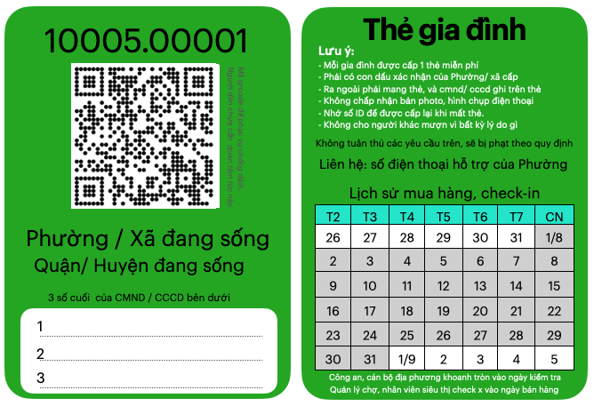

# Lệnh bài: chống dịch và phát triển kinh tế theo khu vực
<!-- @import "[TOC]" {cmd="toc" depthFrom=2 depthTo=6 orderedList=false} -->

<!-- code_chunk_output -->
 
  - [Hệ miễn dịch của cơ thể](#hệ-miễn-dịch-của-cơ-thể)
  - [Hệ miễn dịch của cộng đồng](#hệ-miễn-dịch-của-cộng-đồng)
  - [Thế nào là "hệ thống lệnh bài".](#thế-nào-là-hệ-thống-lệnh-bài)
    - [Tại sao dùng từ "Lệnh"](#tại-sao-dùng-từ-lệnh)
  - [Thực hiện "Mục tiêu kép" của chính phủ](#thực-hiện-mục-tiêu-kép-của-chính-phủ)
  - [Nhiệm vụ 1: Chia vùng dịch các khu vực liền kề](#nhiệm-vụ-1-chia-vùng-dịch-các-khu-vực-liền-kề)
    - [Hạn chế ra ngoài mua nhu yếu phẩm](#hạn-chế-ra-ngoài-mua-nhu-yếu-phẩm)
    - [Giới hạn hoạt động của người dân trong khu vực](#giới-hạn-hoạt-động-của-người-dân-trong-khu-vực)
    - [Giám sát việc di chuyển ra, vào ngoài khu vực](#giám-sát-việc-di-chuyển-ra-vào-ngoài-khu-vực)
  - [Nhiệm vụ  2. Huy động mọi người bên trong khu vực cùng tham gia chống dịch](#nhiệm-vụ-2-huy-động-mọi-người-bên-trong-khu-vực-cùng-tham-gia-chống-dịch)
    - [Hệ thống liên lạc đa chiều](#hệ-thống-liên-lạc-đa-chiều)
    - [Huy động mọi nguồn lực](#huy-động-mọi-nguồn-lực)
    - [Đối tượng lẩn tránh, thiếu trách nhiệm, tiêu cực](#đối-tượng-lẩn-tránh-thiếu-trách-nhiệm-tiêu-cực)
  - [Nhiệm vụ 3: Hệ thống cảnh báo, kiềm soát Covid bùng phát.](#nhiệm-vụ-3-hệ-thống-cảnh-báo-kiềm-soát-covid-bùng-phát)
    - [Tại sao cần hệ thống này?](#tại-sao-cần-hệ-thống-này)
    - [Hệ thống này có khả thi để đối phó Covid ko?](#hệ-thống-này-có-khả-thi-để-đối-phó-covid-ko)
    - [Mở rộng số lượng Thẻ theo nhu cầu hoạt động.](#mở-rộng-số-lượng-thẻ-theo-nhu-cầu-hoạt-động)
  - [Kết luận](#kết-luận)
- [Chi tiết hơn](#chi-tiết-hơn)
  - [Lệnh bài cho cá nhân](#lệnh-bài-cho-cá-nhân)
  - [Áp dụng vào tình hình ở tp HCM](#áp-dụng-vào-tình-hình-ở-tp-hcm)
    - [Đưa, cấp thẻ tới mọi người dưới 7 ngày](#đưa-cấp-thẻ-tới-mọi-người-dưới-7-ngày)
    - [Xây dựng bản đồ chống dịch](#xây-dựng-bản-đồ-chống-dịch)
    - [Duy trì chất lượng của đội y tế](#duy-trì-chất-lượng-của-đội-y-tế)
    - [Sử dụng hết các năng lực truyền, nhận “lệnh”](#sử-dụng-hết-các-năng-lực-truyền-nhận-lệnh)
  - [Chiến thuật Quạt 3 cánh để khoanh vùng và truy quét toàn bộ](#chiến-thuật-quạt-3-cánh-để-khoanh-vùng-và-truy-quét-toàn-bộ)
- [Tham khảo thêm](#tham-khảo-thêm)
  - [Cấu trúc hệ thống quyết định hành vi bên trong](#cấu-trúc-hệ-thống-quyết-định-hành-vi-bên-trong)

<!-- /code_chunk_output -->

### Hệ miễn dịch của cơ thể 

Chúng ta đều biết, một cơ thể có hệ miễn dịch tốt sẽ nhanh chóng phát hiện nguy cơ xâm nhập, phát tín hiệu để đội quân bạch cầu tập trung 
tiêu diệt, trước khi virus gây nguy hại tới các cơ quan quan trọng trong cơ thể, làm cơ thể bị thương tật hoặc ngưng hoạt động vĩnh viễn.

Hiện tại hệ miễn dịch của mỗi người khá chậm chạp trong việc nhận biết Covid. Và khi số lượng trở nên đông đảo, đội quân bạch cầu không đủ sức tiêu diệt, đồng thời các cơ quan quan trọng bị ngừng hoạt động, huỷ hoại, càng khiến cho sức mạnh của tiêu dịch virus càng ít đi. 

Vì lý do này, cần tiêm vacxin để hệ miễn dịch được luyện tập, để nhanh chóng phát hiện covid. Đồng thời luyện tập sức khoẻ để tăng cường sức mạnh của đội quân bạch cầu. Và ngay cả không tiêm vacxin, hệ miễn dịch tự nhiên của cơ thể khoẻ mạnh hầu hết đều chiến thắng, với tỉ lệ trên 90%. 

Nhưng trên phương diện cộng đồng, quốc gia, tỉ lệ chiến thắng lại bị đảo ngược. Covid xem như đã chiến thắng trên 90% quốc gia.

### Hệ miễn dịch của cộng đồng 

Lý do cho việc này là chúng ta khá yếu ở nhiều yếu tố, xem như là "hệ miễn dịch của cộng đồng" để chống lại dịch covid. 

1. **Thiếu cơ chế cảnh báo sớm**: khi đã phát hiện thì dịch đã lây lan, ăn sâu vào cộng đồng
2. **Việc tập trung tiêu diệt chưa hiệu quả**: thiếu cơ chế điều khiển linh hoạt, chưa phát huy mọi nguồn lực đang có, và bỏ sót kẻ thù. 
3. **Cơ thể suy kiệt**: hạn chế di chuyển, tụ tập trên diện rộng, làm suy kiệt kinh tế, là khả năng chống dịch của cơ thể. 
4. **Thiếu cơ chế hạn chế lây lan, kiểm soát bùng phát**: làm tổn hại tới cơ quan quan trọng nhất là hệ thống y tế cộng đồng. 

Hầu hết quốc gia chấp nhận để covid xâm nhập, tìm cách bảo vệ cơ quan quan trọng: hệ thống y tế không sụp đổ. Bên cạnh đó, tập trung luyện tập sức khoẻ (phát triển kinh tế), hạn chế tổn thất về con người bằng tiêm vacxin, và mong chờ nâng cao hệ miễn dịch của cộng đồng bằng tiêm chủng toàn dân. 

Nhưng còn có cách khác để nâng cao nâng cao đồng thời 4 yếu tố nêu trên. Đó là triển khai "hệ thống lệnh bài". 

Ý tưởng của hệ thống này như sau:

- Xem mỗi Phường / Xã trong vùng dịch là một cơ thể. 
- Khi nhiễm bệnh, để cơ thể nghỉ ngơi, tập trung truy quét covid. Khi tạm khoẻ, để cơ thể vận động từ từ, giải toả tâm lý và  phát triển kinh tế cục bộ, giúp đỡ các cơ thể yếu khác đang nằm nghỉ. 
- Mỗi cơ thể cần đeo khẩu trang để hạn chế lây lan, luyện tập khả năng chống dịch thường xuyên, ngay cả khi đã khỏi bệnh. 
- Một hệ thống cảnh báo sớm, phát tín hiệu để mọi người tăng cường đeo khẩu trang. Chia thành 2 đội: khoẻ mạnh thì hỗ trợ cô lập, dập dịch, yếu thì không cho tiếp xúc, tập trung kinh tế. 

Để bắt đầu, chúng ta hãy tìm hiểu. 
### Thế nào là "hệ thống lệnh bài". 

"Lệnh bài" là 1 tấm thẻ, khi triển khai một cách hệ thống sẽ phân chia vùng dịch thành các khu vực lân cận nhau. Trong đó hầu hết hoạt động di chuyển, mua bán và cả làm việc sẽ hạn chế bên trong khu vực này. 

Quan trọng hơn, việc giới hạn hoạt động bên trong khu vực sẽ dần dần một cách "vô thức", không phụ thuộc vào tinh thần tự giác của từng người. 
Tỉ lệ cố ý vi phạm, ra khỏi khu vực không có lý do sẽ ít đi nhiều, và dễ dàng bị phát hiện, bị xử phạt, càng khiến cho số lượng vi phạm dần về 0. 

Để thực hiện được điều này, cần áp dụng 1 cấu trúc cân bằng, đơn giản lên "hệ thống lệnh bài", để bảo đảm rằng mọi yêu cầu truyền tới các đối tượng liên quan tới thẻ này, sẽ được hiểu và thực hiện đúng. 
#### Tại sao dùng từ "Lệnh" 

Từ **lệnh**, nên hiểu là cơ chế lệnh "lây nhiễm" của Covid, hoặc **mệnh lệnh** trong quân đội, bắt buộc mọi đối tượng tiếp nhận phải thực hiện giống nhau. 

Ví dụ: *"mọi gia đình trong tp Hồ Chí mình cần được cấp 1 Thẻ gia đình trong vòng 5 ngày"* là 1 mệnh lệnh gửi tới tất cả các Phường / Xã. **Làm thế nào để kiểm tra được việc thực hiện mệnh lệnh này với hơn 300 Phường / xã ở HCM**?

Ta sử dụng 1 mệnh lệnh khác để kiểm soát chéo, là thông báo với mọi người rằng "từ ngày ..., toàn bộ siêu thị, chợ chỉ bán hàng cho người có Thẻ gia đình. *Gia đình nào chưa nhận được thẻ, cần liên hệ với Phường / xã đang sống. Nếu gặp trở ngại thì gọi tới số hotline để hỗ trợ,..."*

Và **làm sao để bảo đảm, siêu thị, chợ chỉ bán hàng cho người có Thẻ gia đình?** Ta dùng mệnh lệnh khác, như *"mọi đơn hàng phải có thêm ID của thẻ gia đình"*. Nếu phát hiện thiếu ID, sẽ bị xử phạt nghiêm. Tất nhiên còn nhiều cách khác nữa.

Thiết kế một cấu trúc cân bằng, đơn giản cho "lệnh bài" điều không hề đơn giản, cần có lĩnh hội sâu về [tư duy, ngôn ngữ hệ thống](https://vietnambiz.vn/nguyen-li-thu-nam-the-fifth-discipline-la-gi-cac-nguyen-tac-chinh-20191214001907077.htm). 

Cấu trúc này cần bảo đảm đầy đủ các yếu tố then chốt sau: 

1. **Mọi người đều sử dụng được**: 
    - Người già, người không biết tiếng việt, không có smartphone,
    - nhân viên giữ xe, quản lý có thể sử dụng được.
    - tiểu thương ngoài chợ có thể sử dụng được 

2. **Nhận biết nhanh chóng, từ xa bởi con người và thiết bị tự động**: 
    - nhìn, phân biệt bởi màu sắc, thông tin ở mặt trước, và cả mặt sau. quan sát từ xa qua dây đeo 
    - không chỉ công an, dân phòng, mà cả người dân và thiết bị đều nhận biết được
    - Với thiết bị (smartphone, thiết bị checkpoint), quét thẻ, thiết bị hiện thông tin, hoặc phát âm thanh.

3. **Duy nhất, toàn vẹn, không chấp nhận nhân bản, sao chép** 
    - ID duy nhất, thẻ vật lý, không chấp nhận photo, hình ảnh trên điện thoại, thiếu con dấu hoặc có dấu hiệu làm giả,...
    - khoá thẻ từ xa qua ID, có địa chỉ để xử lý tình trạng cho mượn thẻ, 
    - giám sát số lượng hoạt động theo Phường, ... 

4. **Cho phép triển khai nhanh, đồng loạt tới mọi người**
    - phát hành tập trung, xuất file pdf.
    - in ấn tập trung hoặc bởi từng địa phương dựa trên file đã xuất

5. **kết nối với hệ thống tập trung để tối ưu hiệu quả, nhưng cho phép bổ sung trong tương lai**
    - tìm kiếm thông tin theo ID trên hệ thống
    - phần màu trắng là qrcode và cả barcode, để mở rộng tính năng quản lý giám sát trong tương lai. 

Có thể thấy, khẩu trang là  1 cấu trúc có 4 yếu tố đầu tiên. Việc lệnh mọi người đeo nó ra đường, khiến cho hệ thống khẩu trang rất hiệu quả trong việc chống dịch: hạn chế lây nhiễm covid và nhận biết người tuân thủ. 

Đây là 1 thiết kế cho Thẻ Gia đình, 1 loại "lệnh bài" dành cho gia đình

Các phần quan trọng, giúp có được 5 yếu tố trên 

- **ID (1000010001)**: duy nhất và sinh ra bởi hệ thống tập trung.  
- **Phường xã đang sống**, cố định, và liên quan tới 6 số đầu của ID

- **Phần đóng dấu của Phường/ xã** để phục vụ cho việc triển khai nhanh chóng, cũng như dễ dàng nhận biết thật giả.
- **Ngày mua hàng**: check vào để lưu ngày mua, giúp kiểm soát việc ra ngoài nhiều lần mua hàng. triển khai nhanh chóng, bổ sung hệ thống sau này dễ dàng. 
- phần trắng ở mặt trước là phần để kết nối với hệ thống, dễ dàng mở rộng sau. 

Ngoài ra, còn có các "lệnh bài" dành cho cá nhân, dành cho các các nhân có nguy cơ cao, như di chuyển làm việc thường xuyên, hoặc tham gia chống dịch. Chi tiết xem [Lệnh bài cho cá nhân](#lệnh-bài-cho-cá-nhân)

### Thực hiện "Mục tiêu kép" của chính phủ 

Sau 1 thời gian triển khai, vùng dịch có thể thực hiện **mục tiêu kép** chống dịch và phát triển kinh tế

- **Tập trung chống dịch khu vực nguy cơ cao** : khoanh vùng chặt chẽ,  xét nghiệm toàn bộ liên tục để tách hết F0 để chuyển thành vùng an toàn. 

- **Giảm bớt giãn cách để phát triển kinh tế bên trong khu vực an toàn**: cho phép mở lại nhiều hoạt động hơn bên trong, và vẫn duy trì xét nghiệm 

- **Hệ thống cảnh báo sớm** Xét nghiệm theo từng nhóm nguy cơ cao, để nhanh chóng phát hiện, để hạn chế dịch bùng phát trong tương lai. 

Để thực hiện được mục tiêu trên, chúng ta cần vận dụng "hệ thống lệnh bài" để thực hiện 3 nhiệm vụ chính như sau: 
### Nhiệm vụ 1: Chia vùng dịch các khu vực liền kề

#### Hạn chế ra ngoài mua nhu yếu phẩm 

Thẻ gia đình sẽ bảo đảm ra mỗi gia đình chỉ có 1 người ra ngoài mua nhu yếu phẩm. 

Với lệnh, **người bán ghi nhận ngày mua hàng ở mặt sau tấm thẻ**, sẽ giúp phát hiện dễ dàng việc cố tình ra ngoài nhiều lần mà không mua hàng. 

Với lệnh: **chỉ bán cho người có thẻ, không vượt giới hạn mua theo ngày**, giúp loại bỏ nhu cầu ra ngoài mua hàng không cần thiết. 

Đồng thời, **yêu cầu bên bán đưa ra các ưu đãi mua hàng tại nhà**, sẽ hạn chế nhu cầu ra ngoài mua hàng. 

Kết hợp lại, sẽ tạo ra một lệnh mạnh mẽ, phân biệt nhanh người cố tình vi phạm. Bản thân mỗi người cũng biết điều này, khiến họ "vô thức" hạn chế ra đường. 

Hạn chế được mọi người dân ra đường theo tinh thần của chỉ thị 16, giúp việc áp dụng các bước sau nhanh chóng, ít bị phản kháng.
#### Giới hạn hoạt động của người dân trong khu vực  

Ra lệnh bên bán **không phục vụ cư dân ngoài khu vực cụ thể**, cũng như thông báo về cơ chế xử phạt nếu bị phát hiện, sẽ "vô thức" hạn chế việc di chuyển ra ngoài khu  vực của người dân

Tỉ lệ vi phạm sẽ giảm hơn nhiều và dễ bị phát hiện, khiến số lượng ngày càng giảm 

Việc giới hạn một cách tự nhiên cho mọi người mang thẻ dựa trên một lý thuyết là "cấu trúc ảnh hưởng tới hành vi của mọi đối tượng bên trong" và số lượng vi phạm ngày càng giảm là một tiến trình tăng cường theo thời gian. Tham khảo hai phần này trong cuốn [Nguyên lý thứ 5](https://vietnambiz.vn/nguyen-li-thu-nam-the-fifth-discipline-la-gi-cac-nguyen-tac-chinh-20191214001907077.htm) 

#### Giám sát việc di chuyển ra, vào ngoài khu vực
> giống như đeo khẩu trang cho cơ chể, đã nêu ở trên. 

Thẻ đi làm dành cho giao hàng, nhân viên đi làm ra khỏi hay vào khu vực,... giúp cho việc giám sát trở nên dễ dàng.
Yêu cầu tới đường giáp ranh, **khai báo tự nguyện bằng cách quét thẻ tại các điểm Checkpoint** 

Dựa vào đó dễ dàng phân biệt các cá nhân không có Thẻ, hoặc chỉ có Thẻ gia đình. 

Khi cần tăng mức độ kiểm soát ra ngoài khu vực, bổ sung thêm công an, dân phòng tại các điểm Checkpoint và yêu cầu tất cả tuân thủ như khai báo y tế, xét nghiệm, hoặc cách ly,...

Kết quả của việc đồng thời thực hiện các việc trên, giúp phân chia vùng dịch thành những khu vực hoạt động nội bộ, việc đi lại giữa hai khu vực liền kề được giám sát. Hình thành mạng lưới khu vực liền kề, giống **ruộng bậc thang** hạn chế việc lây lan của covid đi xa một cách hiệu quả. 

Hạn chế và khoanh vùng lây lan theo ruộng bậc thang, giúp nguồn lực được tập trung, sử dụng hiệu quả với hệ thống lệnh bài để 
có thể thực hiện nhiệm vụ tiếp theo.
### Nhiệm vụ  2. Huy động mọi người bên trong khu vực cùng tham gia chống dịch

Muốn chống dịch hiệu quả, bên cạnh tinh thần tự giác, cần mọi người cùng phối hợp, tuân thủ những yêu cầu đưa ra. 
#### Hệ thống liên lạc đa chiều

giữa Bộ chỉ huy và mọi đối tượng: người dân, doanh nghiệp địa phương, cán bộ địa phương, và đội ngũ y tế dùng chung. Có nhiều cơ chế liên lạc tuỳ tình hình

- Ra lệnh tổng quát, từ xa: thông qua báo chí truyền hình, ...
- Giải thích lệnh theo từng khu vực, Phường / xã nhỏ hơn:
- hướng dẫn trực tiếp tại từng nhà bởi các bộ địa phương
- đôn đốc các bộ địa phương bám sát mọi gia đình, hạn chế bỏ sót 
- người dân nhắc nhở, hướng dẫn nhau về cách thực hiện. 
- Các cá nhân mang thẻ, gửi dữ liệu thực tế về Bộ chỉ huy khi có yêu cầu hoặc tự giác thực hiện. 

Tăng cường mở rộng, kết hợp nhiều công nghệ: thiết bị tự động, phân tích dữ liệu để tối ưu tổ chức, mô hình dự đoán xu hướng dịch bệnh,... giúp nâng cao năng lực, hiệu quả của hệ thống lệnh bài. 

#### Huy động mọi nguồn lực
Với hệ thống liên lạc mạnh mẽ, nhiều kênh này, sẽ huy động được nguồn lực của cộng đồng

- **Người dân** Sự hợp tác, tuân thủ của mọi gia đình
- **Nguồn lực địa phương**: cán bộ địa phương, tình nguyện viên và cả doanh nghiệp địa phương 
- **Nguồn lực tập trung** được điều phối khoa học, tối ưu và cải thiện theo thời gian. 

Khi việc chống dịch diễn ra thường xuyên: như xét nghiệm tập trung, định kỳ, tiêm vacxin theo đợt,... Hệ thống lệnh bài cũng giúp tạo ra thói quen cho mọi người, như : đến đúng nơi, đúng giờ, di chuyển trật tự,... Thói quen này chính là nguồn sức mạnh vô cùng lớn để chống dịch hiệu quả. 

#### Đối tượng lẩn tránh, thiếu trách nhiệm, tiêu cực 

Ngoài ra, Hệ thống lệnh bài còn giúp lọc ra các đối tượng "lẩn tránh, bỏ sót, và chểnh mảng":
- các gia đình không tham gia theo lệnh
- các gia đình, cá nhân bị bỏ sót, chưa được cấp thẻ.
- các địa phương có cán bộ, đội ngũ chểnh mảng, thiếu trách nhiệm trong chống dịch. 
- các địa phương có tiêu cực trong cấp thẻ, dấu số liệu, ...

Đây là những nguy cơ cao, không chỉ lây lan mà còn tạo nguy cơ bùng phát âm thầm, gây nguy hại rất lớn.

Khi dịch bệnh được kiềm chế trong một khu vực, và cho phép hoạt động lại các hoạt động phát triển kinh tế nội khu, thì nguy cơ xâm nhập từ bên ngoài vẫn thường trực. Hệ thống Lệnh bài lúc này đóng vai trò cảnh báo sớm, đồng loạt kích hoạt các biện phát kiềm chế. Đó là nhiệm vụ thứ 3.

### Nhiệm vụ 3: Hệ thống cảnh báo, kiềm soát Covid bùng phát. 

#### Tại sao cần hệ thống này? 

Covid là một cấu trúc mạnh mẽ, tăng cường lây lan dựa trên hệ thống di chuyển phức tạp của xã hội loài người. Mà việc di chuyển của mọi người là xương sống của nền kinh tế của loài người. 

Có 2 chiến lược chính để đối kháng nguy cơ của Covid:

- Chiến lược chữa trị: giảm thiệt hại kinh tế bằng hạn chế tương đối, cho phép Covid lây lan, tiêm chủng để hạn chế tổn thất nhân mạng và giữ cho hệ thống y tế kịp đáp ứng. 
- Chiến lược phòng bệnh: chấp nhận thiệt hại kinh tế, kiểm soát đi lại, và quét nguy cơ ra khỏi cộng đồng. 

Hiện tại chiến lược phòng bệnh đang gặp nhiều khó khăn tại nhiều nước từng thành công trong 2020, nhưng không có nghĩa là chiến lược phòng bệnh không kháng cự được với dịch Covid, chỉ là chúng ta chưa tìm ra, và áp dụng đủ sớm thôi. 

"Hệ thống lệnh bài" là một công cụ mạnh mẽ để thực hiện chiến lược phòng bệnh như trên.

####  Hệ thống này có khả thi để đối phó Covid ko? 

Chống lại 1 cấu trúc hệ thống mạnh mẽ như Dịch Covid, cần phải đưa ra 1 cấu trúc hệ thống đối kháng mạnh, cho phép nâng cấp, tăng cường khả năng đối kháng trong tương lai. 

Khi hiểu rõ hơn về cấu trúc covid, chúng ta sẽ tìm ra nhiều cấu trúc hệ thống đối kháng tương ứng.

- Hệ thống lệnh bài là dựa trên ý tưởng **"ruộng bậc thang hạn chế rò rỉ nước"** khoanh vùng khu vực, tạo thành dạng ruộng bậc thang nguy cơ để hạn chế lay lan.

Và khi phát hiện 1 khu vực có nguy cơ, nhanh chóng kích hoạt "lệnh bài" trong toàn hệ thống để tăng cường cảnh giác. 

Nếu mọi người đều quen với hệ thống này, thì việc kích hoạt có thể triển khai trong 1 ngày. So với "khả năng lây sau 2-3 ngày" và đó là tốc độ đủ để kiềm soát covid. 

#### Mở rộng số lượng Thẻ theo nhu cầu hoạt động. 

- Giữ nguyên Thẻ gia đình theo cấu trúc 1 gia đình 1 thẻ. 
   - nên giữ chính sách bán hàng theo Thẻ gia đình. 

- Bổ sung Thẻ đi làm: khi mở rộng hoạt động kinh tế, các doanh nghiệp nội khu vực sẽ đăng ký Thẻ đi làm và cấp cho từng hộ gia đình. 

- Việc cảnh báo sớm sẽ phân loại theo nhóm nguy cơ theo thẻ, thứ tự như sau: 

- Thẻ đi làm ngoài khu vực, theo ngành nghề
- Thẻ chống dịch cho cán bộ tại Checkpoint ở đường khoanh vùng
- Thẻ đi làm trong khu vực: theo ngành nghề
- Thẻ gia đình 

### Kết luận 

Trên đây là những điểm chính, quan trọng của đề xuất. Có nhiều vấn đề rất khó thể diễn đạt bằng giấy, như vòng tròn tiến trình tăng cường, cân bằng trong tương tác. Đây là những khái niệm của một ngôn ngữ riêng, cần nhận biết bởi tư duy hệ thống và trao đổi trực tiếp.

Cảm ơn đã dành thời gian đọc tới đây. 

Và mong bạn gửi đề xuất này đến Ban chỉ đạo chống dịch, hoặc các lãnh đạo của Chính phủ. Tình hình thời chiến, xin hãy hành động ngay lập tức. 

Mọi góp ý gửi về quocbao.tn@gmail.com hoặc gọi điện tới số điện thoại: 076 784 7421

## Chi tiết hơn 
### Lệnh bài cho cá nhân
> gồm 2 loại chính

- Thẻ đi làm: nhân viên siêu thị, chợ, nhân viên giao hàng, đi làm tại nhà máy, ...

- Thẻ chống dịch: cán bộ địa phương, tình nguyện viên, đội ngũ y tế, ...

### Áp dụng vào tình hình ở tp HCM

> Một số lưu ý khi triển khai quét mẫu toàn vùng
#### Đưa, cấp thẻ tới mọi người dưới 7 ngày
  - Cán bộ Phường/ Xã tới tận nhà đưa Thẻ gia đình
  - Đơn vị, siêu thị, chợ đưa Thẻ làm việc cho cá nhân mình quản lý, và liên tục cập nhật
  - Cấp thẻ cho giao hàng, lái xe phân phối hàng hoá liên tỉnh,… dựa trên giấy tờ hợp lệ cho việc di chuyển đang có,…
Việc phát triển, sản xuất và vận chuyển Thẻ cần linh hoạt, kết hợp nhiều giải pháp để có thể đưa tới tay hầu hết mọi người trong 7 ngày. Có như vậy mới đáp ứng được tình hình chống dịch

#### Xây dựng bản đồ chống dịch

Có khoảng 500 điểm lấy mẫu, rải rác khắp vùng dịch HCM.

Mỗi địa điểm cần bố trí theo tiêu chuẩn chung về an toàn 

Tiêu chuẩn này thiết lập ban đầu và dựa vào dữ liệu thu thập, cải thiện dần dần: gồm tổ chức khoa học các địa điểm tập trung lấy mẫu, địa điểm hậu cần, và tuyến đường di chuyển của đội lấy mẫu. 

Gợi ý về tiêu chuẩn: **Cố định, Theo luồng, CHECKPOINT.**

Cố định: địa điểm lấy mẫu và danh sách 1000 Thẻ cần lấy. Việc cố định sẽ tạo thói quen cho các lần lấy sau, hạn chế tối đa các Thẻ đi lộn địa điểm, gây khó khăn không đáng có.

Phân luồng thành 3 đợt: sáng , chiều, tối và các Thẻ đi đúng theo đợt, ví dụ sử dụng số cuối cùng trên ID của mỗi thẻ
  - nếu là 0,1,2,3 đi buổi sáng, 4,5,6,7 vào buổi chiều, 9,10 vào buổi tối. 
  - buổi tối cần ít thẻ nhất, để dự phòng các Thẻ đi trễ ở buổi sáng, chiều.

Thiết lập luồng di chuyển hợp lý, có hướng dẫn phân luồng từ xa, và các vị trí CHECKPOINT Thẻ trước khi vào trong. 

Ưu tiên việc đi bộ, hạn chế tập trung bãi giữ xe. 

Thiết lập các CHECKPOINT theo Thẻ, để tự động để thu thập dữ liệu, hoàn thiện các đợt sau.
  - CHECKPOINT là các điểm yêu cầu mỗi người đi qua cần quét qrcode trên Thẻ. Nếu không có smartphone, wifi, sử dụng thiết bị chung của ban tổ chức.

Chia các cá nhân mang “Thẻ công vụ” màu đỏ thành nhiều chức năng:

Đội lấy mẫu tập trung, Đội lấy mẫu tại nhà, Đội nhắc nhở các thẻ “quên”, …

Cập nhật hình ảnh thực Tế

Yêu cầu Thẻ công vụ là cán bộ địa phương, chụp hình thực tế địa điểm cách bố. trí phân luồng, gửi về hệ thống.
Đội phân tích tập trung ở Bộ chỉ huy, dựa trên hình ảnh, dữ liệu thu thập, tối ưu việc bố trí trận địa
“Ra lệnh” cho các Thẻ màu đỏ địa phương, điều chỉnh theo bố trí mới cũng như liên tục cập nhật bất cập thực tế.
Mọi thứ cần chuẩn bị 1,2 ngày trước khi tổ chức lấy mẫu tập trung. 

Việc xây bản đồ trận địa kết hợp với đưa thẻ tới 3 triệu gia đình sẽ diễn ra trong vòng 1 tuần. 
Có như vậy mới kịp với tinh hình hiện tại và bắt đầu trận đánh sớm nhất. 

Chia thành 3 khu vực: cao, trung, thấp trong đó,  vùng cao có số “lệnh bài” gấp đôi trung, thấp.

#### Duy trì chất lượng của đội y tế

Do việc lấy mẫu diễn ra liên tục trong ít nhất 12 ngày, cần dự phòng các nguồn lực để bảo đảm chất lượng.

Nhân sự lấy mẫu cần chia thành ca, luân phiên thực hiện nghỉ ngơi
Nhân sự lấy mẫu cần huấn luyện nội bộ để nâng cao kỹ năng
Tổ chức tuyến di chuyển hợp lý giữa các điểm lấy mẫu
Lập các điểm nghỉ ngơi gần nơi điểm lấy mẫu, và cho đội ngủ tập trung trước ngày thực hiện.

#### Sử dụng hết các năng lực truyền, nhận “lệnh”

có rất nhiều cơ chế truyền, nhận, đánh giá tỉ lệ nhận “lệnh” thông qua giác quan của mỗi người, và cả thiết bị công nghệ, nếu biết sử dụng sẽ là công cụ mạnh mẽ, hiệu quả.

**Truyền lệnh**
Tổng quát từ xa qua các kênh truyền thông đại chúng, hoặc sms, Zalo,…
Chi tiết lệnh tới từng khu vực: từ cấp quận huyện đến tổ dân phố cho Thẻ gia đình, thông qua đơn vị làm việc: Thẻ đi làm
Nhắc nhở, đôn đốc bởi cán bộ địa phương
gọi điện đến từng cá nhân
**Nhận lệnh**: cần báo chí, địa phương hướng dẫn các nhận biết
- dựa trên màu sắc, thông tin khu vực, hay đơn vị làm việc 
- dựa trên ID của thẻ để mỗi cá nhân
- dùng quét qrcode để tra cứu thông tin

**Xác định Tỉ lệ đã / chưa nhận lệnh**

ví dụ: truyền lệnh yêu cầu sẽ xét nghiệm tập trung, mọi cá nhân liên quan cần quét qrcode để xác nhận. Dựa vào tỉ lệ, sẽ biết việc thông báo có cần cải thiện hay không, như mọi người chưa biết thông báo, biết nhưng chưa hiểu, hiểu sai, …

Phản hồi dựa trên quét mã qrcode bởi mỗi cá nhân, hay tại điểm Checkpoint
dùng kiểm tra cheó bởi nhân sự khác để đánh giá phản hồi

**Phản ánh các vi phạm**
mỗi thẻ là một đơn vị giám sát, hỗ trợ, hướng dẫn

**Liên lạc trực tiếp, tập nơi:**
- tìm tới địa chỉ của từng thẻ: tốn công nhưng rất hiệu quả.
- gọi điện tới số điện thoại của thẻ: cho thẻ công vụ, 

### Chiến thuật Quạt 3 cánh để khoanh vùng và truy quét toàn bộ

đây là 1 gợi ích, thực tế có nhiều cách hiệu quả, hợp lý hơn.

Tiêu chí để phân biệt thắng thua.

“trận đánh” trong ngày chỉ xem là thắng lợi khi có trên 99% Thẻ tham gia, và dưới <95% xem như thất bại. Số còn thiếu 1% sẽ có các Đội Cơ động kết hợp với địa phương để truy quét tận nhà.

“trận đánh gia đình” sẽ tiến hành xét nghiệm cho 500,000 Thẻ gia đình, tập trung tại 500 địa tại các phường / xã trên thành phố.

Dựa trên thông tin nhận biết trên Thẻ, mỗi người dân sẽ đến địa điểm vào khung giờ quy đi, và được phân luông từ xa.

Tại điểm đầu có đặt Checkpoint để quét qrcode trên thẻ, ngay khi quét ID của thẻ được gửi về hệ thống và cập nhật tới các bộ phận cần sử dụng.

Cán bộ Phường, tổ dân phố,.. sẽ nhắc nhở từng nhà trong danh sách đi xét nghiệm.
Số gia đình khó khăn trong di chuyển, sẽ có đội lấy mẫu cơ động tới xử lý.

“Phần chưa nhận lệnh” : rủi ro lây lan lớn nhất

Một công dụng khác của hệ thống lệnh bài, nhưng rất quan trọng là quét được “Phần chưa nhận lệnh”. 

Ở đây không chỉ là số Thẻ chưa tham gia, (1% còn lại cuối trận đánh), mà còn đánh giá được các Phường / Xã nào còn “gia đình bị bỏ sót”. 
Thẻ chưa tham gia, có thể lần theo Thẻ để truy quét, nhưng “gia đình bị bỏ sót” nằm ngoài hệ thống, dữ liệu, và rất dễ bỏ quên.

“Gia đình bị bỏ sót” có thể là: người thuê trọ, người lao động tự do, không thuộc diện “gia đình”,… cần hướng dẫn, đôn đốc Phường / xã chú ý để các đối tượng này, để nâng cao “Chất lượng của cấp đia phương”, trên toàn bộ khu vực.

Và với Thẻ đi làm” số lượng ít hơn, có thể xét nhiệm toàn bộ một lần, nhưng việc quan trọng vẫn là giám sát, phát hiện các “cá nhân di chuyển lén lút”

Ngoài việc có kết quả chiến lợi, khi đánh trận cần hạn chế tốn thất cho giữa những người tham gia, và rút ra bài học từ thu thập dữ liệu cho trận đánh tiếp theo.

**Hạn chế tổn thất:**
là hạn chế lây lan covid giữa những người tham gia, hạn chế việc lấy mẫu không đúng, không đạt yêu cầu, đội lấy mẫu bị vét kiệt sức, chất lượng suy giảm cho trận đánh ngày mai. 

Có nhiều cách để làm điều này xoay quanh việc điều tiết Thẻ tham gia.

**Thu thập dữ liệu** trong trận đánh giúp cải thiện hiệu quả các trận đánh tiếp theo, hạn chế tổn thất và nhất là làm tăng niềm tin của người dân khi tham gia lấy mẫu lần sau.

thực hiện trên tinh thần: hướng dẫn để mọi người dùng Thẻ để “tự động nhập liệu”. Thiết lập những cách thu thập đơn giản, những điểm nhập cố định, dễ nhận biết, và hướng dẫn dễ hiểu mang lại hiệu quả lớn với chi phí thấp. Không cần bày vẽ cách máy móc, công nghệ tân tiến, làm không đúng cách sẽ càng phản tác dụng. 

**Cập nhật bản đồ kết quả, cải thiện cho các lần tiếp theo**

Kết quả trận đánh cần công bố cho mọi người biết, ít nhất là những người tham gia.

 - tỉ lệ lấy mẫu trên tổng số tham gia, 
 - tỉ lệ bị sót, cần bổ sung ngày sau.
 - kết quả F0 phát hiện.

Theo tôi, mọi người cần biết thông tin này, tổng hợp theo khu vực trên Bản đồ trận địa. Việc này tạo ra tâm lý rất lớn với những người dân quan tâm về cuộc chiến.

Họ thường là người tuân thủ, nhưng dễ lo lắng với thông tin từ mạng xã hội chia sẻ,…
Còn số không quan tâm tới kết quả, đa phần là đối tượng nguy cơ cao.

Phân biệt được 2 nhóm này, sẽ dễ dàng rất nhiều trong việc quét sạch covid

## Tham khảo thêm 
### Cấu trúc hệ thống quyết định hành vi bên trong
  
**Dịch covid là 1 cấu  trúc hệ thống**
 
 Nếu phân tích kỹ, thì dịch covid là 1 cấu trúc hệ thống. 
 
 - “lây qua tiếp xúc, có khả năng lây sau 2,3 ngày và thời gian ủ bệnh tới 14-21 ngày,…” là 1 cấu trúc
 - hệ thống ở đây là việc tiếp xúc, di chuyển của mọi người trong việt nam và cả thế giới. 
 
 Cấu trúc hệ thống mới xuất hiện này, khiến chúng ta thay đổi hành vi rất nhiều như đeo khẩu trang khi tiếp xúc, hạn chế di chuyển, tụ tập,…

**Cấu trúc hệ thống đối kháng với covid**

- Tạo miễn dịch cộng đồng bằng cách tiêm Vacxin là 1 cấu trúc hệ thống đối kháng covid
- Xét nghiệm, tách F0 ra khỏi cộng đồng là 1 cấu trúc hệ thống đối kháng tương tự.

**Cấu trúc hạn chế lay lan Covid**

**Mọi người đeo khẩu trang khi ra ngoài, tiếp xúc** là 1 cấu trúc hệ thống hạn chế lây lan 

**Chỉ thị 16** cũng có thể xem là 1 cấu trúc, và khi áp dụng trên toàn hệ thống, như vùng dịch ở tp HCM, sẽ thay đổi hành vi của mọi người: hạn chế di chuyển nhất có thể, để hạn chế lây lan cuả covid. Điều này đã giúp Việt Nam chúng ta 3 lần chiến thắng covid. 

 

