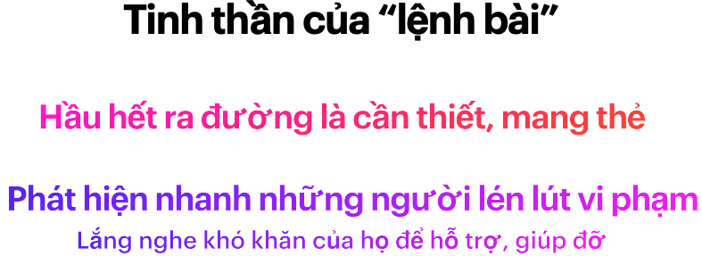
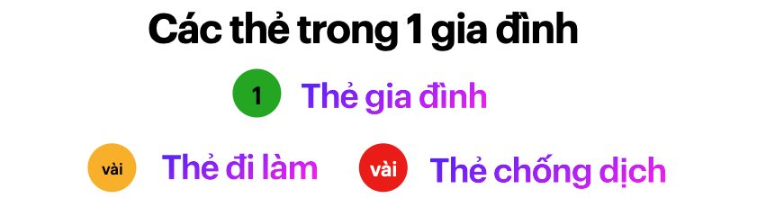

# Lệnh bài: chống dịch và phát triển kinh tế theo khu vực
<!-- @import "[TOC]" {cmd="toc" depthFrom=2 depthTo=6 orderedList=false} -->

**Mục lục**:
<!-- code_chunk_output -->
 
- [Hệ miễn dịch của cơ thể](#hệ-miễn-dịch-của-cơ-thể)
- [Hệ miễn dịch quốc gia](#hệ-miễn-dịch-quốc-gia)
- [Thế nào là "hệ thống lệnh bài".](#thế-nào-là-hệ-thống-lệnh-bài)
  - [Biểu tượng của sự tuân thủ](#biểu-tượng-của-sự-tuân-thủ)
  - [Giám sát chéo](#giám-sát-chéo)
- [Thực hiện "Mục tiêu kép" của chính phủ](#thực-hiện-mục-tiêu-kép-của-chính-phủ)
- [Nhiệm vụ 1: Chia vùng dịch thành các khu vực (Phường/Xã) liền kề](#nhiệm-vụ-1-chia-vùng-dịch-thành-các-khu-vực-phườngxã-liền-kề)
  - [Hạn chế ra ngoài mua nhu yếu phẩm](#hạn-chế-ra-ngoài-mua-nhu-yếu-phẩm)
  - [Giới hạn hoạt động của người dân bên trong khu vực](#giới-hạn-hoạt-động-của-người-dân-bên-trong-khu-vực)
  - [Giám sát việc di chuyển ra, vào ngoài khu vực](#giám-sát-việc-di-chuyển-ra-vào-ngoài-khu-vực)
- [Nhiệm vụ  2. Huy động mọi người bên trong khu vực  cùng tham gia chống dịch](#nhiệm-vụ-2-huy-động-mọi-người-bên-trong-khu-vực-cùng-tham-gia-chống-dịch)
  - [Hệ thống liên lạc đa chiều](#hệ-thống-liên-lạc-đa-chiều)
  - [Huy động mọi nguồn lực](#huy-động-mọi-nguồn-lực)
  - [Đối tượng lẩn tránh, thiếu trách nhiệm, tiêu cực](#đối-tượng-lẩn-tránh-thiếu-trách-nhiệm-tiêu-cực)
- [Nhiệm vụ 3: Hệ thống cảnh báo, kiềm soát Covid bùng phát theo khu vực .](#nhiệm-vụ-3-hệ-thống-cảnh-báo-kiềm-soát-covid-bùng-phát-theo-khu-vực)
  - [Tại sao cần hệ thống này?](#tại-sao-cần-hệ-thống-này)
  - [Hệ thống này có khả thi để đối phó Covid ko?](#hệ-thống-này-có-khả-thi-để-đối-phó-covid-ko)
  - [Mở rộng số lượng Thẻ theo nhu cầu hoạt động.](#mở-rộng-số-lượng-thẻ-theo-nhu-cầu-hoạt-động)
  - [Cảnh báo sớm theo màu của thẻ.](#cảnh-báo-sớm-theo-màu-của-thẻ)
  - [Quy hoạch các hoạt động bên trong khu vực](#quy-hoạch-các-hoạt-động-bên-trong-khu-vực)
- [Tổng kết](#tổng-kết)
  - [Triển khai thực tế](#triển-khai-thực-tế)
  - [Góp ý, liên hệ:](#góp-ý-liên-hệ)

<!-- /code_chunk_output -->

**Lời ngỏ**

Đề xuất này khá dài, và không nhiều người đủ kiên nhẫn đọc từ trên xuống dưới và hiểu nội dung từng mục. 

Nếu các anh chị quan tâm tới giải pháp cho tình huống kiểm soát dịch trong vùng chỉ thị 16 hoặc hơn, hãy đọc phần [Triển khai thực tế](http://baotnq.qrcare.vn/trienkhai.html). Có thể bắt đầu áp dụng sau **vài ngày, và sẽ kiểm soát dịch trong 2,3 tuần.**

Nhưng nếu đủ kiên nhẫn, và bình tĩnh đọc từ trên xuống dưới, sẽ nhận ra nhiều điều lớn hơn, không chỉ cho hiện tại mà nhiều năm trong tương lai. 

Để bắt đầu tìm hiểu, hãy liên tưởng tới khái niệm cơ bản sau: 
### Hệ miễn dịch của cơ thể

Chúng ta đều biết, một cơ thể có hệ miễn dịch tốt sẽ nhanh chóng phát hiện xâm nhập, phát tín hiệu để đội quân bạch cầu tập trung tiêu diệt, trước khi virus kịp làm cơ thể thương tật hoặc ngưng hoạt động vĩnh viễn (chết).

Hiện tại hệ miễn dịch của mỗi người khá chậm chạp trong việc nhận biết Covid. Vì vậy, cần tiêm vacxin để hệ miễn dịch được luyện tập, tăng khả năng phát hiện. Đồng thời cơ thể cũng cần luyện tập thường xuyên tăng cường sức mạnh của đội quân bạch cầu. 

Tuy nhiên, với một cơ thể khoẻ mạnh, ngay cả không tiêm vacxin, đa số trường hợp hệ miễn dịch vẫn đủ sức chiến thắng covid với tỉ lệ trên 90%. 

Nhưng trên phương diện một cộng đồng, một quốc gia, tỉ lệ bị đảo ngược lại, với các quốc gia bị xâm nhập, trên 90% là thất bại trong việc ngăn chặn, kiểm soát covid. 

### Hệ miễn dịch quốc gia 

Nếu xem quốc gia là một cơ thể sống, thì "hệ miễn dịch quốc gia" chính là khả năng chiến đấu, đẩy lùi covid ra khỏi quốc gia đó. 

Trong cơ thể sống này, mỗi gia đình xem như là tế bào, những người đi làm là hồng cầu, và đội ngũ chống dịch (đội lấy mẫu, xét nghiệm, chính quyền địa phương) là đội quân bạch cầu, chính phủ sẽ là bộ não và nền kinh tế là sức khoẻ của cơ thể này. 

Khi hình dung như trên, thì việc hầu hết các quốc gia thất bại trong cuộc chiến với covid là khá hợp lý, vì các quốc gia này đều thiếu các yếu tố then chốt của một hệ miễn dịch hiệu quả.

1. **Thiếu cơ chế cảnh báo sớm**: khi đã phát hiện thì dịch đã lây lan, ăn sâu vào cộng đồng bên trong. 

3. **Cơ thể suy kiệt**: giãn cách kéo dài, hạn chế di chuyển, tụ tập trên diện rộng, làm ngưng trệ nền kinh tế, khiến cho sức đề kháng càng giảm đi.

4. **Thiếu cơ chế hạn chế lây lan, kiểm soát bùng phát**: làm tổn hại tới cơ quan quan trọng nhất là hệ thống y tế cộng đồng. 

2. **Việc tập trung tiêu diệt chưa hiệu quả**: thiếu cơ chế điều khiển linh hoạt, chưa phát huy mọi nguồn lực đang có, và bỏ sót kẻ thù. 

Việc tiêm vacxin toàn dân, giải pháp mà tới lúc này, chưa quốc gia nào dám khẳng định là hiệu quả đối với biến thể Delta, và các biến thể khác trong tương lai, có thể xem là hi vọng duy nhất trong việc xây dựng miễn dịch cộng đồng (là một hệ miễn dịch cuả quốc gia đủ mạnh để chống covid). 

Nhưng còn có cách khác để cải thiện hệ miễn dịch quốc gia. Đó là nâng cao đồng thời 4 yếu tố nêu trên bằng "hệ thống lệnh bài", một liều vacxin để tạo kháng thể covid cho hệ miễn dịch cuả quốc gia. 

**Ý tưởng để phát triển "hệ thống lệnh bài"**:

- Xem mỗi Phường / Xã trong quốc gia là một cơ thể. 
- Khi nhiễm bệnh, để cơ thể nghỉ ngơi, tập trung truy quét covid. Khi tạm khoẻ, để cơ thể vận động từ từ, giải toả tâm lý và phát triển kinh tế cục bộ và phối hợp các cơ thể khác xung quanh. 
- Cần trang bị "khẩu trang", cơ chế hạn chế xâm nhập cho mỗi cơ thể, luyện tập khả năng phát hiện nguy cơ thường xuyên, ngay cả khi đã khỏi bệnh. 
- Một hệ thống cảnh báo sớm, phát tín hiệu để mọi người tăng cường đeo khẩu trang. Chia thành 2 đội: khoẻ mạnh thì hỗ trợ cô lập, dập dịch, đội yếu thì không cho tiếp xúc.

Với ý tưởng này, Việt nam sẽ là ngôi nhà của trên 10,000 cơ thể này. Và để bắt đầu, chúng ta cần tìm hiểu
### Thế nào là "hệ thống lệnh bài". 

"Lệnh bài" là **1 tấm thẻ đơn giản, yêu cầu mọi người ra ngoài, di chuyển hay làm việc, phải đeo nó.**

Khi triển khai tấm thẻ này lên toàn hệ thống sẽ phân chia vùng dịch thành các khu vực lân cận nhau. Trong đó hầu hết hoạt động di chuyển, mua bán và cả làm việc sẽ hạn chế bên trong khu vực này. 

Quan trọng hơn, việc giới hạn hoạt động bên trong khu vực sẽ dần dần một cách "vô thức", không phụ thuộc vào tinh thần tự giác của từng người. 
Tỉ lệ cố ý vi phạm, ra khỏi khu vực không có lý do sẽ ít đi nhiều, và dễ dàng bị phát hiện, xử phạt, càng khiến cho số lượng vi phạm dần về 0. 

#### Biểu tượng của sự tuân thủ

Khẩu trang là 1 biểu tượng về sự tuân thủ nơi công cộng. Chúng ta dễ dàng sử dụng khẩu trang, và dễ nhận biết gười không đeo khẩu trang, đeo không đúng cách, hoặc lúc đeo lúc không khi ra ngoài hay tụ tập nơi công cộng.

Lệnh bài cũng là 1 biểu tượng của sự tuân thủ khi ra ngoài. Hơn nữa, còn thể hiện sự đồng lòng, sẵn sàng tham gia chống dịch của người mang thẻ.

**Lệnh** trong lệnh bài, là mệnh lệnh trong quân đội, bắt buộc mọi đối tượng tiếp nhận phải thực hiện giống nhau. Đối tượng không chỉ là người đeo thẻ, mà còn là các bên khác như cấp thẻ (chính quyền địa phương), phục vụ thẻ (doanh nghiệp), và kiểm tra thẻ (công an).

Để thực hiện được điều này, cần 1 cấu trúc cân bằng, đơn giản lên tấm thẻ, và triển khai toàn hệ thống. Cấu trúc này cho phép giám sát chéo giữa các đối tượng. 

Ví dụ: *"mọi gia đình trong tp Hồ Chí mình cần được cấp 1 Thẻ gia đình trong vòng 5 ngày"* là 1 mệnh lệnh gửi tới tất cả các Phường / Xã. 

**Làm thế nào để bảo đảm mệnh lệnh này được thực hiện đúng với hơn 300 Phường / xã ở HCM**?

Ta sử dụng 1 mệnh lệnh khác để kiểm soát chéo. Đó là thông báo với mọi người rằng "từ ngày ..., toàn bộ siêu thị, chợ chỉ bán hàng cho người có Thẻ gia đình. *Gia đình nào chưa nhận được thẻ, cần liên hệ với Phường / xã đang sống. Nếu gặp trở ngại thì gọi tới số hotline để hỗ trợ,..."*

Và **làm sao để bảo đảm, siêu thị, chợ chỉ bán hàng cho người có Thẻ gia đình?**

Dùng 1 lệnh khác, *"mọi đơn hàng phải có thêm ID của thẻ gia đình"*. Nếu phát hiện thiếu ID, sẽ bị xử phạt nghiêm. Tất nhiên còn nhiều cách khác nữa.

Thiết kế một cấu trúc cân bằng, đơn giản cho "lệnh bài" điều không hề đơn giản, cần có kiến thức và lĩnh hội sâu về [tư duy, ngôn ngữ hệ thống](https://vietnambiz.vn/nguyen-li-thu-nam-the-fifth-discipline-la-gi-cac-nguyen-tac-chinh-20191214001907077.htm). 

Cấu trúc này cần bảo đảm đầy đủ các yếu tố then chốt sau: 

1. **Tính hệ thống: mọi người đều sử dụng được**
    - Người già, người không biết tiếng việt, không có smartphone,...
    - nhân viên giữ xe, quản lý chợ, tiểu thương có thể sử dụng được.

2. **Tính nhận diện: nhanh chóng, từ xa bởi con người và thiết bị**: 
    - nhìn từ xa qua dây đeo, phân biệt bởi màu sắc, thông tin ở mặt trước, và cả mặt sau.
    - không chỉ công an, dân phòng, mà cả người dâu đều có thể phân biệt được.
    - Với thiết bị (smartphone, thiết bị checkpoint), quét thẻ để hiện thông tin, hoặc có âm thanh cảnh báo.

3. **Tính duy nhất: toàn vẹn, không chấp nhận nhân bản, sao chép** 
    - ID duy nhất, thẻ vật lý, không chấp nhận photo, hình ảnh trên điện thoại, thiếu con dấu hoặc có dấu hiệu làm giả,...
    - khoá thẻ từ xa qua ID, có địa chỉ để xử lý tình trạng cho mượn thẻ, 
    - giám sát số lượng hoạt động theo Phường, ... 

4. **Tốc độ triển khai: nhanh, đồng loạt tới mọi khu vực, mọi người**
    - phát hành tập trung, in ấn hoặc xuất file pdf gửi online.
    - địa phương xác nhận và cấp cho từng đối tượng 

5. **lưu trữ lịch sử**: trên thẻ và trên hệ thống để tra cứu theo ID
    - các lần bị kiểm tra bởi công an, cán bộ phường, ....
    - các lần mua hàng bởi quản lý chợ, siêu thị 
    - kết hợp nhiều cách lưu trữ để mang lại hiệu quả: ghi trên thẻ và lưu vào  theo ID

5. **Tính kết nối: với hệ thống chung để tối ưu hiệu quả, nhưng cho phép bổ sung trong tương lai**
    - tìm kiếm thông tin theo ID trên hệ thống
    - qrcode để mở rộng tính năng quản lý giám sát trong tương lai. 

Có thể thấy, khẩu trang là  1 cấu trúc có 4 yếu tố đầu tiên. Điều này khiến cho hệ thống khẩu trang rất hiệu quả trong việc chống dịch: hạn chế lây nhiễm covid và nhận biết người tuân thủ. 

Và đây là thiết kế cho Thẻ Gia đình, 1 loại "lệnh bài" dành cho gia đình

Các phần quan trọng, giúp có được 5 yếu tố trên 

- **ID (1000010001)**: duy nhất và sinh ra bởi hệ thống tập trung.  
- **Phường xã đang sống**, cố định, và liên quan tới 6 số đầu của ID

- **Phần đóng dấu của Phường/ xã** để phục vụ cho việc triển khai nhanh chóng, cũng như dễ dàng nhận biết thật giả.
- **Ngày mua hàng**: check vào để lưu ngày mua, giúp kiểm soát việc ra ngoài nhiều lần mua hàng. triển khai nhanh chóng, bổ sung hệ thống sau này dễ dàng. 
- **mã QRCode** là phần để kết nối với hệ thống, dễ dàng mở rộng sau. 

Chi tiết tham khảo thêm [Triển khai Thẻ Gia đình](https://baotnq.qrcare.vn/trienkhai.html#triển-khai-thẻ-gia-đình)

Hệ thống lệnh bài có yếu tố quan trọng như sau, lấy ví dụ về Thẻ gia đình, 1 loại trong lệnh bài

- **Các bên có thể tương tác**: người dân, chính quyền địa phương, doanh nghiệp, công an và Ban chỉ đạo chống dịch.

- cơ chế giám sát chéo
#### Giám sát chéo
Cơ chế giám sát đan xen, hạn chế tối đa khe hở vi phạm, thiếu trách nhiệm. 

Hướng dẫn chi tiết, bao gồm luôn cách giám sát, kèm các chế tài xử lý vi phạm rõ ràng sẽ giúp mọi bên tự động tuân thủ. Bỏ qua các suy nghĩ tiêu cực: **tìm cách vi phạm và tin rằng sẽ không bị phát hiện**

Một số trường hợp đặc biệt, sẽ có tài khoản sử dụng trên **MobileApp** riêng. Phần công nghệ này có thể bổ sung sau.

Với cơ chế giám sát chéo và hệ thống tập trung, Thẻ gia đình giải quyết nhiều hạn chế của các giải pháp đang có.
Tham khảo thêm [Bất cập của phiếu ra đường, thẻ đi chợ](https://baotnq.qrcare.vn/trienkhai.html#bất-cập-của-phiếu-ra-đường-thẻ-đi-chợ)

Ngoài ra, còn có các "lệnh bài" dành cho cá nhân, dành cho các các nhân có nguy cơ cao, như di chuyển làm việc thường xuyên, hoặc tham gia chống dịch. Chi tiết xem [Lệnh bài cho cá nhân](https://baotnq.qrcare.vn/trienkhai.html#lệnh-bài-cho-cá-nhân)

### Thực hiện "Mục tiêu kép" của chính phủ 

Sau 1 thời gian triển khai, vùng dịch có thể thực hiện **mục tiêu kép** chống dịch và phát triển kinh tế

- **Tập trung chống dịch khu vực nguy cơ cao** : khoanh vùng chặt chẽ,  xét nghiệm toàn bộ liên tục để tách hết F0 để chuyển thành vùng an toàn. 

- **Giảm bớt giãn cách để phát triển kinh tế bên trong khu vực an toàn**: cho phép mở lại nhiều hoạt động hơn bên trong, và vẫn duy trì xét nghiệm 

- **Hệ thống cảnh báo sớm** Xét nghiệm theo từng nhóm nguy cơ cao, để nhanh chóng phát hiện, để hạn chế dịch bùng phát trong tương lai. 

Để thực hiện được mục tiêu trên, chúng ta cần vận dụng "hệ thống lệnh bài" để thực hiện 3 nhiệm vụ chính như sau: 
### Nhiệm vụ 1: Chia vùng dịch thành các khu vực (Phường/Xã) liền kề

#### Hạn chế ra ngoài mua nhu yếu phẩm 

Thẻ gia đình sẽ bảo đảm ra mỗi gia đình chỉ có 1 người ra ngoài mua nhu yếu phẩm. 

Với lệnh, **người bán ghi nhận ngày mua hàng ở mặt sau tấm thẻ**, sẽ giúp phát hiện dễ dàng việc cố tình ra ngoài nhiều lần mà không mua hàng. 

Với lệnh: **chỉ bán cho người có thẻ, không vượt giới hạn mua theo ngày**, giúp loại bỏ nhu cầu ra ngoài mua hàng không cần thiết. 

Đồng thời, **yêu cầu bên bán đưa ra các ưu đãi mua hàng tại nhà**, sẽ hạn chế nhu cầu ra ngoài mua hàng. 

Kết hợp lại, sẽ tạo ra một lệnh mạnh mẽ, phân biệt nhanh người cố tình vi phạm. Bản thân mỗi người cũng biết điều này, khiến họ "vô thức" hạn chế ra đường. 

Hạn chế được mọi người dân ra đường theo tinh thần của chỉ thị 16, giúp việc áp dụng các bước sau nhanh chóng, ít bị phản kháng.
#### Giới hạn hoạt động của người dân bên trong khu vực  

Ra lệnh bên bán **không phục vụ cư dân ngoài khu vực cụ thể**, cũng như thông báo về cơ chế xử phạt nếu bị phát hiện, sẽ "vô thức" hạn chế việc di chuyển ra ngoài khu  vực của người dân

Tỉ lệ vi phạm sẽ giảm hơn nhiều và dễ bị phát hiện, khiến số lượng ngày càng giảm 

Việc giới hạn một cách tự nhiên cho mọi người mang thẻ dựa trên một lý thuyết là "cấu trúc ảnh hưởng tới hành vi của mọi đối tượng bên trong" và số lượng vi phạm ngày càng giảm là một tiến trình tăng cường theo thời gian. Tham khảo hai phần này trong cuốn [Nguyên lý thứ 5](https://vietnambiz.vn/nguyen-li-thu-nam-the-fifth-discipline-la-gi-cac-nguyen-tac-chinh-20191214001907077.htm) 

#### Giám sát việc di chuyển ra, vào ngoài khu vực 
> giống như đeo khẩu trang cho cơ chể, đã nêu ở trên. 

Thẻ đi làm dành cho giao hàng, nhân viên đi làm ra khỏi hay vào khu vực,... giúp cho việc giám sát trở nên dễ dàng.
Yêu cầu tới đường giáp ranh, **khai báo tự nguyện bằng cách quét thẻ tại các điểm Checkpoint** 

Dựa vào đó dễ dàng phân biệt các cá nhân không có Thẻ, hoặc chỉ có Thẻ gia đình. 

Khi cần tăng mức độ kiểm soát ra ngoài khu vực, bổ sung thêm công an, dân phòng tại các điểm Checkpoint và yêu cầu tất cả tuân thủ như khai báo y tế, xét nghiệm, hoặc cách ly,...

Kết quả của việc đồng thời thực hiện các việc trên, giúp phân chia vùng dịch thành những khu vực hoạt động nội bộ, việc đi lại giữa hai khu vực liền kề được giám sát. Hình thành mạng lưới khu vực liền kề, giống **ruộng bậc thang** hạn chế việc lây lan của covid đi xa một cách hiệu quả. 

Hạn chế và khoanh vùng lây lan theo ruộng bậc thang, giúp nguồn lực được tập trung, sử dụng hiệu quả với hệ thống lệnh bài để 
có thể thực hiện nhiệm vụ tiếp theo.
### Nhiệm vụ  2. Huy động mọi người bên trong khu vực  cùng tham gia chống dịch

Muốn chống dịch hiệu quả, bên cạnh tinh thần tự giác, cần mọi người cùng phối hợp, tuân thủ những yêu cầu đưa ra. 
#### Hệ thống liên lạc đa chiều

giữa Bộ chỉ huy và mọi đối tượng: người dân, doanh nghiệp địa phương, cán bộ địa phương, và đội ngũ y tế dùng chung. Có nhiều cơ chế liên lạc tuỳ tình hình

- Ra lệnh tổng quát, từ xa: thông qua báo chí truyền hình, ...
- Giải thích lệnh theo từng khu vực, Phường / xã nhỏ hơn:
- hướng dẫn trực tiếp tại từng nhà bởi các bộ địa phương
- đôn đốc cán bộ địa phương bám sát mọi gia đình, hạn chế bỏ sót 
- người dân nhắc nhở, hướng dẫn nhau về cách thực hiện. 
- Các cá nhân mang thẻ, gửi dữ liệu thực tế về Bộ chỉ huy khi có yêu cầu hoặc tự giác thực hiện. 

Tăng cường mở rộng, kết hợp nhiều công nghệ: thiết bị tự động, phân tích dữ liệu để tối ưu tổ chức, mô hình dự đoán xu hướng dịch bệnh,... giúp nâng cao năng lực, hiệu quả của hệ thống lệnh bài. 

#### Huy động mọi nguồn lực
Với hệ thống liên lạc mạnh mẽ, nhiều kênh này, sẽ huy động được nguồn lực của cộng đồng

- **Người dân** Sự hợp tác, tuân thủ của mọi gia đình
- **Nguồn lực địa phương**: cán bộ địa phương, tình nguyện viên và cả doanh nghiệp địa phương 
- **Nguồn lực tập trung** được điều phối khoa học, tối ưu và cải thiện theo thời gian. 

Khi việc chống dịch diễn ra thường xuyên: như xét nghiệm tập trung, định kỳ, tiêm vacxin theo đợt,... Hệ thống lệnh bài cũng giúp tạo ra thói quen cho mọi người, như : đến đúng nơi, đúng giờ, di chuyển trật tự,... Thói quen này chính là nguồn sức mạnh vô cùng lớn để chống dịch hiệu quả. 

#### Đối tượng lẩn tránh, thiếu trách nhiệm, tiêu cực 

Ngoài ra, Hệ thống lệnh bài còn giúp lọc ra các đối tượng "lẩn tránh, bỏ sót, và chểnh mảng":
- các gia đình không tham gia theo lệnh
- các gia đình, cá nhân bị bỏ sót, chưa được cấp thẻ.
- các địa phương có cán bộ, đội ngũ chểnh mảng, thiếu trách nhiệm trong chống dịch. 
- các địa phương có tiêu cực trong cấp thẻ, dấu số liệu, ...

Đây là những nguy cơ cao, không chỉ lây lan mà còn tạo nguy cơ bùng phát âm thầm, gây nguy hại rất lớn.

Khi dịch bệnh được kiềm chế trong một khu vực, và cho phép hoạt động lại các hoạt động phát triển kinh tế nội khu, thì nguy cơ xâm nhập từ bên ngoài vẫn thường trực. Hệ thống Lệnh bài lúc này đóng vai trò cảnh báo sớm, đồng loạt kích hoạt các biện phát kiềm chế. Đó là nhiệm vụ thứ 3.

### Nhiệm vụ 3: Hệ thống cảnh báo, kiềm soát Covid bùng phát theo khu vực . 

#### Tại sao cần hệ thống này? 

Covid là một cấu trúc mạnh mẽ, tăng cường lây lan dựa trên hệ thống di chuyển phức tạp của xã hội loài người. Mà việc di chuyển của mọi người là xương sống của nền kinh tế của loài người. 

Có 2 chiến lược chính để đối kháng nguy cơ của Covid:

- Chiến lược chữa trị: giảm thiệt hại kinh tế bằng hạn chế tương đối, cho phép Covid lây lan, tiêm chủng để hạn chế tổn thất nhân mạng và giữ cho hệ thống y tế kịp đáp ứng. 
- Chiến lược phòng bệnh: chấp nhận thiệt hại kinh tế, kiểm soát đi lại, và quét nguy cơ ra khỏi cộng đồng. 

Hiện tại chiến lược phòng bệnh đang gặp nhiều khó khăn tại nhiều nước từng thành công trong 2020, nhưng không có nghĩa là chiến lược phòng bệnh không kháng cự được với dịch Covid, chỉ là chúng ta chưa tìm ra, và áp dụng đủ sớm thôi. 

"Hệ thống lệnh bài" là một công cụ mạnh mẽ để thực hiện chiến lược phòng bệnh như trên.

####  Hệ thống này có khả thi để đối phó Covid ko? 

Chống lại 1 cấu trúc hệ thống mạnh mẽ như Dịch Covid, cần phải đưa ra 1 cấu trúc hệ thống đối kháng mạnh, cho phép nâng cấp, tăng cường khả năng đối kháng trong tương lai. 

Khi hiểu rõ hơn về cấu trúc covid, chúng ta sẽ tìm ra nhiều cấu trúc hệ thống đối kháng tương ứng.

- Hệ thống lệnh bài là dựa trên ý tưởng **"ruộng bậc thang hạn chế rò rỉ nước"** khoanh vùng khu vực, tạo thành dạng ruộng bậc thang nguy cơ để hạn chế lay lan.

Và khi phát hiện 1 khu vực có nguy cơ, nhanh chóng kích hoạt "lệnh bài" trong toàn hệ thống để tăng cường cảnh giác. 

Nếu mọi người đều quen với hệ thống này, thì việc kích hoạt có thể triển khai trong 1 ngày. So với "khả năng lây sau 2-3 ngày" và đó là tốc độ đủ để kiềm soát covid. 

#### Mở rộng số lượng Thẻ theo nhu cầu hoạt động. 

Khi dịch bệnh được kiểm soát trong 1 khu vực (hoặc tỉnh / tp), 1 gia đình sẽ có các các thẻ.

- Giữ nguyên cấu trúc: 1 Thẻ gia đình và duy trì chính sách bán hàng theo gia đình. 

- Bổ sung Thẻ đi làm: khi mở rộng hoạt động kinh tế, các doanh nghiệp nội khu vực sẽ đăng ký Thẻ đi làm và cấp cho từng hộ gia đình. 

- Thêm Thẻ chống dịch cho người dân muốn tham gia: 

#### Cảnh báo sớm theo màu của thẻ.

**Màu đỏ (Thẻ chống dịch)**: nguy cơ bị lây, và lây lan cao nhất

- cần chú ý các tình nguyện viên: ít được tiêm vacxin, kỹ năng hạn chế bị lây thấp
- ưu tiên vacxin và liên tục xét nghiệm: 1,2 ngày / 1 lần

**Màu vàng (Thẻ đi làm)**: chia thành 2 nhóm
- đi làm ngoài khu vực sinh sống: nhất là giao hàng liên tỉnh, lái xe đường dài cần thường xuyên xét nghiệm: 2,3 lần ngày / 1 lần. 

- đi làm trong cùng khu vực sinh sống: rủi ro thấp hơn: 4,5 ngày / 1 lần

**Màu xanh (thẻ gia đình)**: 

Việc xét nghiệm theo nhóm thẻ giúp tối ưu nguồn lực xét nghiệm nhưng vẫn giữ được tính cảnh báo sớm Covid trong khu vực. 

#### Quy hoạch các hoạt động bên trong khu vực

- Các dịch vụ cho người dân bên trong khu vực: công viên, trường học, khu vui chơi ngoài trời,... cần tuân theo các tiêu chuẩn phòng và giám sát dịch trước khi hoạt động
- Ưu tiên cho các doanh nghiệp sắp xếp đội ngũ nhân viên, bố trí nơi ở và làm việc bên trong 1 khu vực. 

tham khảo thêm : 

- [Hỗ trợ các gia đình khó khăn](https://baotnq.qrcare.vn/trienkhai.html#hỗ-trợ-các-gia-đình-khó-khăn)

- [Tổ chức dịch vụ nội khu](https://baotnq.qrcare.vn/trienkhai.html#tổ-chức-dịch-vụ-nội-khu)
### Tổng kết 

Trên đây là những điểm chính, quan trọng của đề xuất. Có nhiều vấn đề rất khó thể diễn đạt bằng giấy, như vòng tròn tiến trình tăng cường, cân bằng trong tương tác. Đây là những khái niệm của một ngôn ngữ riêng, cần nhận biết bởi tư duy hệ thống và trao đổi trực tiếp.

Nếu mọi người quan tâm tới giải pháp chi tiết, 

#### Triển khai thực tế

- xem link [Triển khai thực tế](http://baotnq.qrcare.vn/trienkhai.html)

#### Góp ý, liên hệ:

Cảm ơn đã dành thời gian đọc tới đây. 

Và mong bạn gửi đề xuất này đến Ban chỉ đạo chống dịch, hoặc các lãnh đạo của Chính phủ. 

Mọi góp ý gửi về **quocbao.tn@gmail.com** 
hoặc gọi điện tới số: **076 784 7421**

 

