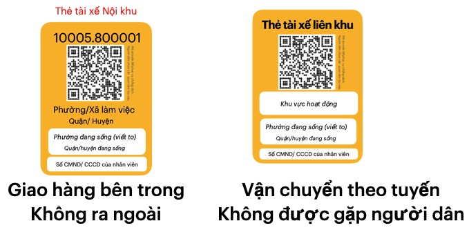

<!-- @import "[TOC]" {cmd="toc" depthFrom=1 depthTo=3 orderedList=false} -->

<!-- code_chunk_output -->

- [Hệ thống Thẻ Lệnh](#hệ-thống-thẻ-lệnh)
  - [Vấn đề: thiếu số liệu di chuyển của mọi người](#vấn-đề-thiếu-số-liệu-di-chuyển-của-mọi-người)
  - [Cấp Thẻ cho các đối tượng được phép ra ngoài.](#cấp-thẻ-cho-các-đối-tượng-được-phép-ra-ngoài)
  - [Thu thập số liệu thực tế bằng quét Thẻ](#thu-thập-số-liệu-thực-tế-bằng-quét-thẻ)
  - [Điều chỉnh hành vi bằng Lệnh](#điều-chỉnh-hành-vi-bằng-lệnh)
  - [Tăng tuân thủ, giảm vi phạm bằng Hệ thống Thẻ Lệnh](#tăng-tuân-thủ-giảm-vi-phạm-bằng-hệ-thống-thẻ-lệnh)
  - [Lấy mẫu xét nghiệm hiệu quả an toàn](#lấy-mẫu-xét-nghiệm-hiệu-quả-an-toàn)
  - [Hỗ trợ đúng đối tượng khó khăn](#hỗ-trợ-đúng-đối-tượng-khó-khăn)
  - [Shipper nội khu: công việc cho người dân mất thu nhập](#shipper-nội-khu-công-việc-cho-người-dân-mất-thu-nhập)
  - [Phát triển kinh tế trong Phường/Xã an toàn.](#phát-triển-kinh-tế-trong-phườngxã-an-toàn)

<!-- /code_chunk_output -->

## Hệ thống Thẻ Lệnh

### Vấn đề: thiếu số liệu di chuyển của mọi người 

Hiện tại có nhiều biện pháp hành chánh đang được triển khai để hạn chế hoạt động của người dân theo Chỉ thị 16 của chính phủ. Nổi bật là Phiếu mua hàng để hạn chế ra ngoài mua hàng và Giấy đi đường để cấp phép cho việc di chuyển để làm việc. 

#### Phiếu mua hàng 

Mỗi địa phương có phiếu mua hàng khác nhau, nhưng cách làm thì không khác nhau nhiều. Sau nhiều lần cải tiến, Tp Hồ Chí Minh đang áp dụng mẫu Phiếu bên dưới. 

Người dân phải điền nhiều thông tin vào Phiếu mua hàng, khiến việc số hoá cho 1 phiếu tốn nhiều thời gian. Chưa kể 1 phiếu sử dụng được 1,2 lần trong 6 ngày, khiến mỗi Phường/Xã thường xuyên in và phát, rất khó để thống kê tổng số bao nhiêu phiếu đã phát. 

Việc số hoá tất cả các phiếu này là tốn rất nhiều nhân lực, và không một siêu thị, chợ nào có thể thực hiện mỗi ngày.

Điều này khiến cho số liệu thực tế về hoạt động mua hàng gần như không có. Hoặc nếu có cũng với số lượng nhỏ so với thực tế. 

#### Giấy đi đường

Thời gian đầu, giấy đi đường là do Đơn vị chủ quản tự cấp cho nhân viên. Sau vài lần điều chỉnh, việc cấp Giấy đi đường sẽ do Phường/Xã thực hiện, và đây là 1 mẫu mới nhất mà Tp Hà Nội đang áp dụng 

Giấy đi đường cũng có rất nhiều thông tin phải nhập. 
Trên giấy không có QRCode, ID riêng, khiến các chốt kiểm tra **không thể thu thập danh sách người ra chốt mỗi ngày**.

Để khắc phục việc không thể thu thập dữ liệu từ Phiếu mua hàng hay Giấy đi đường ở trên, nhiều biện pháp khác được bổ sung để người dân tự nguyện khai báo.

#### Khai báo tại chốt kiểm tra, siêu thị, chợ  

Các giải pháp khác như "Di biến động dân cư", Tờ khai Y tế trên ứng dụng NCovi, Bluezone tốn khá nhiều thời gian để thực hiện. 
Khiến gây tắc nghẽn khi kiểm tra tại chốt. 
Việc triển khai cũng có giới hạn tại một số chốt liên quận, khiến dữ liệu thu thập chỉ là 1 phần nhỏ của di chuyển thực tế. 

Chưa kể người dân chỉ khai báo khi có nhu cầu "thông chốt", hoặc vào vào mua hàng ở các siêu thị lớn. Khiến việc này không có nhiều ý nghĩa. 

Tóm lại, các biện pháp đang áp dụng khiến mọi người tốn rất nhiều thời gian để điền thông tin, để khai báo nhưng số liệu quan trọng cho việc phòng chống dịch bệnh gần như không có.

Điều này khiến Chính quyền không biết được 
1. Số lượng người **được phép** ra ngoài, theo từng Phường/Xã, Quận/Huyện hoặc cả Thành phố? 
2. Những người này **đã tới** những địa điểm, vào lúc nào mỗi ngày? 

Chưa trả lời được 2 câu hỏi, Chính quyền sẽ khó đánh giá được hiệu quả thực tế của các biện pháp đã thực hiện, cũng như đưa ra các kế hoạch chống dịch hợp lý trong tương lai. 

Chúng ta cần một giải pháp khả thi để tìm câu trả lời, đó là cấp thẻ cho mọi cá nhân được phép ra ngoài và thu thập dữ liệu di chuyển của các Thẻ này. 

### Cấp Thẻ cho các đối tượng được phép ra ngoài. 

Thẻ là 1 tấm giấy, kích thước bằng thẻ ngân hàng, kèm theo dây để đeo cổ. Nên dùng giấy (thay vì nhựa) để làm thẻ để in ấn dễ dàng và tiết kiệm chi phí.  

Có 3 loại thẻ chính cho 3 nhu cầu: ra ngoài mua hàng, làm việc hay tham gia chống dịch.

**Thẻ gia đình** (màu xanh)
- Phường/Xã cấp cho mỗi gia đình 1 Thẻ.
- Dùng để mua nhu yếu phẩm, thay cho Phiếu mua hàng, và không giới hạn số lần sử dụng. 
- Gia đình ở đây là hộ gia đình, nhà trọ, phòng trọ,... như nội dung "Gia đình cách ly với gia đình" của chỉ thị 16 

**Thẻ làm việc** (màu vàng)
- Dành cho cá nhân ra ngoài làm việc như : đi làm tại nhà máy, doanh nghiệp, bán hàng tại siêu thị, chợ hay giao hàng, vận chuyển hàng hoá 
- Chia thành Thẻ đi làm (cố định), Thẻ Giao hàng (nội khu vực) và Thẻ Vận chuyển (liên khu vực)
- Địa phương nơi làm việc sẽ cấp thẻ cho Đơn vị chủ quản. Đơn vị sẽ cấp cho nhân viên theo danh sách đã đăng ký. 

**Thẻ chống dịch** (màu đỏ)
- Dành cho cá nhân tham gia chống dịch như: cán bộ địa phương, công an dân phòng, đội ngũ y tế, tình nguyện viên, nhà báo,...

- Chính quyền cấp Thẻ cho các đơn vị chống dịch. Các đơn vị này sẽ cấp cho cá nhân tham gia chống dịch.

Đặc điểm chung của các loại Thẻ này là 
- có ID duy nhất, thuộc Phường/ Xã cấp thẻ 
- có mã QRCode để check-in nhanh chóng
- được phát hành bởi 1 hệ thống, Hệ thống Thẻ lệnh 

Phôi Thẻ là thẻ được in ra, nhưng chưa được đóng dấu. 

Với việc Địa phương cấp thẻ cho các cá nhân được phép ra ngoài, Chính quyền sẽ biết được chính xác số lượng người được phép ra ngoài theo từng Phường/Xã, Quận / Huyện hay cả Tỉnh / TP. 

### Thu thập số liệu thực tế bằng quét Thẻ 

Mọi cá nhân ra ngoài phải đeo thẻ và thực hiện quét thẻ tại các địa điểm tụ tập, hoặc chốt kiểm tra trên đường.

- Tại lối vào, ra của Chợ, siêu thị nhân viên sẽ dùng app để quẹt Thẻ gia đình, và chỉ cho phép Thẻ hợp lệ mua hàng.

- Tại các chốt kiểm tra, công an dân phòng quét thẻ của mọi cá nhân qua chốt. 
- Tại lối vào, ra của địa điểm tổ chưc lấy mẫu xét nghiệm,tiêm vacxin : quét thẻ mọi cá nhân tham gia. 

Có thể đặt nhiều Checkpoint (ID khác nhau) để người dân tự quét thẻ, giúp thu thập dữ liệu xếp hàng, di chuyển qua các điểm này. 
Các điểm tổ chức lấy mẫu xét nghiệm, hoặc các chốt đông người xếp hàng nên áp dụng cách này để phân luồng và bảo đảm 5K. 

Từ dữ liệu thực tế thu thập bằng quét thẻ, sẽ biết được hoạt động của mọi người một cách chi tiết, đầy đủ theo khu vực, và theo địa điểm, khung giờ,... như 

- Tại chốt kiểm tra, bao nhiêu người đã đi qua từ 8h-9h
- Một cá nhân (ID) đến bao nhiêu chợ, siêu thị để hoàn thành 1 lần mua hàng.
- Số lượng người đi làm tại 1 Phường xã. Ngày nào trong tuần có đông người đi làm nhất. 
- Có bao nhiêu vi phạm trong 1 phường / xã
- Có bao nhiêu nhân viên vi phạm của 1 Đơn vị

Tất cả các số liêụ trên giúp Chính quyền đánh giá được thực tế xã hội, và có các biện pháp điều chỉnh hành vi của mọi người để phục vụ chống dịch. 

### Điều chỉnh hành vi bằng Lệnh 

**Lệnh** là các quy định hành chính áp dụng cho các đối tượng liên quan tới Thẻ. Các quy định này là cụ thể hoá nội dung phòng chống dịch của chính quyền, như chỉ thị 16 của chính phủ hay chỉ thị 12 của tp HCM. 

Lệnh cũng bao gồm các quy định xử phạt khi vi phạm, để tạo tính răn đe, "mệnh lệnh" phải tuân thủ. 

Ví dụ: **"Ra ngoài phải mang thẻ. Không mang sẽ bị xử phạt từ 1-3 triệu đồng theo quy định ra ngoài không có lý do chính đáng"** là 1 Lệnh, trên nội dung quy định của chỉ thị 16.
#### Lệnh cho người dân

**Ra ngoài mua hàng**
- Phải đeo Thẻ gia đình, trình thẻ tại các chốt để check-in.
- Mua hàng theo quy định về ngày, khung giờ theo ID trên Thẻ. 
- Trường hợp ra ngoài nhưng không mua hàng (hết hàng, không muốn mua, muốn đi chơi...) chỉ được ra ngoài tối đa 2 lần / 1 ngày. 
- Vi phạm sẽ bị xử lý như ra ngoài không có lý do chính đáng. 

**Đi làm**
- Phải đeo Thẻ làm việc, Trình thẻ tại các chốt để check-in
- Di chuyển không dừng giữa 2 Phường: đang sống và làm việc. 
- Nếu dừng lại, mua bán, tiếp xúc với người khác tại Phường/Xã khác, sẽ bị xử lý. và thông báo tới Đơn vị chủ quản (doanh nghiệp, cơ quan quản lý,...) ghi trên Thẻ. 

**Tham gia chống dịch**
- Tham gia chống dịch phải mang Thẻ chống dịch 
- Trình thẻ tại các chốt để check-in
- Chỉ được đi lại theo khu vực quy định trên thẻ.
- Nếu phát hiện vi phạm, sẽ xử lý và thông báo tới Đơn vị chủ quản ghi trên Thẻ 

Không chỉ với người dân, Lệnh còn áp dụng với Siêu thị, chợ, Đơn vị chủ quản, và cả Chính quyền địa phương.

#### Lệnh cho siêu thị, chợ 
- Bán hàng cho người không mang Thẻ gia đình sẽ bị xử phạt. 
- Bán hàng cho Thẻ gia đình trong Phường/ Xã đang sống.
- Đúng ngày theo 5 khung giờ mua bên dưới 
- Đơn hàng phải có ID của Thẻ gia đình.

Xử phạt cho từng tình huống vi phạm. Khung hình phạt cao hơn nếu tỉ lệ vi phạm chiếm > 1% số đơn hàng mỗi ngày. Tiếp diễn trên 3 lần sẽ bị đình chỉ hoạt động. 

**5 khung giờ mua hàng** : dựa trên số cuối cùng từ 0 tới 9 của ID Thẻ gia đình, đây là 1 ví dụ: 
- 7h-8h30: cho (1,2)
- 9h-1030: cho (3,4)
- 11h-12h30 cho (5,6)
- 13h-14h30 cho (7,8)
- 15h-16h30 cho (9,0)
- mỗi khung giờ cách nhau 30 phút để hạn chế tụ tập 

**Giới hạn 2 ngày 1 lần mua**: 
- Dựa trên tính chẵn lẻ của ID: ID chẵn mua ngày chẵn.
- 1 cách linh động hơn: một ID không được mua hàng 2 ngày liên tiếp. 

Giới hạn 3 ngày 1 lần mua trở lên sẽ gây tâm lý tích trữ cho người dân, và cố tình vi phạm gây áp lực lên chợ, siêu thị. 

Ưu tiên **đặt hàng tại nhà theo ID** Thẻ gia đình, cho phép đặt mua mỗi ngày để hạn chế ra ngoài mua hàng. 

#### Lệnh cho Đơn vị chủ quản (Doanh nghiệp, cơ quan, ...)
- Đơn vị chủ quản chịu trách nhiệm quản lý Thẻ đi làm của nhân viên. 
- Nếu phát hiện nhân viên vi phạm, Đơn vị sẽ liên đới bị xử phạt theo quy định....
- Nếu số lượng vi phạm chiếm > 5% tổng số Thẻ đã cấp, Đơn vị sẽ bị xử phạt cao hơn theo quy định. 

#### Lệnh cho Phường / Xã
- Cấp Cho mỗi hộ gia đình, nhà trọ, phòng trọ,... 1 Thẻ gia đình. Các bộ Phường sẽ bị xử lý nếu phát hiện tiêu cực trong Cấp Thẻ
- Hàng tuần tới từng nhà dân, đôn đốc hướng dẫn chống dịch, xác nhận bằng cách quét Thẻ gia đình. Phường nào có tỉ lệ xác nhận dưới 95%, xem như thiếu trách nhiệm trong công tác phòng dịch. 

#### Lệnh cho Công an, Dân phòng
- Quét thẻ mọi cá nhân qua Chốt kiểm tra.
- Trường hợp tập trung đông tại chốt, có thể để người dân tự quét theo theo hướng dẫn sau....

Trên đây là tổng quan về các Lệnh cho vùng dịch áp dụng chỉ thị 16. Để đưa vào thực tế, cần chi tiết hơn, cũng như liên tục cải thiện các lệnh này để bao quát mọi tình huống phát sinh.

Kết hợp các Lệnh này đồng bộ, sẽ tạo cơ chế **giám sát chéo** giữa các đối tượng, khiến cho việc vi phạm rất dễ bị phát hiện.
Nhờ vậy Thẻ lệnh có tính răn đe cao, khiến mọi người dẹp bỏ các tư tưởng tiêu cực như *"cứ vi phạm xem sao, xui lắm thì mới bị  phát hiện"*

Kết hợp Thẻ Lệnh vẫn là điều kiện cần. Muốn giải pháp mang lại hiệu quả thực tế, cần triển khai một cách "Hệ thống", đồng nhất và bao phủ mọi đối tượng liên quan. 

### Tăng tuân thủ, giảm vi phạm bằng Hệ thống Thẻ Lệnh 

**Mọi đối tượng cần tuân thủ**

Người dân cần tuân thủ: đeo thẻ ra đường, tuân thủ các giới hạn mà Thẻ quy định, đưa thẻ để check-in hoặc tự check-in tại các điểm Checkpoint.

Siêu thị, chợ cần tuân thủ các Lệnh về phục vụ người dân. 

Với các địa phương: cán bộ Phường/Xã, công an dân phòng: hoàn thành tốt các nhiệm vụ mà Lệnh đưa ra chính là tuân thủ. 

Ngoài ra cần nhắc nhở hỗ trợ lẫn nhau để **cùng tuân thủ**. 
- Cán bộ hướng dẫn về các lệnh cho người dân.
- Nhân viên siêu thị, chợ hướng dẫn cho khách hàng.
- Công an, dân phòng hướng dẫn người dân tự giác check-in.

Tăng cường sự tuân thủ trong cộng đồng, là giá trị của Hệ thống Thẻ lệnh. Bên cạnh đó, việc giảm vi phạm được thực hiện bằng kiểm tra thường xuyên và dùng số liệu để phát hiện bất thường, ngăn ngừa nguy cơ.

#### Kiểm tra để phát hiện vi phạm 

- Cần kiểm tra liên tục việc ra ngoài của người dân theo từng khu phố, cụm dân cư để nhanh chóng phát hiện vi phạm.

- Cần kiểm tra định kỳ, ngẫu nhiên vào các khung giờ khác nhau tại cổng vào và cổng ra của chợ, siêu thị. 

- Cần kiểm tra các shipper di chuyển trên đường, xem đơn hàng có  ID của Thẻ gia đình không. 

Bằng cách Giám sát chéo, phát hiện **các trường hợp thiếu trách nhiệm** của cán bộ Địa Phương. 

- Ví dụ: Để biết cán bộ có thật sự tới gặp mọi gia đình trong Phường/Xã họ quản lý, hãy Lệnh họ *"dùng app quét Thẻ gia đình và gửi ID và toạ độ GPS về hệ thống"* . 
- Hệ thống sẽ tổng hợp, đối chiếu với Tổng số Thẻ đã phát để tính được tỉ lệ hoàn thành của mỗi phường/Xã. 
#### Dùng số liệu để phát hiện nguy cơ, ngăn ngừa tái phạm. 

**Để dự báo**

- Khả năng đáp ứng mua hàng cho Tổng số thẻ Mua hàng
    - Số lượng siêu thị, chợ cần có
    - Lượng hàng hoá cần đáp ứng 
- Số lượng shipper nội bộ (Thẻ Giao hàng) có đáp ứng đặt hàng tại nhà. 
- Nguồn lực phân bổ theo quy mô của mỗi Phường/ Xã 
- Sự bất thường khi đăng ký nhân viên đi làm của Đơn vị chủ quản

**Để điều tiết hợp lý**
- Điều tiết việc chỗ này tụ tập đông, chỗ kia vắng người mua hàng
- Điều tiết việc chốt này có nhiều người đi qua, chốt kia lại rất ít. 
- Điều tiết hơn việc mua hàng theo khung giờ 

**Để phát hiện bất thường**
- Hàng hoá bị thiếu, khiến di chuyển nhiều điểm mới mua được hàng.
- Hiện tường nhiều người đi qua nhiều chốt kiểm tra, nhưng không thấy mua hàng. 
- Việc đi lại bất thường của các Thẻ làm việc. 

Kết quả của các biện phát trên là giảm nguy cơ gây ra vi phạm, có khả năng xảy ra ở Phường/Xã này, và lặp lại ở các nơi khác.

Tính tương đồng, lặp lại hiện tượng theo khu vực là 1 đặc điểm cơ bản của một Hệ thống: vừa hỗn loạn vừa trật tự, nhiều khác biệt nhưng cũng có nhiều tương đồng.

Hệ thống Thẻ Lệnh được xây dựng dựa trên Tư duy hệ thống:phát hiện sự tương đồng, và sự trật tự trong một hệ thống xã hội mở.
Bên cạnh việc điều chỉnh hoạt động xã hội để trở nên trật tự hơn, nhiệm vụ quan trọng khác của Thẻ lệnh là tăng tính hiệu quả của Chống dịch bằng truy quét F0. 

### Lấy mẫu xét nghiệm hiệu quả an toàn

Chống dịch bằng cách xét nghiệm toàn dân để truy quét F0 là một nhiệm vụ rất khó khăn và tốn kém, bởi các yếu tố

- Số lượng cần lấy mẫu nhiều
- Không để lây lan trong khi tập trung lấy mẫu 
- Thực hiện trong thời gian ngắn 
- Các cá nhân nguy cơ cao thường tránh né lấy mẫu. 

**Thẻ Lệnh giúp tối ưu số mẫu cần lấy**

Màu sắc của 3 loại Thẻ Lệnh phản ánh nguy cơ lây nhiễm của các đối tượng mang Thẻ. 

- Màu đỏ (Thẻ chống dịch) nguy cơ cao nhất. Đây là đội ngũ chống dịch, tiếp xúc với rất nhiều cá nhân khả năng F0 

- Màu vàng (Thẻ làm việc) nguy cơ cao, là các đối tượng di chuyển thường xuyên, và xa khu vực đang sống. Chưa kể tụ tập đông tại nơi làm việc. 
- Màu xanh (Thẻ gia đình) nguy cơ, là các cá nhân ra ngoài, tiếp xúc với Thẻ màu vàng và cả Thẻ màu đỏ. 

Dữ liệu check-in thực tế theo ID cũng giúp lọc ra các đối tượng nguy cơ cao hơn cần lấy mẫu, là các ID có check-in liên tục, hoặc di chuyển nhiều nơi.

Từ đó Thẻ Lệnh giúp giảm số lượng mẫu cần lấy, nhưng vẫn bảo đảm tính khoa học, phủ được các đối tượng nguy cơ cao. Cho phép Chống dịch bằng truy quét lấy mẫu, diễn ra thường xuyên, định kỳ hơn với chi phí tối ưu. 

**Tổ chức lấy mẫu một cách khoa học và an toàn**

Khi cần lấy mẫu toàn bộ để quét sạch F0 ra khỏi mọi gia đình. Số lượng lấy mẫu sẽ rất lớn, và chúng ta có thể dùng Thẻ gia đình 
để đại diện cho một gia đình. Trường hợp của Tp HCM, sẽ có tầm 3 triệu Thẻ gia đình cần lấy mẫu. 

Trong tình huống này, Thẻ Lệnh phát huy vai trò tổ chức việc lấy mẫu một cách khoa học, bảo đảm an toàn, nhưng bảo đảm không bỏ sót các gia đình né tránh, không tham gia. 

- Phân khung giờ lấy mẫu theo số cuối của ID
- Hướng dẫn xếp hàng di chuyển theo luồng Checpoint một cách khoa học.
- Quét Thẻ tại Checkpoint để có số liệu thực tế, cải thiện 
- Vét các ID không tham gia lấy mẫu vào cuối ngày. 

Ngoài ra Thẻ Lệnh giúp tối ưu đội ngũ lấy mẫu tập trung, chính là các cá nhân mang Thẻ Chống dịch màu đỏ. 

Trên đây là các ưu điểm của Hệ thống Thẻ Lệnh để chống dịch hiệu quả. Bên cạnh đó Thẻ Lệnh còn giúp duy trì sức dân và phát triển kinh tế trong khu vực an toàn. 
### Hỗ trợ đúng đối tượng khó khăn 

Trong hoàn cảnh dịch bệnh kéo dài, có khá nhiều đối tượng khó khăn, có thể là 
- các gia đình nghèo, không có tiền mua nhu yếu phẩm
- các gia đình trong khu phong toả, không nhận đủ nhu yếu phẩm. 

Thông qua Thẻ gia đình, các đối tượng này phản ảnh khó khăn. Cán bộ Phường/Xã sẽ tới tận nơi, xác nhận khó khăn, và gửi về Hệ thống Thẻ Lệnh.

Từ danh sách này, Chính Quyền đưa ra các gói hỗ trợ phù hợp, đúng với từng đối tượng và tiến hành hỗ trợ thông qua Cán bộ địa phương.

Các nhà từ thiện, cũng dựa trên danh sách này, hỗ trợ đúng các đối tượng thay vì cách làm chung chung như hiện nay. 

Các khó khăn khác của người dân như cần chăm sóc Y tế, cần xe cấp cứu,... từ Thẻ gia đình kết nối với các hệ thống chuyên môn khác. 

### Shipper nội khu: công việc cho người dân mất thu nhập

Khi giãn cách kéo dài, mọi người sẽ tìm cách để tăng nguồn thu bằng cách làm thêm. Một công việc hợp lệ là làm Shipper giao hàng

Các shipper đăng ký trên ứng dụng như Grab, GoJek,... phải chấp nhập di chuyển nhiều nơi, tiếp xúc nhiều người để có thu nhập.
Đổi lại họ gặp rủi ro về sức khoẻ và bị phạt tiền nếu vi phạm. 
Grab, Gojek,... thu lợi từ công việc của Shipper, nhưng Nhà nước sẽ phải trả phí nếu các Shipper bị dính covid. Điều này khá vô lý. 

Có một cách để cân bằng quyền lợi của các bên, đó là chia việc vận chuyển hàng hoá thành 2 đội: Shipper nội khu và Shipper liên khu. 

**Shipper nội khu**

Chỉ Shipper nội khu được phép giao nhận hàng với người dân. Các shipper xế này hoạt động và sinh sống bên trong 1 khu vực, tốt nhất là trong 1 Phường/ Xã.

Grab, Gojek... có thể bố trí Shipper sống và làm việc theo Phường. Hoặc Phường Xã tự xây dựng đội shipper này. 

Những cá nhân mất thu nhập có thể đăng ký với Phường/ Xã đang sống để tham gia đội Shipper nội khu. 

Siêu thị, chợ bên trong Phường sẽ sử dụng đội Shipper này, để vận chuyển các đơn hàng tới tay người dân. Siêu thị, chợ sẽ trả phí giao hàng như thông thường cũng như trả phí xét nghiệm định kỳ cho đội này. 

Người dân muốn chuyển hàng tới Quận huyện khác, có thể gọi Shipper nội khu chuyển hàng tới điểm tập kết, hàng sau đó sẽ do Grab, Gojek... vận chuyển tiếp. 

Shipper nội khu cân bằng lợi ích giữa lợi ích kinh tế và việc phòng chống dịch 

- Shipper nội khu không phải di chuyển ra ngoài Phường/ Xã, tăng nguy cơ lây lan dịch bệnh
- Siêu thị, chợ đủ năng lực giao hàng tại nhà, với chi phí hợp lý. 
- Người dân cảm thấy an toàn hơn và tiết kiện được Chi phí giao nhận
- Shipper có thêm thu nhập, không chịu rủi ro dịch bệnh hoặc bị phạt khi qua chốt. 

**Shipper liên khu**
Các tài xế Vận chuyển liên khu không được vào bên trong Phường/ Xã, trừ nơi họ đang sống. Họ cũng không được giao hàng tới người dân. 

Việc di chuyển chủ yếu giữa các điểm tập kết, theo các trục đường giáp ranh gửi 2 Phường, hoặc 2 Quận...

Tài xế liên khu không được tiếp xúc, hoặc tự ý hoán đổi với tài xế Giao nhận nội khu

Các doanh nghiệp vận chuyển cần tổ chức thành 2 đội này, để bảo đảm an toàn trong Phòng chống dịch cũng như phát triển bền vững trong tương lai.

Hệ thống Thẻ Lệnh có 2 loại thẻ màu vàng cho Shipper nội khu và Shipper liên khu theo mẫu bên dưới.

### Phát triển kinh tế trong Phường/Xã an toàn.

Để phát triển kinh tế song song với chống dịch hiệu quả, cần tổ chức vùng dịch thành Ruộng bậc thang Phường/Xã, trong đó mỗi Phường/Xã kiểm soát toàn bộ ra mỗi ngày. 

khi đó Chính quyền sẽ tập trung Chống dịch trong Phường/Xã nguy cơ, đồng thời cho phép phát triển kinh tế bên trong Phường Xã an toàn. 

Phát triển kinh tế trong Phường/Xã an toàn 
- Sống và làm việc trong khu vực
- Tách biệt giữa Giao hàng nội khu và Vận chuyển liên khu 
- khoanh vùng hoạt động theo khu vực

