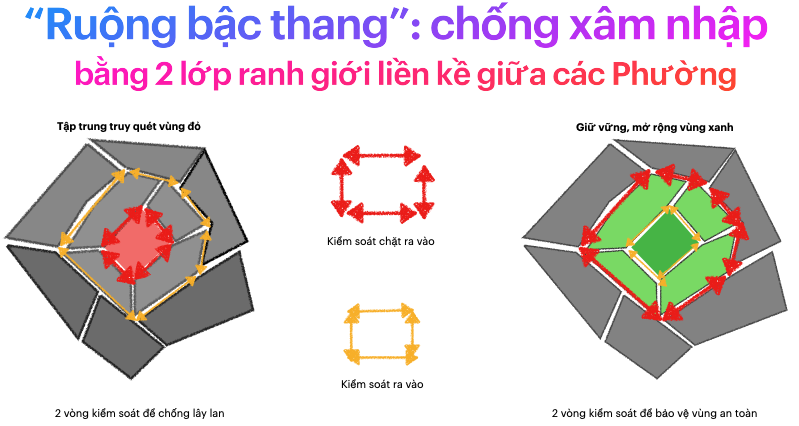
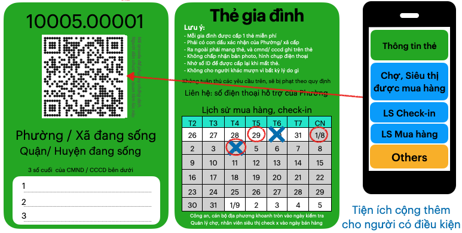
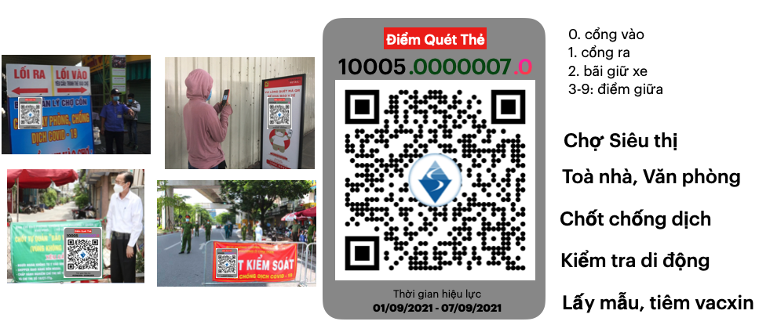

## THƯ KIẾN NGHỊ
## Phòng chống dịch COVID-19 và Phát triển kinh tế bằng Thẻ Lệnh 

### TP Hồ Chí Minh ngày 10/9/2021

Kính gửi: 

- Ông Nguyễn Xuân Phúc, Chủ tịch nước Cộng hòa Xã hội Chủ nghĩa Việt Nam,
- Ông Phạm Minh Chính, Thủ tướng Chính phủ nước Cộng hòa Xã hội Chủ nghĩa Việt Nam,
- Ông Vũ Đức Đam, Phó Thủ tướng Chính phủ, Trưởng Ban Chỉ đạo Quốc gia Phòng, chống dịch COVID-19,
- Ông Tô Lâm, Bộ trưởng Bộ Công An,
- Ông Nguyễn Thanh Long, Bộ trưởng Bộ Y tế,
- Văn phòng Chủ tịch nước, 
- Ban Bí Thư Trung ương Đảng Cộng sản Việt Nam,
- Ban Kinh tế Trung ương Đảng Cộng sản Việt Nam,
- Ban Tuyên giáo Trung ương Đảng Cộng sản Việt Nam, 
- Ủy ban Xã hội của Quốc hội.

Chúng tôi gồm các tổ chức thành viên tập hợp trong các Mạng lưới, Liên minh dưới đây (chi tiết xem thêm Phụ lục 1):

Hưởng ứng lời kêu gọi của Thủ tướng Chính phủ Phạm Minh Chính [^1] “Toàn dân tham gia phòng chống đại dịch” (01/5/2021), của Chủ Tịch nước Nguyễn Xuân Phúc ngày 27/5/2021[^2], của Tổng Bí thư Nguyễn Phú Trọng [^3] ngày 29/7/2021 gửi toàn thể người dân Việt Nam cả trong và ngoài nước, chúng tôi, .... , đã cùng nhau phát triển các góp ý điều chỉnh các chính sách phòng chống dịch COVID-19 trước tình hình mới.

[^1]: https://dangcongsan.vn/nong-trong-ngay/thu-tuong-keu-goi-toan-dan-chung-tay-phong-chong-dich-covid-19-579620.html 

[^2]: https://tuoitre.vn/chu-tich-nuoc-nguyen-xuan-phuc-keu-goi-ca-nuoc-chung-tay-day-lui-dich-benh-20210527215903762.htm

[^3]: https://moh.gov.vn/hoat-dong-cua-lanh-dao-bo/-/asset_publisher/TW6LTp1ZtwaN/content/tong-bi-thu-nguyen-phu-trong-ra-loi-keu-goi-phong-chong-ai-dich-covid-19
 
Kính thưa Chủ tịch nước và Thủ tướng Chính phủ,

Chúng tôi xin trình bày một Chiến lược khả thi để Phòng Chống Covid-19 mà không cần giãn cách toàn xã hội. Đặt tên là **Thẻ Lệnh**. 

Thẻ Lệnh có thể **triển khai ngay** trên toàn lãnh thổ Việt Nam, nhất là những vùng đang áp dụng giãn cách xã hội theo chỉ thị 16 để kiểm soát Covid-19 như tp Hồ Chí Minh, Hà Nội,...

Chúng tôi tin rằng, trước quyết tâm rất cao và sự chỉ đạo rất linh hoạt gắn liền với thực tiễn của Thủ tướng chính phủ, sau 1,2 tuần triển khai, mỗi vùng có thể điều chỉnh mức độ giãn cách xã hội, mở lại các hoạt động kinh tế theo lộ trình mà vẫn kiểm soát, khống chế Covid-19.

Thẻ Lệnh kết hợp các Quy định Phòng chống dịch bệnh (Lệnh) để điều chỉnh, quy hoạch xã hội, Thẻ và hệ thống Công nghệ thông tin để thay đổi hành vi của mọi người cùng với xét nghiệm để phát hiện Covid. Đây là khoa học về điều chỉnh mô hình, hệ thống xã hội, dựa trên các cơ sở thực tế.

### CƠ SỞ ĐỂ ĐỀ XUẤT CHIẾN LƯỢC THẺ LỆNH

Trước hết, chúng tôi khẳng định, Chính phủ đã có những chỉ đạo điều chỉnh rất đúng và rất kịp thời, mới nhất là Phiên họp Chính phủ thường kỳ tháng 8 năm 2021 [^4] ngày 6/9/2021 dưới sự chủ trì, điều hành của Thủ tướng. Cụ thể các điểm sau:

- “mỗi xã, phường, thị trấn là một pháo đài; mỗi người dân là một chiến sỹ; người dân vừa là trung tâm, vừa là chủ thể trong phòng, chống dịch.”

- “nghiên cứu giải pháp thích ứng an toàn trong điều kiện mới; xây dựng kịch bản khôi phục, phát triển kinh tế trong tình hình mới.”,

- tuyên truyền, vận động để “dân biết, dân hiểu, dân tin, dân theo và dân làm.” 

[^4]: https://www.vietnamplus.vn/thu-tuong-dieu-hanh-phien-hop-chinh-phu-thuong-ky-thang-8/738740.vnp

Trên cơ sở đó, chúng tôi nêu thêm các cơ sở nhận định dưới đây đề nghị Chính phủ và Lãnh đạo Nhà nước tham khảo:

**Thứ nhất**, đã có những bằng chứng khoa học mới nhất giúp nhận định chính xác hơn về biến chủng DELTA và khả năng xuất hiện các biến chủng mới:

- **Bằng chứng khoa học về vai trò của vắc xin và nguy cơ diễn biến dịch lâu dài**: Miễn dịch tạo bởi các vắc xin tốt nhất hiện có (Moderna, Pfizer, Johnson and Johson, Astrazeneca) giảm diễn biến nặng và hạ thấp số tử vong khi bị mắc vi rút, nhưng chưa đủ hiệu lực để chặn hoàn toàn sự lưu hành của vi rút, khiến khả năng xuất hiện biến thể mới là chắc chắn xảy ra. Dịch sẽ tiếp tục tồn tại lâu dài hơn như đã dự đoán trước đây, kể cả khi đã đạt tỷ lệ tiêm chủng cao tới 70% dân số, khiến các nước đang phải lên kế hoạch có mũi tái chủng (mũi 3) cho những đối tượng có nguy cơ cao giảm miễn dịch và xem xét kế hoạch chỉ định triển khai đại trà cho toàn thể người dân trong thời gian tới [^5].

[^5]: Public Health England (2021). COVID-19 vaccination programme Information for healthcare practitioners. Republished 6 August 2021, Version 3.10. https://assets.publishing.service.gov.uk›file›CO...

[^6]: https://www.forbes.com/sites/williamhaseltine/2021/08/04/a-warning-about-the-future-of-covid-19-from-the-scientific-advisory-group-for-emergencies-of-the-united-kingdom/

- **Bằng chứng khả năng xảy ra biến đổi của vi rút tạo chủng mới với những đe dọa mới**: Nhân loại đang phải đương đầu với một loại vi rút có khả năng gây bệnh và chống chọi sự can thiệp y tế vượt hẳn so với các loại vi rút gây bệnh đường hô hấp đã biết trước đây. Báo cáo của Hội đồng Tư vấn khoa học phòng chống dịch bệnh khẩn cấp SAGE của Anh (The Scientific Advisory Group for Emerfencies- SAGE- in the United Kingdom), dựa trên các kết quả nghiên cứu khoa học mới nhất đã kết luận rằng với khả năng phòng chống dịch trên toàn cầu như hiện nay, vi rút SARS-COV-2 chắc chắn sẽ tạo biến chủng mới, nguy cơ phát triển thành dạng nguy hiểm hơn cả chủng DELTA là hoàn toàn có khả năng. Chính phủ và toàn dân phải chuẩn bị chủ động đối phó với chiều hướng này. Nhóm tư vấn SAGE đã đưa ra 4 tình huống và nhận định cụ thể xác suất xảy ra [^6] giúp định hướng chính sách phòng chống dịch cả trước mắt và lâu dài. Trong đó chúng tôi xin lưu ý ở đây các điểm trọng yếu của báo cáo SAGE:

   - Chắc chắn sẽ xảy ra (to be likely) khả năng biến chủng mới kháng lại được tất cả các loại thuốc chống vi rút;

   - Gần như chắc chắn (an almost certainty) sẽ xuất hiện chủng mới có khả năng “bất hoạt” được các loại vắc xin (tức các vắc xin hiện có trở nên vô dụng);

   - Có khả năng thực tế (a realtistic possibility) vi rút phát triển thành biến chủng mới có khả năng gây tử vong cao hơn như đã thấy ở các vi rút cùng nhóm COVI gây các dịch trước đó (SARS-COV và MERS-COV). Tức là, từ mức tỷ lệ tử vong hiện tại chỉ 1-2% (ở những người nhiễm vi rút) sẽ phát triển lên tới 10-35%;

**Thứ hai**, dịch bệnh COVID-19 lây lan dựa trên hệ thống di chuyển, tiếp xúc của con người. Xu hướng toàn cầu hoá, tự do thương mại hình thành nên hệ thống di chuyển phức tạp, hỗn loạn. Các hạn chế di chuyển đã diễn ra trên cấp độ quốc gia, sau đó thu hẹp tới từng tỉnh thành, quận huyện và đang mang lại những kết quả nhất định: ngăn bùng phát trên diện rộng và dần dần kiểm soát theo khu vực, nhưng ảnh hưởng lớn tới hoạt động kinh tế. Có những **phương pháp khoa học về hệ thống xã hội**, để điều chỉnh nhu cầu di chuyển hiện tại, cho phép Phòng, chống dịch và phát triển kinh tế bền vững. 

**Thứ ba**, dịch bệnh COVID-19 là hậu quả của sự phá vỡ môi trường sinh thái[^7], sự thất bại trong bảo đảm vai trò khoa học dẫn đường cho các chính sách can thiệp kinh tế - xã hội kéo dài ở cấp độ toàn cầu! Cần nhìn nhận đại dịch COVID-19 là sự tiếp nối của xuất hiện các vụ dịch trước đó như dịch SARS (2003)[^8] hay MERS (2012)[^9]. Nguy cơ xuất hiện thêm các vụ dịch nhiễm trùng mới, gây bởi nhóm vi rút Corona hoặc loại khác, là chắc chắn, nếu toàn cầu không tạo được một hành lang pháp lý bắt buộc thực hiện các biện pháp an ninh y tế toàn cầu gắn liền với phòng chống biến đổi khí hậu.

[^7]: https://www.nature.com/articles/d41586-020-02341-1

[^8]: https://www.who.int/health-topics/severe-acute-respiratory-syndrome#tab=tab_1 

[^9]: https://www.who.int/health-topics/middle-east-respiratory-syndrome-coronavirus-mers#tab=tab_1

### NỘI DUNG CỦA CHIẾN LƯỢC THẺ LỆNH

Đầu tiên, chúng tôi trình bày "Mạng lưới Phát hiện xâm nhập vào Phường/Xã", vai trò trong việc Phòng, chống Dịch Covid-19 mà không cần phải giãn cách toàn xã hội. 

Sau đó sẽ trình bày các thay đổi trong xã hội để "Mạng lưới Phát hiện xâm nhập vào Phường/Xã" có thể hoạt động và duy trì lâu dài. 

Cuối cùng là Thực hiện được thay đổi trên bằng Thẻ Lệnh.

### I. Mạng lưới Phát hiện xâm nhập vào Phường/Xã

Với một khu vực an toàn, những người từ bên ngoài vào chính là nguồn mang Covid-19 xâm nhập. 

Có hai cách để phát hiện Covid-19 từ nguồn xâm nhập này:

1. Xét nghiệm tại chỗ, hoặc kiểm tra giấy xét nghiệm: âm tính mới được phép vào, sau đó cách ly và xét nghiệm thường xuyên, gọi là Cơ chế Ngăn chặn xâm nhập

2. KHÔNG kiểm tra hay xét nghiệm tại chỗ, chỉ lưu thông tin (nơi ở) để bắt buộc xét nghiệm thường xuyên, gọi là Cơ chế Phát hiện xâm nhập. 

Cơ chế Ngăn chặn xâm nhập an toàn hơn, nhưng yêu cầu nhân lực (công an, nhân viên y tế) ở tất cả ngõ ra vào nên phù hợp ở quy mô một quốc gia hoặc một tỉnh/thành phố. Ở quy mô nhỏ hơn rất tốn kém, khó duy trì lâu dài.

Ngược lại, **Cơ chế Phát hiện xâm nhập** ít cản trở việc di chuyển, không gây tụ tập, tắc nghẽn tại các Chốt Chống dịch. Khi mọi người có thói quen "Quét Thẻ tại tất cả điểm đến" (trình bày bên dưới), KHÔNG cần duy trì nhân lực tại các Chốt Chống dịch bao quanh. 

Việc tối ưu (hoặc không cần) nhân lực, cho phép tất cả các Phường/Xã triển khai Cơ chế Phát hiện xâm nhập đồng thời, hình thành nên **Mạng lưới Phát hiện xâm nhập vào Phường/Xã**. Mạng lưới này có thể duy trì trong giai đoạn "bình thường mới", ít ảnh hưởng tới hoạt động di chuyển, phát triển kinh tế liên quan. 

Tuy nhiên, có 2 rủi ro với Mạng lưới Phát hiện xâm nhập vào Phường/Xã:

1. Giữa 2 lần xét nghiệm, vài người trở thành F0 có khả năng lây lan ra cộng đồng. 

2. Cơ chế Phát hiện xâm nhập ở vài Phường/Xã hoạt động chưa tốt, bỏ sót đối tượng có lịch sử ra vào, âm thầm lây lan Covid-19 bên trong và lan sang các Phường/Xã khác. 

**Rủi ro 1** được phát hiện sớm bởi Cơ chế của mỗi Phường/Xã, giúp truy vết và kiểm soát nhanh chóng. Các Phường/Xã có F0 di chuyển nâng cao mức độ cảnh giác để đánh giá mức độ nguy cơ, áp dụng các hạn chế di chuyển phù hợp. 

**Rủi ro 2** được phát hiện bởi Phường/Xã khác trong Mạng lưới Phát hiện xâm nhập. Lúc này các Phường/xã liền kề tăng cường nguồn lực Chống dịch, tạo thành 2 lớp kiểm soát lây lan ra ngoài trước khi truy quét, chống dịch bên trong. Đây là mô hình "Ruộng bậc thang" chống dịch, như hình bên dưới. 

Rủi ro 2 gây thiệt hại lớn hơn, nhưng sẽ hạn chế bằng cách tăng cường phối hợp, nâng cao hiệu quả của "Mạng lưới Phát hiện xâm nhập vào Phường/Xã".
Trong cả hai tình huống, rủi ro nhanh chóng được phát hiện, cô lập, và tập trung xử lý bên trong. Các Phường/Xã khác được thông báo để cần nâng cao cảnh giác, và tiếp tục các hoạt động như bình thường. 

Với vùng Dịch bị nhiễm bệnh sâu, còn F0 trong cộng đồng hoặc không thể "cách ly" nguy cơ: F0 điều trị tại nhà, trong khu phong toả, ... "Mạng lưới Phát hiện xâm nhập vào Phường/Xã" kiểm soát lây lan giữa các Phường/Xã, hạn chế bùng phát diện rộng ngay cả khi mở lại các hoạt động kinh tế, xã hội. Hệ thống y tế không bị quá tải kết hợp với tiêm vaccine cho mọi người sẽ giảm tối đa tổn thất. Đây là cách xã hội "sống chung với Covid-19". 

Với những vùng ít nguy cơ, Mạng lưới đóng vai trò phát hiện sớm Phường/Xã nguy cơ, để cô lập, khống chế để không ảnh hưởng tớicác Phường/Xã khác. Sau thời gian có thể đưa toàn vùng về trạng thái "không covid"

Tóm lại, "Mạng lưới Phát hiện xâm nhập vào Phường/Xã" là biện pháp hiệu quả để không giãn cách xã hội mà vẫn Phòng, chống dịch hiệu quả. T

uy nhiên, với di chuyển trong xã hội hiện nay, số lượng ra vào Phường/Xã mỗi ngày là rất lớn, và nguồn lực xã hội (đội ngũ y tế, chi phí xét nghiệm, thời gian của người dân,...) để xét nghiệm là cản trở lớn để triển khai và duy trì "Mạng lưới Phát hiện xâm nhập" trên một vùng rộng lớn. 

Bên cạnh những cải thiện để tối ưu nguồn lực thực hiện 1 xét nghiệm như người dân có thể tự test nhanh Covid-19 tại nhà, thiết bị phát hiện Covid-19 tại trong phòng,... Có những biện pháp khoa học để điều chỉnh hệ thống di chuyển của để giảm số lượng ra vào Phường/Xã mỗi ngày và duy trì ở mức hợp lý. Đó là nội dung trong phần thứ II. 

### II. Những điều chỉnh để thay đổi xã hội 

#### Thứ nhất: Điều chỉnh, quy hoạch di chuyển theo Phường/Xã

Các nhu cầu di chuyển có thể điều chỉnh ngay

- **Phục vụ tại chỗ**, quy hoạch theo Phường/Xã
   - mua hàng tại chợ, siêu thị (còn lại đặt mua từ xa, giao hàng tại nhà)
   - Tập thể dục, giải trí hàng ngày
   - buôn bán đường phố: chỉ bán cho cư dân bên trong 
   - dịch vụ tại chỗ như: ngân hàng, hớt tóc, gym,... phục vụ cư dân bên trong. 

- **Đi làm mỗi ngày**: điều chỉnh để di chuyển không dừng theo đường biên, không ra, vào Phường/Xã, trừ nơi sinh sống và nơi làm việc. 

- **Đi lại trong thời gian làm việc**: ăn uống, gặp gỡ khách hàng,... giới hạn bên trong Phường/Xã làm việc. 

- **Công việc địa phương, phổ thông**: sắp xếp để nhân viên làm việc và sống trong Phường/Xã.

Một số nhu cầu phức tạp hơn, quy hoạch dần dần theo thời gian: 

- **Giao nhận hàng hoá**: chia thành 2 loại di chuyển, quy hoạch thanh 2 đội:
   - Đội Tài xế Nội khu: tự do di chuyển bên trong, nhưng không được ra ngoài Phường/Xã. Hàng hoá ra ngoài Phường/Xã sẽ chuyển tới các điểm tập kết liên Phường/Xã. 
   - Đội Vận chuyển Liên khu (Shipper hai bánh, xe tải nhỏ,...) sẽ trung chuyển hàng hoá tới điểm tập kết ở Phường/Xã nơi đến.
   - Đội Liên khu không được vào trong Phường/Xã, giao hàng cho người dân hay tiếp xúc với Đội Nội khu. 
   -  Tối ưu giao nhận bằng nhiều cách: Đặt hàng tại nhà, nhận hàng tại điểm bán; Người dân tự giao, nhận hàng ở điểm tập kết,...

- **Nhân viên của doanh nghiệp có nhiều chi nhánh**: sắp xếp, bố trí để làm việc và sinh sống 

- **Ưu tiên sử dụng nhân sự bên trong Phường** cho các công việc phổ thông. 

- **Cấp Thẻ để giám sát** số người có nhu cầu chính đáng ra vào Phường/Xã. 
Tuỳ theo mức độ nguy cơ của khu vực, mà giới hạn số lượng được phép, bằng cách khoá Thẻ từ xa.

Với những điều chỉnh quy hoạch như trên, có thể giảm được 80% số lượng ra vào Phường/Xã mỗi ngày, và để việc quy hoạch hiệu quả, đối tượng cần điều chỉnh là doanh nghiệp, cơ quan,.... Các đối tượng này sẽ từ từ điều chỉnh việc di chuyển của cá nhân: nhân viên và người dân được phục vụ.  Đây là lý thuyết đòn bẩy của *khoa học về hệ thống xã hội*. 

Chính quyền địa phương tập trung giám sát việc tuân thủ của doanh nghiệp, cơ quan, sẽ tối ưu hơn việc kiểm soát người dân. Công an, dân phòng cần tập trung vào **phát hiện các đối tượng vi phạm**, thay vì kiểm tra giấy tờ của mọi người, và tăng cường kiểm tra **các điểm đến** thay vì cố định tại Chốt chống dịch.

Về lâu dài, Chính phủ cần có chính sách để khuyến khích việc quy hoạch di chuyển bên trong Phường/Xã và khu vực rộng hơn (Quận/huyện). 

- **Bộ tiêu chí quy hoạch di chuyển** để Phòng chống bệnh truyền nhiễm, khuyến khích doanh nghiệp bố trí nơi làm việc gần với nơi nhân viên đang sinh sống. Doanh nghiệp sẽ cân nhắc giữa lợi ích từ việc quy hoạch với "chi phí Covid" phát sinh như xét nghiệm định kỳ,nguy cơ tạm ngưng hoạt động khi dịch bùng phát,...

- Mô hình **"remote teams"**: Khuyến khích doanh nghiệp tổ chức nhân sự thành nhiều nhóm nhỏ, sinh sống gần nhau, để làm việc trong một văn phòng  trong khu vực đó. Mô hình này sẽ bền vững và hiệu quả hơn mô hình "work from home" hiện nay. 

- Và nhiều quy hoạch đô thị khác để phù hợp với xã hội sau Đại dịch Covid-19

Mạng lưới Phát hiện xâm nhập vào Phường/Xã có thể triển khai ngay, sử dụng các nguồn lực sẵn có. Và càng thực hiện quy hoạch theo Phường/Xã, không chỉ năng lực phòng chống dịch, khả năng phát triển kinh tế cũng được nâng cao, xã hội phát triển an toàn, bền vững. 

Bên cạnh việc điều chỉnh ở **quy mô xã hội**, cần điều chỉnh ở **quy mô tổ chức*: doanh nghiệp, cơ quan, đơn vị,... để phục vụ xã hội điều tiết, hiệu quả hơn. 
#### Thứ hai: Phục vụ nhu cầu theo gia đình

Mục tiêu cần hướng tới là tối ưu nguồn lực xã hội, nhất là các nguồn lực bị hạn chế, khan hiếm giữa giãn cách xã hội, để điều tiết và bảo đảm mọi gia đình đều được phục vụ. 

Cần hạn chế tối đa các hành vi không cần thiết như tích trữ quá mức, thu gom mà không sử dụng, hoặc tệ hơn là bán lại kiếm lời,... gây nên kham hiếm giả tạo, tăng giá. Nếu để tình trạng khan hiếm, tăng giá kéo dài, những gia đình gặp khó khăn (về tài chính, trong khu phong toả, chăm sóc y tế,...) sẽ mất dần cơ hội được phục vụ. 

Nếu KHÔNG điều tiết, giới hạn theo gia đình, nhiều nguồn lực có giới hạn khi giãn cách xã hội sẽ bị lãng phí, gây khan hiếm, tắc nghẽn cục bộ: quá tải đơn hàng Online, huỷ đơn hàng vì đã đặt nhiều, ... ảnh hướng trực tiếp tới an sinh xã hội. 

Chúng tôi đề xuất một Cơ chế điều tiết thông qua **Thẻ gia đình với ID riêng** cho nhiều nhu cầu như: 

   
   - ID (10005.00001) với 5 số đầu là ID Phường/Xã để điều tiết việc phục vụ theo gia đình. 
   - qrcode là tiện ích nâng cao với người dân, không phải bắt buộc.

Mua bán hàng hoá theo gia đình: 
- Chợ, siêu thị chỉ bán hàng theo ID, với giới hạn theo Phường/Xã, khung thời gian, loại mặt hàng,...
- Giao hàng cho Thẻ trùng với ID trên đơn hàng, tối ưu việc giao theo nhóm ID gần nhau. 
- Siêu thị, chợ sẽ điều tiết, chuẩn bị hàng hoá tốt hơn dựa trên tổng số ID trong Phường/Xã 
- Chính quyền sẽ dự đoán được mức độ đáp ứng nhu cầu người dân theo từng khu vực, để có kế hoạch phân bố, vận chuyển hàng hoá tốt hơn giữa các Phường/Xã.

An sinh xã hội: cho những gia đình được Phường/Xã xác nhận
- phân bố cân bằng nguồn lực cứu trợ của chính quyền
- nguồn lực từ thiện được phân bố đúng đối tượng 

Các nhu cầu khác liên quan tới Phòng chống Covid-19 như: xét nghiệm, cách ly tại nhà, tiêm vaccine,... cũng cần được phục vụ và điều tiết theo Thẻ gia đình. 

Thẻ gia đình giúp hạn chế **bỏ sót các đối tượng nguy cơ**: các gia đình  tránh né xét nghiệm, bị cách ly nhưng vẫn ra ngoài,... Đây là những nguy cơ lây lan âm thầm, khiến việc truy quét toàn bộ khó đạt hiệu quả mong muốn.

Khi quay về "bình thường mới", xã hội sẽ còn nhiều khó khăn về cung cấp hàng hoá, tài chính, nhân lực,.... Do đó "phục vụ theo gia đình" sẽ là một cách điều tiết quan trọng để tối ưu nguồn lực hạn hẹp.

#### Thứ ba: Thay đổi hành vi của mọi người

**1. "Quét Thẻ tại tất cả điểm đến có dán Checkpoint"** là hành vi quan trọng mà mọi người cần có. 

Trong giai đoạn chống dịch, Thẻ gồm 3 loại lớn, với thiết kế đồng nhất, phân biệt theo màu sắc cho 3 nhóm đối tượng chính: 

Mọi người đều sử dụng được, tinh gọn, hiệu quả, chống tiêu cực,... là những yếu tố căn bản mà Thẻ hướng tới. Quy trình triển khai cũng nhanh chóng sau vài ngày và việc cơ chế cấp Thẻ không gây tập trung đông tại các Phường/Xã như giấy đi đường hiện tại. 

Dán Checkpoint như hình bên dưới cho tất cả các điểm cần "quét Thẻ". 
Giải pháp dán Checkpoint cho phép triển khai nhanh chóng với chi phí thấp, được thiết kế cho 10 triệu điểm đến trong 1 Phường/Xã. 

Giải pháp triển khai Thẻ, Checkpoint sẽ trình bày trong tài liệu tham khảo đính kèm. 

Dùng Thẻ giấy, bắt buộc "Đeo khi di chuyển" cho phép phát hiện vi phạm từ xa, phát hiện ngay điểm xuất phát,... giúp loại trừ tư tưởng vi phạm.
Phiếu đi chợ, giấy đi đường, mã qrcode,... làm giảm giá trị trên, gây khó khăn cho người tuân thủ, và tạo cơ hội cho vi phạm diễn ra. 

Khi "quét Thẻ" được thực hiện tại hàng triệu điểm đến, chúng ta sẽ có được dữ liệu điểm đến theo thời gian thực, sát với di chuyển thực tế. Dữ liệu điểm đến quan trọng và bao hàm luôn dữ liệu tại các Chốt kiểm tra. Dữ liệu này sát với thực tế, hơn là khai báo (y tế, di chuyển) do người dân tự thực hiện.

Dữ liệu di chuyển giữa các điểm đến là công cụ đo lường quan trọng, giúp nâng cao hiệu quả của "Quy hoạch di chuyển theo Phường/Xã" và "Phục vụ theo gia đình".

Giá trị của dữ liệu các điểm đến là để **phát hiện nguy cơ** nhằm cảnh báo:

- Cảnh báo cho cá nhân: khi tới các điểm vừa phát hiện F0

- Cảnh báo cho doanh nghiệp: tăng cường quản lý nhân viên, có những khuyến nghị để "quy hoạch theo khu vực" tốt hơn. 

- Cảnh báo cho Phường/Xã: bắt buộc xét nghiệm thường xuyên, những người có lịch sử ra vào.

- Cảnh báo cho công an, dân phòng các cá nhân vi phạm nhiều lần, cần kiểm tra tại nhà để ngăn chặn kịp thời. 

Dựa trên việc không có dữ liệu, **phát hiện những bất thường ở mức hệ thống**,là nguy cơ bùng phát dịch bệnh. Ví dụ: *Có nhiều gia đình trong 1 khu phố KHÔNG CÓ lịch sử mua hàng, di chuyển trong 2,3 tuần gần đây*. Đây là một bất thường ở mức hệ thống, cần điều tra nguyên nhân thực tế.

**2. Tăng Tuân thủ các Lệnh đưa ra** 

**Lệnh** là các quy định hành chính do Chính phủ hay Chính quyền mỗi tỉnh thành phố đưa ra. Lệnh cần mô tả rõ hành động, càng đơn giản càng tốt, để mọi người dễ dàng hiểu và tuân thủ. 

"Quét Thẻ tại điểm dán Checkpoint", "Đeo Thẻ khi di chuyển" là những ví dụ về Lệnh. 

Kết hợp **Thẻ Lệnh** sẽ tạo nên sức mạnh để "tuân thủ" trở thành hành vi mỗi ngày, và tác động tới nhiều đối tượng khác nhau có liên quan tới Thẻ:  

- Đối tượng Cấp Thẻ: cán bộ phường/Xã 
- Đối tượng Phục vụ Thẻ: nhân viên chợ, siêu thị,...
- Đối tượng Kiểm tra: công an, dân phòng, người dân tự kiểm tra,...
- Đối tượng Giám sát: đội ngũ giám sát dữ liệu di chuyển,...
- Đối tượng không có Thẻ: bị ảnh hưởng bởi người xung quanh, dần dần tuân thủ.

Cơ chế kiểm tra định kỳ, giám sát chéo của Thẻ Lệnh càng củng cố hành vi "tuân thủ", biến nó thành thói quen. Đây là 1 minh hoạ. 

Và như bất kỳ thói quen nào, "Tuân thủ" cũng gây nhiều khó chịu, bất tiện với mọi người. Nhưng sau một thời gian, mọi người sẽ nhận ra nhiều lợi ích của thói quen Tuân thủ: ít bị làm phiền (bị kiểm tra, gây khó dễ,...), sự an tâm khi thấy nhiều người xung quanh tuân thủ, và cuối cùng là **sự tự do trong khuôn khổ**. 

Với trách nhiệm là bên đưa ra Lệnh, Chính quyền cũng cần tuân thủ các lệnh này. Đó là không được gây khó dễ, mất thời gian khi mọi người tuân thủ.

Với 3 nội dung trên tạo nên thay đổi rất lớn trong xã hội. Trong hoàn cảnh bình thường, gần như không thể thực hiện các quy hoạch, thay đổi này, nhưng Đại dịch Covid-19 là **cơ hội để thực hiện những điều "tưởng chừng không thể"**.

Với người dân, sẽ có bất tiện ban đầu, nhưng so với các quy định khắt khe trong giãn cách, thì việc di chuyển bên trong Phường/Xã một cách tự do cũng là sự khác biệt lớn. Về lâu dài, người dân sẽ được nhiều lợi ích như: được phục vụ tốt hơn mà không phải đi xa, được làm việc gần nhà hơn, ít bị kẹt xe tắt đường ở đô thị lớn,... và nhất là không phải trở lại giãn cách toàn xã hội như trước đây. 

Với Doanh nghiệp, ngoài lợi ích được trở lại hoạt động sớm, thực hiện quy hoạch nhận được nhiều lợi ích lâu dài như: hiệu quả của nhân viên tăng do thời gian đi lại giảm, ít bị kẹt xe tắt đường, không phải trả nhiều "chi phí Covid", không bị gián đoạn hoạt động khi dịch bệnh bùng phát,...

Chính phủ tận dụng cơ hội "trăm năm có một" này và triển khai từng bước theo lộ trình, sẽ giải quyết được **nhiều bài toán lớn của đô thị đông dân cư**: an sinh xã hội, kẹt xe tắt đường, ô nhiễm môi trường,... và nâng cao hiệu quả toàn xã hội, phát triển kinh tế bền vững trong một môi trường an toàn, hài hoà.

### III. Các bước triển khai Thẻ Lệnh vào thực tế

#### Bước 1: Triển khai Thẻ Lệnh tới mọi đối tượng

**Cấp, phát Thẻ tới mọi đối tượng.**

- Phát hành phôi Thẻ cho tất cả Phường/Xã (1-2 ngày)
   - ưu tiên Thẻ gia đình, rồi tới Thẻ làm việc Thẻ chống dịch 

- Đóng dấu và Phát Thẻ Gia đình tại từng nhà dân (2-3 ngày)
   
- Cấp Thẻ làm việc cho Doanh nghiệp (3-4 ngày)
   - tiếp nhận hồ sơ của Doanh nghiệp: online và offline 
   - Cấp thẻ cho các hồ sơ đã duyệt. 

- Chuẩn bị hệ thống Công nghệ thông tin, ứng dụng mobileapp cho các giai đoạn tiếp theo. 

- Lưu ý: vận dụng nguyên tắc **"Trách nhiệm thuộc bên tiếp nhận"** và **"Định kỳ kiểm tra, duyệt Thẻ"** để việc triển khai diễn ra nhanh chóng, hạn chế tụ tập tại trụ sở Phường/Xã.

**Triển khai Lệnh sau khi Thẻ được cấp**

- Với mọi người: quét Thẻ tại các Chốt kiểm tra, các điểm đến có dãn Checkpoint. Tự giác thực hiện. 

- Doanh nghiệp: tuân thủ các Lệnh về bán hàng theo Thẻ gia đình

- Công an, dân phòng phát hiện và xử phạt người không có Thẻ. Nhắc nhở, hướng dẫn người dân tự thực hiện quét Thẻ tại khi thấy mã Checkpoint.

- Phường/Xã: định kỳ kiểm tra các Thẻ đã cấp, nhắc nhở xử phạt các vi phạm phát hiện tư dữ liệu quét Thẻ. 

- Chính quyền đưa ra các Lệnh để Doanh nghiệp thực hiện quy hoạch di chuyển theo Phường/Xã. Đưa ra lộ trình để doanh nghiệp điều chỉnh. 

**Truy quét để bóc tách F0 cộng đồng** Tăng cường nguồn lực để 
   - bóc tách toàn bộ F0 cộng đồng  bên trong Phường/Xã.
   - giám sát chặt F0 được cách ly tại nhà,và các đối tượng nguy cơ. 
 
#### Bước 2: Mở lại hoạt động kinh tế dưới sự giám sát của Mạng lưới Phát hiện xâm nhập theo Phường/Xã 

**Triển khai Mạng lưới Phát hiện xâm nhập vào Phường/Xã** tuỳ theo nguy cơ trong vùng dịch 

**Với vùng bị nhiễm sâu** như ở Tp Hồ Chí Minh và các tỉnh miền tây đang có nhiều ca nhiễm, Bổ sung những Lệnh mạnh hơn để tăng cường hiệu quả của "Mạng lưới Phát hiện xâm nhập vào Phường/Xã":
   - Với mọi người: bắt buộc đeo Thẻ khi di chuyển, bị xử phạt tại chỗ (hay phạt nguội) khi di chuyển ngoài khu vực quy định.

   - Với Tổ phòng chống Covid cộng đồng tăng cường kiểm tra, quét Thẻ ngay khi người dân ra ngoài. Đồng thời giám sát tại các địa điểm bán hàng: phát hiện các vi phạm liên quan tới không đeo Thẻ, bán hàng ko đúng,...

   - Với Phường/Xã, hàng tuần tới gặp người dân nhắc nhở, hướng dẫn Phòng Chống dịch, hỗ trợ các gia đình khó khăn,... và quét Thẻ gia đình để xác nhận.

   - Với Doanh nghiệp, quản lý chặt việc đi lại sử dụng Thẻ làm việc của nhân viên.

   - Với công an, dân phòng, kiểm tra và bắt buộc quét Thẻ tại Chốt kiểm tra.

**Với vùng chưa có nhiều ca nhiễm** như ở tp Hà Nội: 

- Phường/Xã còn phát hiện F0, Xét nghiệm toàn bộ 1,2 lần để làm sạch F0 bên trong. 
- Sau đó triển khai Mạng lưới Phát hiện xâm nhập theo Phường/Xã,  bắt buộc xét nghiệm thường xuyên (3 ngày/lần) hay định kỳ (7 ngày / lần) tuỳ mức độ nguy cơ của Quận Huyện đó. 

**Mở lại các hoạt động kinh tế, xã hội**

Ưu tiên mở lại các hoạt động bên trong để kiểm tra năng lực Phát hiện xâm nhập của từng Phường/Xã. 
   - Phường/Xã Cấp mã Checkpoint cho các địa điểm được hoạt động trở lại. 
   - xét nghiệm ngẫu nhiên các đối tượng nguy cơ cao, di chuyển nhiều bên trong.
   - Cấp phép hạn chế Thẻ làm việc  có  nhu cầu ra vào mỗi ngày

Cấp phép cho nhiều Thẻ được phép ra vào Phường/Xã mỗi ngày, điều chỉnh tuỳ theo nguy cơ mà Mạng lưới Phát hiện xâm nhập.

#### Bước 3: Vùng dịch trở về với Bình thường mới

Khi cả vùng dịch không còn phát hiện F0 cộng đồng, Mạng lưới Phát hiện xâm nhập chuyển sang chế độ định kỳ (1 tuần / lần) kết hợp với các kiểm tra ngẫu nhiên, điều tra bất thường để hạn chế nguy cơ. 

Duy trì các Lệnh để 

- Mọi người quét Thẻ tại các điểm đến, bỏ bắt buộc tại Chốt chống dịch

- Mọi người tuân thủ việc xét nghiệm hoặc cách ly theo yêu cầu. 

- Tối ưu việc phục vụ nhu câu theo gia đình 

- Doanh nghiệp tiếp tục quy hoạch di chuyển theo Phường/Xã 

### NHỮNG GIÁ TRỊ MÀ CHÚNG TÔI MUỐN ĐÓNG GÓP

#### Năng lực về giải pháp, phương pháp luận cho Hệ thống xã hội. 

Chúng tôi thiết kế chi tiết giải pháp, các Lệnh cho nhiều tình huống và các quy trình triển khai để sẵn sàng đưa vào thực tế khi có yêu cầu, chúng tôi xin đóng góp tất cả cho Chính Phủ để phục vụ cho công tác Phòng Chống dịch Covid-19 ở Việt Nam.

Sẵn sàng cùng tham gia, tư vấn thêm về Phương pháp để phù hợp với tình hình thực tế. 

Với các phương pháp để hỗ trợ Doanh nghiệp quy hoạch theo khu vực, như "Remote Teams" đề cập ở trên, sẵn sàng tư vấn và hỗ trợ đưa vào thực tế.
"Remote Teams" là một tầm nhìn của chúng tôi trong việc thay đổi xã hội trước khi Covid-19 xuất hiện. 

Chúng tôi tin rằng, không chỉ với việt nam, Chiến Lược Thẻ Lệnh còn phù hợp với nhiều quốc gia khác trên thế giới. Và chúng tôi sẵn sàng phối hợp với Chính Phủ, Tổ chức Y tế thế giới (WHO), để chia sẻ giải pháp này tới các quốc gia đang cần. 

#### Năng lực Thiết kế Hệ thống Công nghệ thông tin: 

Core hệ thống và những tính năng ban đầu, sẵn sàng chuyển giao cho Bộ Công An, và sẽ sàng hỗ trợ khi có yêu cầu. Bộ Công An có thể phát triển thêm nhiều modules và kết nối với các hệ thống đang có. 

Lĩnh vực hoạt động chính của chúng tôi là thiết kế, phát triển các giải pháp Công nghệ Thông tin phục vụ cho Doanh nghiệp, Cơ quan chính phủ. Nên chúng tôi sẵn sàng thực hiện những gói dự án khi Chính Phủ hay các tỉnh thành phố cần.

Nhưng đối tượng chúng tôi muốn phục vụ chính là Doanh nghiệp, để giúp chuyển đổi số hiệu quả và kết nối với hệ thống Thẻ Lệnh chung. 

- Thẻ làm việc được sử dụng như Thẻ nhân viên trong quản lý, chấm công nhân viên.
- Các hệ thống phục vụ Doanh nghiệp như chợ, siêu thị,... lên kế hoạch, điều tiết nhu cầu theo gia đình
- Các hệ thống cải thiện hiệu quả làm việc của nhân viên, nhất là trong mô hình làm việc "remote teams" bên trên. 

