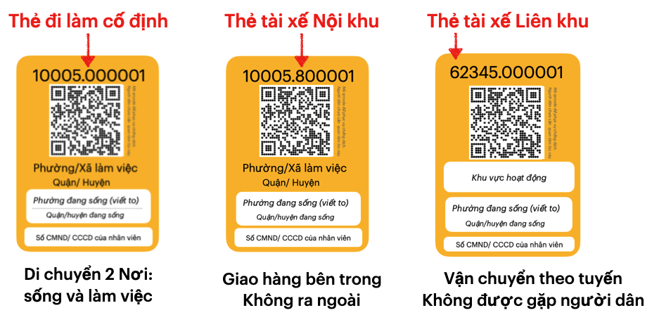

#### 2. Điều chỉnh hành vi của mọi người bằng Lệnh

- Đeo Thẻ khi di chuyển và quét thẻ tại Chốt Chống dịch

#### 3. Phuc vụ theo gia đình bằng Lệnh 

- Bán hàng theo Thẻ gi
#### Cấp Thẻ và điều chỉnh hành vi của mọi người bằng Lệnh

Chi tiết các bước triển khai, tham khảo thêm tài liệu đính kèm. Sau đây là một số lưu ý:

Cần vận dụng nguyên tắc **"Trách nhiệm thuộc bên tiếp nhận"** và **"Định kỳ kiểm tra, duyệt Thẻ"** để việc triển khai diễn ra nhanh chóng, hạn chế tụ tập tại trụ sở Phường/Xã.

**Phường/Xã chịu trách nhiệm với số Phôi Thẻ đã nhận**

   - Phường/Xã chủ động đóng dấu lên Phôi và Cấp Thẻ, đồng thời cập nhật về hệ thống thông tin các Phôi đã sử dụng, chưa sử dụng và các Thẻ đã khoá (thu hồi sau khi cấp).

   - Với cơ chế trách nhiệm này, số Phôi được nhận có thể nhiều hơn dự kiến ban đầu, hạn chế thiếu Phôi khi phát sinh thực tế. 

- **Cấp và kiểm tra định kỳ Thẻ gia đình**

- Cán bộ Phường/Xã tới từng gia đình, phòng trọ, nhà trọ,... Cấp 1  Thẻ theo thứ tự ID tăng dần, cập nhật số Thẻ đã cấp kèm thông tin: địa chỉ nhà, số cmnd  người sử dụng (tối đa 3 người)

- Định kỳ mỗi tuần, tới từng gia đình trong danh sách đã cấp trước đây, bên cạch việc đôn đốc, hướng dẫn, hỗ trợ từng gia đình chống dịch, ... Quét Thẻ đã cấp để xác nhận.

- Với cơ chế kiểm tra định kỳ này, dữ liệu thu được sẽ đánh giá mức độ "tuân thủ", trách nhiệm của cán bộ Phường/Xã 

- Thẻ gia đình sẽ thay thế cho Phiếu đi chợ, mua hàng hiện nay. 

**Doanh nghiệp chịu trách nhiệm với Thẻ làm việc đã cấp**

Các bước thực hiện gồm

1. Phường/Xã cấp theo Số lượng đăng ký

   - Doanh nghiệp đăng ký sơ bộ với số lượng cần kèm cam kết chịu trách nhiệm. Có thể đăng ký Online 
   -  Sau khi kiểm tra tính hợp lệ của hồ sơ, Phường Xã cấp đúng số lượng Thẻ đăng ký. 
   - Việc này diễn ra nhanh chóng (5 phut/ 1 doanh nghiệp) hạn chế tối đa việc tụ tập. 

3. Doanh nghiệp chỉ cấp cho nhân viên có Thẻ gia đình 

   - Điền thông tin vùng màu trắng, đóng dấu và cấp Thẻ cho nhân viên. 
   - Gửi danh sách chi tiết vào hệ thống để  mỗi Phường biết danh sách thực tế, và số Thẻ chưa sử dụng nếu có. 
   - quản lý, giám sát việc sử dụng Thẻ của nhân viên. 

4. Doanh nghiệp chịu trách nhiệm khi nhân viên vi phạm, với  chế tài tăng dần. 
   - Nhân viên vi phạm, bị lập biên bản
   - Phát hiện vi phạm từ dữ liệu quét Thẻ, tuỳ mức độ sẽ cảnh báo, xử phạt. 
   - Nhân viên không tuân thủ xét nghiệm theo yêu cầu. 
   
6. Công An tỉnh/ Thành phố (hoặc từng Phường/Xã) khoá Thẻ từ xa, khi cần giới hạn số lượng Thẻ đã cấp: 

   - Thông báo để Doanh Nghiệp thu hồi Thẻ đã khoá từ nhân viên. Giữ để sử dụng lại, không cần nộp lại cho Phường/Xã 

   - Nếu Thẻ đã khoá có lịch sử "quét Thẻ", Doanh nghiệp chịu trách nhiệm giống như 1 trường hợp vi phạm.

**Thẻ chống dịch**: đơn vị chủ quản chịu trách nhiệm quản lý cá nhân tham gia. Cơ chế cũng tương tự như Thẻ làm việc. 

**Thẻ Làm việc, Thẻ Chống dịch phải có ID của Thẻ Gia đình**:

- nhân viên, cá nhân tham gia chống dịch phải cung cấp ID của Thẻ gia đình mà họ đang sống

- Phường/Xã nơi sinh sống được thông báo, dựa trên ID của Thẻ gia đình.

- Có thể ngẫu nhiên kiểm tra tại nơi ở: đối chiếu giữa thông tin giữa các Thẻ đã cấp với Thẻ gia đình 
   

#### Triển khai điểm quét thẻ Checkpoint

Về nguyên tắc, nơi nào có con người tụ tập, tiếp xúc nhau, nơi đó nên dán Checkpoint. Mỗi địa điểm đó sẽ có 1 ID duy nhất, được tạo ra dựa trên tài khoản do Phường/Xã ở địa điểm đấy cấp. 

Với Chốt Chống dịch cố định, điểm di động trên đường, có 1 mã Checkpoint, được in nhiều bảng, đặt cách nhau để việc "quét Thẻ" khi đông người vẫn bảo đảm khoảng cách. 

Địa điểm phục vụ người dân, như chợ, siêu thị, toà nhà, công viên... cần tối thiểu 2 checkpoint: 1 tại cổng vào và 1 tại cổng ra có cùng ID. Các địa điểm lấy mẫu tập trung, tiêm vacxin,... có thể có nhiều hơn 2 checkpoint.

Dựa vào 2 checkpoint này, giám sát được số lượng người đang tụ tập tại một địa điểm. 

Checkpoint có cơ chế kiểm soát, giám sát vi phạm từ xa

   - Mỗi mã Checkpoint có thời gian hiệu lực, để hạn chế không tới điểm đến mà vẫn quét với hình chụp lần trước. 
   - Với các địa điểm vi phạm, sẽ bị khoá từ xa và các checkpoint cho địa điểm này sẽ không thể quét Thẻ. 
   - kết hợp thêm công nghệ GPS,... để phát hiện gian lận. 

##### 2. Dùng Thẻ Lệnh để giám sát di chuyển theo Phường/Xã và bắt buộc xét nghiệm định kỳ

**Giám sát di chuyển theo Phường/Xã**

Quét Thẻ tại điểm đến cho phép phát hiện di chuyển 
**Về ngắn hạn**, sử dụng các **Lệnh** bên dưới để hạn chế tối đa số người được phép ra, vào:

- Cấm ra ngoài Phường/Xã để mua hàng.

- Không được đi vào trong Phường/Xã khi di chuyển, trừ nơi làm việc và nơi đang sống

- Chia shipper thành 2 đội: Shipper Nội khu hoạt động bên trong Phường/Xã được phép tiếp xúc với người dân, Shipper Liên khu chỉ được giao nhận hàng tại điểm tập kết ở giáp ranh các Phường/Xã, không được gặp người dân. Shipper Nội khu do Phương/Xã cấp phép và ưu tiên người dân sống bên trong.

- Chợ, siêu thị sắp xếp nhân viên bán hàng để sống và làm việc bên trong Phường/Xã. Doanh nghiệp, cơ quan có nhiều chi nhánh như Ngân hàng,... cần bố trí lại nhân viên để hạn chế tối đa di chuyển liên Phường/Xã 

- Cấp phép hạn chế số người được ra ngoài Phường/Xã để làm việc.

Đơn vị chủ quản (doanh nghiệp, cơ quan,...) chịu trách nhiệm quản lý, trả phí xét nghiệm định kỳ các cá nhân này cũng như bị xử phạt liên đới khi có sai phạm. 

Về dài hạn, quy hoạch nơi làm việc và sinh sống trong một khu vực hợp lý (bên trong một quận huyện)

- Siêu thị, chợ,... bán hàng theo Phường/Xã, và cần đảm bảo đầy đủ hàng hoá theo nhu cầu. 

- mua hàng bên ngoài Phường/Xã bằng đặt hàng và nhận hàng theo ID Thẻ gia đình. 

- doanh nghiệp tự điều chỉnh theo mô hình remote teams hoặc chấp nhận chi phí Covid: chia nhân viên thành nhiều nhóm nhỏ (có thể không cùng chuyên môn) tại nhiều văn phòng nằm rải rác, thay vì tập trung ở 1 trụ sở, văn phòng lớn. Tuyển dụng nhân sự mới lưu ý tới yếu tố khu vực sinh sống. 

- chính sách quy hoạch, tuyển dụng mới đội ngũ nhân viên để hạn chế việc di chuyển liên Phường/Xã. Hoặc chấp nhận "trả phí Covid" như xét nghiệm định kỳ,...

**3. Tăng niềm tin trong xã hội** 

Trong Đại dịch Covid, có nhiều yếu tố làm giảm niềm tin : sự lo lắng, sự nghi ngờ người lạ, sự cô lập,.... Đây là sự mất mát rất lớn, để lại hậu quả lâu dài trong xã hội. Thiếu niềm tin, mọi người sẽ khó lòng hợp tác, phối hợp với nhau, gây nên sự cản trở rất lớn với mục tiêu chung của xã hội. 

Bên cạnh những chiến lược, kế hoạch hợp lý, thì việc tăng niềm tin cũng góp phần quan trọng để đạt được kết quả mong muốn. 

Mỗi người, thông qua những hành động nhỏ như "quét Thẻ", "đeo Thẻ" (tuân thủ) sẽ làm tăng niềm tin của những người xung quanh. Một loạt hành động nhỏ, nhưng nhất quán sẽ củng cố niềm tin của mọi người trong xã hội, ngay cả những người nghi ngờ nhất. 

Và Chính phủ có thể tăng niềm tin của xã hội bằng hành động chấp điểm kết quả chống dịch theo Phường/Xã mỗi ngày,... nhằm khích lệ sự tinh thần thi đua, phối hợp chống dịch của mọi người. 

Trường hợp bị nhiễm Covid-19 sâu như tp Hồ Chính Minh, Các Phường/Xã sau khi truy quét toàn bộ F0 bên trong, sẽ tăng cường kiểm tra, Phát hiện xâm nhập để kiểm soát "tái nhiễm". Hạn chế tối đa **"tái nhiễm"** sẽ bảo vệ thành quả truy quét trước đó, giúp Phường/Xã tự tin gỡ bỏ giãn cách, mở lại nhiều hoạt động kinh tế bên trong.  

Với vùng bị nhiễm ít như Hà Nội, mỗi Phường/Xã triển khai Phát hiện xâm nhập định kỳ, dần dần mở lại các hoạt động kinh tế bên trong, tăng số lượng ra ngoài làm việc. Nếu phát hiện xâm nhập thì tăng cường kiểm tra vùng biên, và cô lập và tập trung truy vết bên trong. 

Điều chỉnh thói quen di chuyển của mọi người bằng Thẻ Lệnh 

Quy hoạch khu vực làm việc của nhân viên bằng Thẻ làm việc là Lệnh 

Tổ chức Phòng chống dịch theo Phường/Xã 

Tối ưu hiệu quả chống dịch của địa 

**Đeo Thẻ khi ra ngoài và Quét Thẻ tại các điểm đến**

, là những điều chỉnh hành vi khi di chuyển của mọi người để phòng chống dịch, đó là là đeo Thẻ khi ra ngoài và Quét Thẻ tại các điểm đến.

Đeo Thẻ khi ra ngoài là hành động bắt buộc để Công an phát hiện nhanh, từ xa những vi phạm. Bố trí dân phòng kiểm tra ngay đầu khu dân cư, chung cư,... sẽ phát hiện sớm đối tượng vi phạm.

Quét Thẻ tại các điểm đến, nhất là các Chốt chống dịch là điều bắt buộc. Lịch sử quét Thẻ sẽ lọc ra những đối tượng vi phạm, và cảnh cáo hoặc xử phạt nguội. 

**Hạn chế tối đa số người ra ngoài Phường/Xã mỗi ngày**

Đây là 2 thói quen quan trọng nhất để chống dịch.

Công cụ dành cho người dân để điều chỉnh hành vi khi di chuyển, hình thành thói quen phòng chống dịch. Công cụ này gồm Thẻ gia đình và các Lệnh đi kèm

Quét Thẻ tại các điểm đến, đeo Thẻ khi di chuyển trên đường là các hành vi cơ bản cần tuân thủ. 

Mỗi người với Thẻ gia đình sẽ được mua hàng trong Phường/Xã đang sống 

Công cụ dành cho doanh nghiệp, cơ quan và nhân viên
Thẻ làm việc và Lệnh đi kèm 

Công cụ dành cho đội ngũ chống dịch và cá nhân tham gia. Thẻ chống dịch và Lệnh đi kèm 

Công cụ để tạo thói quen phòng chống dịch cho cộng đồng. Công cụ này gồm 2 phần chính là Thẻ và Lệnh, phối hợp với nhau trong một hệ thống.

Đề xuất một công cụ để mọi người thể hiện trách nhiệm, sự tuân thủ phòng chống dịch. Công cụ này được gói gọn trong một tấm Thẻ, với 3 mẫu bên dưới.

Kèm theo Thẻ gia đình là những quy định, giới hạn để được mua hàng, và có tính bắt buộc, gọi là Lệnh. 

Mọi người cần một công cụ để thể hiện sự tuân thủ,  phòng chống dịch

Công cụ cho người dân để thể hiện sự tuân thủ như cần đi đâu, làm gì, khi gặp khó khăn thì phản ánh tới đâu.

Công cụ này được đóng gói trong một tấm thẻ

mỗi người dân cần một công cụ để biết họ cần tuân thủ những 

##### Điều chỉnh cấu trúc xã hội 

Trên tinh thần "xã, phường, thị trấn là một pháo đài" của Thủ tướng, cần xác định rằng các "pháp đài" này có thể bị xâm phạm từ bên ngoài, từ các cá nhân ra vào "pháo đài" có rủi ro mang mầm bệnh. 

Một cá nhân xét nghiệm âm tính khi vào "pháo đài", có thể chuyển thành F0 vài ngày sau, nên cần giám sát để đưa vào danh sách để xét nghiệm định kỳ. 

Khi phát hiện, những "pháo đài" mà F0 này từng ra, cần chuyển sang trạng thái "Chiến đấu", các "pháo đài" liền kề chuyển sang trạng thái "Cảnh giác", các "pháo đài" còn lại trong trạng thái "an toàn", định kỳ giám sát và hoạt động bình thường.

Khi "Chiến đấu", pháo đài cần tập trung kiểm tra chặt đường biên để hạn chế tối đa các cá nhân ra ngoài, nhất là tới các Pháo đài an toàn. Pháo đài liền kề, trạng thái "Cảnh giác", tăng cường kiểm tra đường biên thứ 2, ngăn ngừa lây lan thứ cấp sang các pháo đài an toàn. 

Khi tạo thành 2 đường vòng biên để ngăn chặn lây lan, chúng ta sẽ yên tâm chiến đấu bên trong: đánh giá mức độ xâm nhập bằng xét nghiệm thêm đối tượng nguy cơ, từ đó đưa ra mức độ giãn cách phù hợp bên trong các pháo đài này. 

Như vậy, điều chỉnh quan trọng của Phường/Xã là nâng cao năng lực phát hiện Covid-19 xâm nhập vào bên trong bằng cách xét nghiệm định kỳ các đối tượng nguy cơ cao.
 Đây chính là vũ khí quan trọng để đối phó với biến thể Delta lây lan nhanh, có nhiều F0 lang thang không có triệu chứng.

Vậy đối tượng nào cần xét nghiệm để phát hiện Delta xâm nhập? 

Đó là những người từ bên ngoài vào trong Phường, có thể là cư dân bên trong, ra ngoài Phường/xã đang sống để mua hàng, làm việc,... hoặc là nhân viên từ nơi khác tới làm việc, giao hàng mỗi ngày. 

Nếu có thể giảm tối đa số người được phép ra vào Phường/Xã mỗi ngày, thì việc kiểm soát, giám sát số còn lại là khả thi và chi phí xét nghiệm là chấp nhận được để tất cả Phường/Xã thực hiện định kỳ. 

Xét nghiệm định kỳ tất cả cá nhân ra vào Phường/Xã là điều kiện đủ để Phường/Xã trở thành một đơn vị Phòng chống dịch. 

Khi tất cả Phường/Xã đều là đơn vị Phòng chống dịch, sẽ hình thành một mô hình Phòng chống dịch cực kỳ hiệu quả (đặt tên là Ruộng bậc thang Phường/Xã), giúp phát hiện sớm Phường/Xã nguy cơ để cô lập, tập trung Chống dịch mà không cần giãn cách toàn vùng, làm ảnh hưởng tới hoạt động hằng ngày ở các Phường/Xã khác. 

Đây cũng là mô hình bền vững trong trạng thái Bình thường mới, không chỉ Phòng, chống biến thể Delta, mà các biến thể nguy hiểm khác hay các bệnh truyền nhiễm khác trong tương lai. 

Tóm lại, để Phường/Xã thành một đơn vị Phòng chống dịch, thì điều kiện cần là **hạn chế tối đa số người được phép ra vào** và điều kiện đủ là **xét nghiệm định kỳ tất cả cá nhân này**. 

Đầu tiên, cần triển khai Thẻ Lệnh cho tất cả Phường/Xã.

### Định nghĩa mới về miễn dịch cộng đồng

Miễn dịch cộng đồng với đại dịch Covid là một hiện trạng của xã hội. Khi đạt tới hiện trạng này, toàn xã hội không cần phải giãn cách triệt để mà vẫn kiểm soát lây lan, khống chế bùng phát, và dập tắt dịch bệnh. 

Có vài chiến lược để đạt tới hiện trạng này: 
- tạo ra miễn dịch cho phần lớn người dân (Israel, Anh,...)
- Không Covid bằng kiểm soát chặt biên giới ra vào (Trung Quốc, NewZealand, Việt Nam,..)
- giám sát lây lan Covid mà không cần giãn cách toàn xã hội (Hàn Quốc hiện tại)

Còn một chiến lược nữa: đó là hệ thống hoá, quy hoạch hoá việc di chuyển theo khu vực. 

**Hệ thống hoá** là tạo cho mọi người những thói quen mới một cách hệ thống để phòng, chống covid. Đeo khẩu trang là một thói quen mà toàn xã hội đang có. Một thói quen khác cần được hệ thống là "Check-in tại mọi điểm đến trong nhà và cả ngoài trời. 

Tất cả mọi người có thói quen check-in hàng ngày, thì mới xem Hệ thống (xã hội) cần có. 

Chúng ta thường hiểu nhầm, hiểu sai về "Hệ thống", cứ nghĩ nó là hệ thống phần mềm, app,.cntt,... Phần mềm, app chỉ là công cụ, 1 phần để hình thành Hệ thống thói quen bên trên thôi. 

Thói quen của cá nhân vẫn là chưa đủ để phòng chống dịch bệnh. Xã hội cần một thói quen khác, ở quy mô lớn hơn đó là thói quen **"quy hoạch việc di chuyển theo khu vực"**

Mục đích của thói quen này, là phân chia xã hội thành nhiều khu vực nhỏ, tương đồng nhau. Trong đó hầu hết việc di chuyển hàng ngày đều tập trung bên trong khu vực này. Nhu cầu di chuyển liên khu vực vẫn diễn ra, nhưng đã giảm đi rất nhiều. 

Di chuyển liên khu vực ít đi, thì tốc độ lây lan qua nhiều khu vực sẽ giảm đi một cách tự nhiên. Quản lý, giám sát các di chuyển này cũng dễ dàng, và việc kiểm soát chặt khi cần chống dịch là điều khả thi. 

Thói quen "Quy hoạch việc di chuyển theo khu vực" đã và đang diễn ra khi Covid xuất hiện, với "khu vực" là quy mô quốc gia. Mỗi quốc gia chủ động được việc này, và việc kiểm soát xâm nhập đã mang lại lợi ích rất lớn: mọi hoạt động bên trong diễn ra bình thường.

Nhưng với biến thể Delta, thì khu vực ở đây cần nhỏ hơn rất nhiều, và lý tưởng nhất là theo Phường/Xã. 

Mỗi Phường/Xã định kỳ kiểm tra Covid xâm nhập, sẽ tạo thành 1 một "radar siêu nhạy" để phát hiện nguy cơ. Và trong lúc Delta lây lan chậm lại giữa các Phường/Xã, chúng ta có đủ thời gian để khoanh vùng, kiểm soát và dập tắt bùng phát.  

Đây chính là một hiện trạng "miễn dịch cộng đồng" mà thế giới đang cần, bởi tính chủ động, sẵn sàng áp dụng của mỗi quốc gia, vùng dịch.

Nhưng mỗi quốc gia cần làm gì để có thói quen "quy hoạch việc di chuyển theo khu vực"? Đối tượng nào trong xã hội cần có thói quen này? Bao lâu để đạt được thói quen trên? 

Giải pháp để thực hiện từng bước đã có, và có thể áp dụng ngay lúc này. 

Nhưng luôn có 1 câu hỏi quan trọng nhất trước khi bắt đầu. 

Đó là **lợi ích mang lại, có xứng đáng với công sức, nỗ lực mà xã hội bỏ ra để có  thói quen "Quy hoạch di chuyển theo Phường/Xã" hay không?**

Ai cũng biết, một thói quen tốt luôn xứng đáng với mọi cố gắng, công sức để tạo nên thói quen đó. Nhưng thế nào là tốt, xấu thì tuỳ thuộc quan điểm, cảm nhận của mỗi người. 

Và để mọi người đồng thuận rằng "Quy hoạch di chuyển theo khu vực (Phường/Xã)" là thói quen tốt so với không làm gì, để "xã hội di chuyển hỗn loạn như hiện tại", còn vất vả, tốn thời gian hơn là thực hiện thói quen đó. 

Một định nghĩa mới về "Miễn dịch cộng đồng", là rất cần thiết lúc này, giúp chúng ta hình dung rõ hơn về đích đến. Một đích đến rõ ràng, sẽ giúp chúng ta **không phải hối hận**, khi nhận ra đã "bắc thang lên nhầm bức tường". 

P/S: "Quy hoạch di chuyển theo khu vực" là thói quen mà xã hội cần thực hiện với Doanh nghiệp, tổ chức, cơ quan,... để đạt tới kết quả "mọi người sinh hoạt và làm việc theo khu vực"

- bán hàng tại chỗ theo khu vực
- giao hàng theo khu vực 
- làm việc trong khu vực đang sống. 
- các quy hoạch đô thị khác. 

### khác

Hệ thống hoá việc di chuyển, tụ tập của cộng đồng

- thói quen mỗi cá nhân
    - check-in tại điểm đến bằng Thẻ do chính quyền cấp

- quy hoạch việc di chuyển
    - mua hàng theo khu vực
    - đi làm theo tuyến cố định
    - giao hàng theo khu vực
    - làm việc ngay khu vực đang sống.

### Câu chuyện giấy đi đường

Niềm tin về tờ "giấy đi đường".

Sau 4,5 lần thay đổi lớn, giấy đi đường đã trở nên chặt chẽ hơn: trong đó Công an phát hành mẫu giấy, Sở công thương và địa phương cấp cho Doanh nghiệp theo nhu cầu. 

Nhưng còn lâu lắm, Giấy đi đường mới tới được hình hài của Thẻ làm việc: gọn gàng, dễ nhận ra từ xa và nhất là sự cân bằng giữa lợi ích các bên. 

Bên phát hành (Công an) giám sát được số Thẻ sử dụng thực tế so với tổng số Phôi đã cấp. Sở công thương đáp ứng được nhu cầu thực tế theo quy định của UBND, và Doanh nghiệp quản lý được Thẻ của nhân viên,... 

Và trong lúc chờ Giấy đi đường biến hình, báo chí sẽ tốn nhiều giấy mực về kể về giấy đi đường, người dân sẽ lãnh kết quả cuối cùng.

Và niềm tin của cộng đồng, sẽ vơi đi qua từng đợt đổi giấy.

### Dao động của mỗi người và hỗn loạn của hệ thống

Con người luôn dao động, trong tâm trí và ngoài cơ thể. Ngay cả khi ngồi im, tâm trí của mỗi người vẫn luôn dao động. 

Khi nhận thông tin bên ngoài, tâm trí mỗi cá nhân sẽ bị dao động, và chuyển đổi thành các hành động chia sẻ (thông tin, cảm xúc,lo lắng...) tới người khác có cùng quan tâm, và vô tình lây lan dao động này sang những người xunh quanh. 

Lấy ví dụ về thông tin về giới hạn mua hàng. Người tiếp nhận sẽ phát sinh lo lắng khi bị giới hạn (là dao động tâm trí), và sẽ lan truyền sang cá nhân khác quan tâm tới việc mua hàng. 

Dao động này được tăng cường lẫn nhau và chuyển sang hành động ra ngoài mua hàng, tích trữ. Và khi quan sát, xem trên báo chí... về hành động mua hàng của người khác,mỗi người càng dao động mạnh hơn, khuyến đại thêm để thành hiện tượng đổ sô, chen chúc đi mua hàng.

Nếu chỉ dừng ở đây, thì cũng chưa phải vấn đề lớn.

Việc dao động từ bên mua (người dân), tiếp tục lan tới bên phục vụ (chợ, siêu thị), tiếp tục tới bên kiểm tra (công an, dân phòng) và trở về điểm ban đầu là kết quả mà những người quyết định nhận được. Thời gian kết quả nhận về (gọi là sự trễ nhịp) nhanh thì 1 tuần, trung bình 1 tháng hoặc lâu hơn. 

Không nhiều người nhận biết được kết quả từ quyết định của mình, ngày với quyết định có sự trễ nhịp nhanh nhất là 1 tuần. Một phần vì kết quả thực tế khó thu thập đầy đủ, quan trọng hơn là trong 1 tuần đó, có nhiều quyết định khác gây ra kết quả chồng chéo nhau. 

Và khi chưa nhận đủ kết quả, hoặc bất ngờ với kết quả ban đầu sau vài ngày (thay vì chờ tới 1 tuần), người ra quyết định sẽ bị dao động, mất bình tĩnh và đưa ra nhiều quyết định tiếp theo (có thể tốt hoặc tệ hơn cái trước).

Đây cũng là điều tự nhiên, vì người ra quyết định vẫn là con người. Và nếu dừng ở đây, thì vẫn còn kiểm soát được.

Nhưng 1 cộng đồng đâu chỉ 1 người ra quyết định, chưa kể nhiều quyết định nhỏ hơn được diễn giải khác nhau bởi cấp dưới. 

Tất cả những điều trên cộng hưởng lẫn nhau, tạo nên hỗn loạn cho mọi đối tượng bên trong: bên mua, bên bán, bên kiểm tra và bên đưa quyết định, tạm gọi là Sự hỗn loạn của 1 Hệ thống mở (xã hội loài người)

Từ ngàn xưa, nhiều bậc trí giả, chỉ việc ngồi trong nhà,không cần đi quá nhiều, hoặc cần thiết bị, công nghệ tối tân nào vẫn có thể hình dung ra sự hỗn loạn xã hội này từ quan sát trực tiếp hoặc lắng nghe tường thuật từ người khác. 

Nhiều bậc vĩ nhân, còn lĩnh hội những nguyên lý sâu xa, để  điều chỉnh hệ thống họ đang sống, khiến nó trở nên trật tự hơn, cân bằng hơn vài trăm năm sau. 

Vài chục năm gần đây, các nghiên cứu về vấn đề trên đã đúc kết thành một số nguyên lý về hệ thống mở, gọi tên là "tư duy hệ thống" (google)

Nếu ai quan tâm tìm hiểu, sẽ được như các bật trí giả, ngồi nhà và hình dùng được bức tranh hiện tại ở những vùng chỉ thị 16. 

### Trật tự trong hỗn loạn của Hệ thống con người.

### Bức tranh "bình thường mới" với Thẻ Lệnh.

Thẻ Lệnh là hệ thống phát hiện sớm và ngăn chặn nguy cơ bùng phát Covid khi xã hội trở về "Bình thường mới"

#### Với mọi người:

Được cấp Thẻ miễn phí cho các nhu cầu chính đáng.

Mỗi người khi ra ngoài sẽ mang (đeo) Thẻ, di chuyển tự do, bình thường như trước đây. 

Mỗi Thẻ có phạm vi di chuyển tự do, nếu vượt quá thì cần tự giác khai báo, (cũng như trả thêm phí xét nghiệm,...). 

- Thẻ Gia đình sẽ tự do bên trong Phường/Xã, hoặc trong  Quận/ Huyện. Nên mua hàng Online từ các Quận Huyện khác hoặc muốn mua tại chỗ thì cần tuân thủ yêu cầu phòng dịch và trả thêm phí. 

- Thẻ Làm việc cho phép di chuyển trên trục đường giữa 2 Phường/Xã, và tự do di chuyển bên trong 2 nơi này.  Nếu di chuyển sang các nơi khác vì công việc, như gặp khách hàng, hội họp, ... phải tuân thủ các biện pháp Phòng dịch và trả thêm chi phí.

- Nếu có nhu cầu di chuyển chính đáng khác như thăm người thân, đi du lịch,... cần đăng ký với Phường/Xã để được cấp Thẻ Di chuyển 1 lần. Tuân thủ các yêu cầu chống dịch khi di chuyển, và thông báo sau khi thành chuyến đi để khoá Thẻ. 

- Khi chuyển sang nơi khác để sinh sống, thì xin cấp Thẻ mới (và hoàn trả Thẻ cũ) ngay tại Phường/Xã mới. 

Khi tới điểm đến như chợ, siêu thị, toà nhà,... sẽ được bảo vệ ở đó yêu cầu quét thẻ để Check-in. 

Nếu 1 điểm đến phát hiện F0, danh sách ID đã check-in sẽ được lọc ra và thông báo công khai. 
  - Người dân có ID trùng cần tự giác tuân thủ các biện pháp cách ly hoặc xét nghiệm. 
  - Phường/Xã đang sống sẽ nhắc nhở, hỗ trợ khi cần thiết. 

#### Với chợ, siêu thị: 
- Chỉ bán cho người có Thẻ gia đình 
- Có chính sách khuyến mãi, ưu đãi cho Thẻ gia đình bên trong Phường/Xã
- Ưu tiên đặt hàng Online, không phân biệt Thẻ từ nơi nào. 
- Hạn chế mua hàng tại chỗ với Thẻ từ Phường/Xã khác (như số lần mua 1 tuần, khai báo y tế)
- Với các siêu thị lớn, phục vụ nhiều Phường/Xã xung quanh, 
Cần phân chia để cư dân 2 Phường không mua hàng cùng 1 ngày.

#### Với toà nhà, văn phòng làm việc 

Chỉ cho người có Thẻ làm việc ra vào, và bắt buộc quét Thẻ.

Với các văn phòng bên trong toà nhà, bắt buộc quét Thẻ lúc vào, lúc ra ngay cả với nhân viên làm việc bên trong . 

#### Với các Chốt chống dịch

Trong trạng thái bình thường, phát hiện người không có Thẻ bằng các biện pháp kiểm tra thông thường. Với người đeo Thẻ, không cần kiểm tra hoặc yêu cầu quét Thẻ. 

Cần giám sát: yêu cầu mọi người đi qua phải tự quét Thẻ. Cảnh cáo hoặc xử phạt các cá nhân không tự giác thực hiện quét Thẻ. Hệ thống sẽ phân tích, lọc ra các Thẻ đang vượt quá giới hạn để cảnh cáo, nếu lặp lại nhiều lần, sẽ bị xử phạt vì tội cố ý.

Cần kiểm soát: quét Thẻ và kiểm tra chi tiết thông tin. Nếu được phép thì mới cho qua, không thì buộc quay đầu. 

#### Với Phường/Xã

Hệ thống sẽ gửi danh sách ID cảnh báo, để cán bộ Phường/Xã gửi giấy nhắc nhở,cảnh báo tới các ID này. 

Với ID vi phạm, yêu cầu mang Thẻ trung ID tới để nộp phạt

Nhưng tới Phường/Xã Cảnh báo, sẽ phải đưa thẻ tại các Chốt Chống dịch, công an sẽ để kiểm tra và lưu lịch sử. Nếu được phép thì cho vào, không thì quay về. 

### Tính nhân văn của Thẻ Lệnh 

#### Không lưu thông tin cá nhân của mọi người

> Bảo đảm an toàn thông tin ngay cả với nhân sự phát triển,  vận hành Thẻ Lệnh.

Khi Thẻ được cấp, chỉ lưu 1 phần (3 hay 6 số cuối cùng) của CMND/ CCCD của người được cấp.

Phường/Xã lưu địa chỉ nhà của người được cấp Thẻ, để có thể tới tận nhà kiểm tra khi cần. 

Không cần lưu thông tin cá nhân như tên, số điện thoại, ngày sinh, hay hình ảnh cmnd vào hệ thống. 

#### Nhắc nhở thay vì xử phạt.

Dựa vào dữ liệu quét Thẻ để phát hiện vi phạm (Phạt nguội), mục đích chính là hình thành thói quen tuân thủ Phòng dịch của mọi người. 

Những vi phạm lần đầu xem như là vô ý, cần được nhắc nhở, hướng dẫn để cải thiện.

Những vi phạm liên tiếp, sẽ bị cảnh báo xử phạt

Những vi phạm tiếp diễn sau khi xử phạt, sẽ thêm hình phạt thích đáng. 

