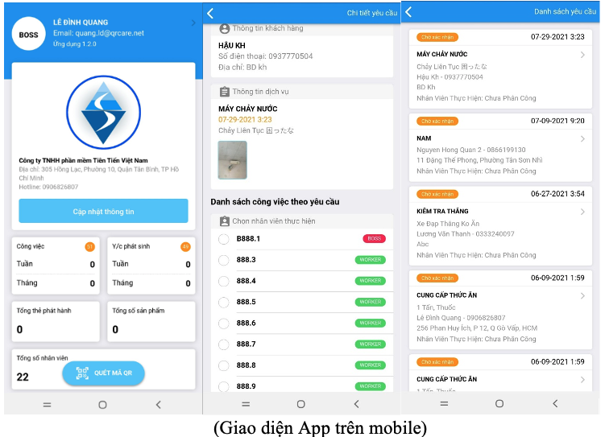

## QRCare giúp mọi người sử dụng thiết bị hiệu quả hơn. 

Thiết bị mà QRCare muốn nhắm tới có giá trị cao, vòng đời sử dụng lâu dài, dành cho gia đình như máy điều hoà, tủ lạnh, máy giặt,... dành cho doanh nghiệp như máy móc cho nhân viên làm việc tại nhà, thiết bị để sản xuất.

Để nâng cao hiệu quả sử dụng thiết bị, QRCare tập trung giải quyết các bài toán sau: 

### Bảo trì định kỳ

Để thiết bị được sử dụng hiệu quả, thì việc bảo trì định kỳ rất quan trọng. 

Do cuộc sống bận rộn, nhiều gia đình ít chú ý tới việc bảo trì thường xuyên các thiết bị trong nhà, nhất là máy điều hoà. 
Việc gọi thợ khá là "nhiêu khê", nhất là ở các thành phố đông đúc, khiến mọi người thường trì hoãn việc bảo trì, chỉ thực hiện khi máy gặp trục trặt, hoặc chạy mà không mát.

Sự nhiêu khê khi bảo trì là do tâm lý lo ngại bạn thợ làm việc thiếu trách nhiệm, gian dối, khiến lúc bảo trì cần có người biết kỹ thuật, ở nhà để kiểm tra. Mà người biết kỹ thuật, thường là đàn ông, hay ở nhà vào cuối tuần, khiến việc bảo trì, vệ sinh tập trung đông đúc vào cuối tuần, và thưa thớt trong tuần. 

Nếu có cơ chế giám sát công việc từ xa, thì phụ nữ, người lớn tuổi có thể tự tin làm việc với thợ vào các ngày trong tuần. 

Từ đó, thời gian làm việc tăng lên, chi phí thấp hơn vào ngày trong tuần, sẽ khiến người dân bảo trì máy lạnh thường xuyên hơn, đúng lịch hơn. Về tổng thể, hiệu quả sử dụng của hàng triệu máy lạnh ở việt nam tăng lên, giảm lượng điện năng chung cho xã hội, nhất mà mùa nóng. 

### Thanh lý khi không cần

Mọi người thường có tâm lý sở hữu, ngay cả khi không cần.

Qúa trình thanh lý một món đồ tốn thời gian, bực bội, khiến chúng ta vẫn giữa cái không cần, trong khi có nhiều người rất thiếu.

Nhiều cửa hàng thanh lý chèn ép giá cả, khiến cho nhiều người không muốn tìm tới để bán lại nhất là những người có điều kiện,muốn cho đi để mua mới. Với những người này, thà cho, tặng cho người khó khăn, tổ chức từ thiện sẽ mang lại niềm vui, hài lòng hơn là ít tiền thu lại mà bị o ép. 

Nhưng họ thường thiếu thời gian, kiên nhẫn để mang cho, và cuối cùng là thiết bị vẫn để trong kho, chờ vứt thùng rác. 

Ngược lại, nhiều người gặp khó khăn, lại phải tìm đến các cửa hàng thanh lý để mua lại, và tất nhiên phải trả gía cao hơn. 

Việc đưa thiết bị còn sử dụng tới đúng người có nhu cầu cũng là cách tăng hiệu quả sử dụng thiết bị. 

Và quan trọng hơn, khi cho tới những hoàn cảnh khó khăn, chúng ta sẽ nhận ra sự lãng phí của mình, và tự điều chỉnh để sống tốt hơn. Chúng ta sẽ cân nhắc khi mua một thiết bị để rồi không sử dụng và tước đi cơ hội cho những người sử dụng khác.

### Tăng hiệu quả sử dụng bằng QRCare

Mỗi thiết bị đang sử dụng sẽ dán 1 thẻ QRCare như hình bên dưới

- ID duy nhất
- quét mã qrcode để truy cập vào trang Vòng đời thiết bị: chứa thông tin thiết bị, lịch sử bảo trì sửa chữa, các yêu cầu hỗ trợ, ghi chú,...

QRCare kết nối 3 đối tượng theo mô hình bên dưới

- nSuppliers: gồm Nhà sản xuất, nhà phân phối, bên bán, và bên cung cấp dịch vụ bảo trì thiết bị
- Owner: bên mua, sở hữu thiết bị, có thể là cá nhân hoặc 1 tổ chức
- mUsers: người sử dụng thiết bị: có thể là người thân trong gia đình hoặc nhân viên trong công ty. 

### Mục tiêu hướng tới

**Sự minh bạch**: chủ yếu giữa Bên cung cấp (Suppliers) và Chủ sở hữu(Owner)
- về nguồn gốc, trạng thái của thiết bị
- về cam kết bảo hành, bảo trì miễn phí
- về hỗ trợ, thực hiện công việc giữa nhân viên Supplier và khách hàng

**Sự giám sát**: khi thiết bị được sử dụng bởi những người khác trong gia đình, hoặc nhân viên công ty

**Sự hiệu quả**: bên cung cấp hỗ trợ, bảo trì, sửa chữa trực tiếp cho người sử dụng. Hai bên làm việc trực tiếp sẽ tối ưu thời gian, công sức và tăng hiệu quả sử dụng thiết bị. 

### Tầm nhìn của QRCare

**Hàng tỷ thiết bị đang và sẽ đưa vào sử dụng**

Nhiệm vụ của QRCare là tiếp cận, dán Thẻ và giúp nâng cao hiệu quả sử dụng của các thiết bị này.

**Hàng triệu doanh nghiệp** đang cần nâng cao tiêu chuẩn phục vụ khách hàng
- minh bạch, chuyên nghiệp, tinh thần phục vụ là những tiêu chuẩn mới mà doanh nghiệp cần hướng tới.

**Users: quyết định việc sử dụng hiệu quả.**

QRCare chia khách hàng thành 2 đối tượng riêng: Owner là người mua, sở hữu và Users là người sử dụng. 

QRCare nhấn mạnh vai trò của Người sử dụng, là người quyết định tính hiệu quả của thiết bị, và cũng là người ảnh hưởng lớn tới việc lựa chọn thiết bị trong tương lai. 

Bên cung cấp nên ưu tiên phục vụ tốt Người sử dụng, sẽ mang lại nhiều giá trị trong dài hạn. 

### Các tính năng hiện có của QRCare 

> tham khảo https://qrcare.vn 

#### Đối với khách hàng, người sử dụng

Bật camera điện thoại quét qua mã qrcode trên sản phẩm và thực hiện các thao tác đơn giản: 

- Xem thông tin nhà cung cấp, thông tin sản phẩm, bảo trì, bảo hành ....
- Tạo yêu cầu dịch vụ thông quan trang qrcare.net
- Tạo ghi chú cá nhân... 
- Xem lịch sử bảo hành, sửa chữa sản phẩm 
- Kích hoạt bảo hành, xác nhận đánh giá lắp đặt,bảo hành sửa chữa nhân viên kỹ thuật.
 
#### Dành cho nhà phân phối, bán lẻ, cửa hàng dịch vụ (Supplier)

Sử dụng app QRSupplier, đăng nhập bằng cách quét thẻ

- Quản lý thông tin khách hàng, người sử dụng
- Quản lý thông tin bảo hành sản phẩm
- Giám sát nhân viên, trung tâm bảo hành thực hiện các công việc được chuyển.

#### Dành cho chủ sở hữu (Owner)

Sử dụng app QROnwer, tạo tài khoản miễn phí

- thêm thẻ QRCare vào danh sách cần quản lý
- xem thông tin trang Vòng đời thiết bị từ xa
- gửi yêu cầu dịch vụ
- tạo ghi chú

### Chiến lược triển khai

#### Mô hình kinh doanh

- Thu phí theo Thẻ phát hành, 
- Miễn phí sử dụng, nâng cấp mobileapp, hệ thống phần mềm phục vụ cho công việc.

- Thông qua mạng lưới Đại lý, Cộng tác viên để tiếp cận và chăm sóc tập khách hàng riêng.

- Hợp tác với Đối tác để mở rộng sang các lĩnh vực khác

### Chào đón mọi bên cùng tham gia

- Liên kết thành mạng lưới Supplier để phục vụ khác hàng

- Liên kết để cùng mở rộng nền tảng QRCare, đáp ứng tốt nhất nhu cầu của Mạng lưới Supplier, Owner và Users. 

### THÔNG TIN LIÊN HỆ
 
Công ty TNHH Phần mềm Tiên Tiến Việt Nam VinaAS Co.,Ltd 
- 305 Hồng Lạc, Phường 10 Quận Tân Bình, TP Hồ Chí Minh
- website: qrcare.vn 
