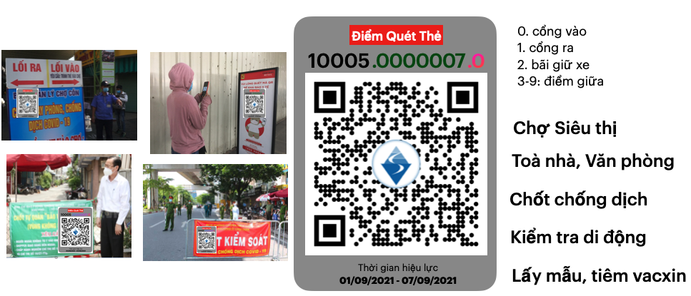
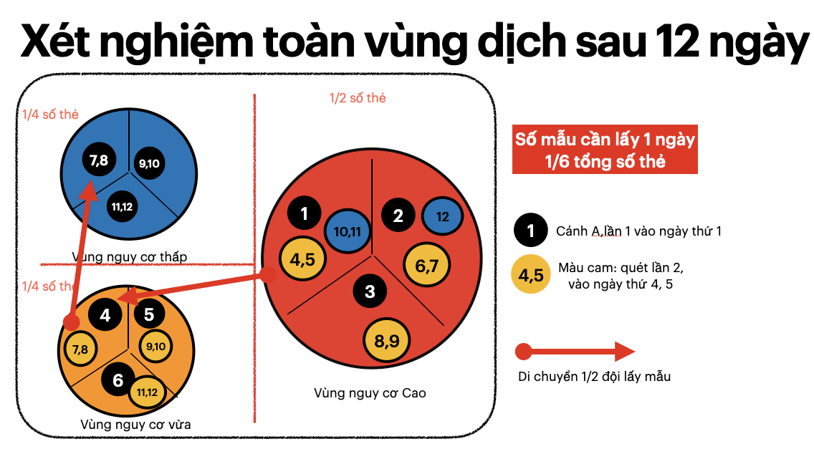

## Chống dịch và phát triển kinh tế theo Phường/Xã bằng Thẻ Lệnh

Thẻ Lệnh ra đời dựa trên đường lối Chống dịch của Chính Phủ Việt Nam, mới nhất là [Công điện số 1099/CĐ-TTg về việc tăng cường giãn cách xã hội và các biện pháp phòng, chống dịch Covid-19](https://hcmcpv.org.vn/tin-tuc/cong-dien-thu-tuong-chinh-phu-ve-tang-cuong-gian-cach-xa-hoi-va-cac-bien-phap-phong-chong-dich-covi-1491882950) được Thủ tướng ký ngày 22/08/2021.

Theo công điện này, "Thủ tướng đặc biệt yêu cầu các địa phương phải lấy **xã, phường, thị trấn là “pháo đài”**" và "thần tốc **xét nghiệm diện rộng (riêng TPHCM xét nghiệm toàn TP)**, đây chính là 2 điểm quan trọng để xây dựng tầm nhìn chung. 

Thẻ Lệnh là tổng hợp các chiến lược dài hạn, giải pháp ngắn hạn để thay đổi thói quen di chuyển của xã hội. Việc di chuyển của xã hội được tập trung bên trong theo Phường/Xã, và giảm tối đa số người ra, vào mỗi ngày.

 để hạn chế lây lan giữa các Phường/Xã. Bên cạnh đó định kỳ giám sát số lượng ra vàođể Phòng chống dịch bệnh. 

Đây không chỉ là điều chỉnh việc di chuyển của cá nhân, mà là điều chỉnh của tổ chức (doanh nghiệp, cơ quan nhà nước,...) với việc di chuyển để làm việc của nhân viên, của chính quyền cấp Phường/Xã và cả của Chính Phủ. Các hành vi này cũng cần duy trì khi chúng ta quay về "bình thường mới", và gọi chung là "thói quen xã hội"

, để phát hiện sớm các đối tượng nguy cơ cao, để khoanh vùng lây lan, kiểm soát bùng phát mà không phải giãn cách toàn xã hội

Việt Nam đã thành công trong việc hình thành thói quen **đội mũ bảo hiểm** để an toàn hơn khi tham gia giao thông, hay **đeo khẩu trang** để bảo vệ sức khoẻ cá nhân. 

Và tin rằng chúng ta sẽ tạo được các thói quen bên dưới:

- Mọi người: đeo Thẻ khi di chuyển và quét Thẻ tại các điểm đến.

- Doanh nghiệp, cơ quan, tổ chức,...: giảm số nhân viên cần di chuyển liên Phường/Xã để làm việc, vận chuyển hàng hoá, hội họp tập trung,...

- Cấp xã, phường: quản lý được mọi người có nhu cầu ra vào Phường/xã, và định kỳ xét nghiệm đối tượng nguy cơ này.

- Chính Phủ: giám sát hoạt động Phòng chống Covid của từng Phường/Xã và tập luyện thường xuyên về năng lực tổ chức lấy mẫu tập trung, trên diện rộng.

Các thói quen của xã hội sẽ cần hoạt động trên một hệ thống chung phức tạp (quy định, nhân lực, công nghệ,...), liên tục thay đổi để bám sát thực tiễn. Thẻ Lệnh đóng vai trò kết nối các hệ thống đang có để cùng xây dựng hệ thống chung trên.

Để hỗ trợ Chính Phủ giải quyết vấn đề hiện tại, là Chống dịch đang bùng phát ở Việt Nam, đặc biệt là tp Hồ Chí Minh,
Thẻ Lệnh được sử dụng như một chiến lược truy quét F0 theo Phường/Xã, tóm tắt trong 3 ý sau: 

1. "Mọi người được phép ra ngoài" được Phường/Xã cấp **Thẻ nhận diện có ID** và được **Lệnh** đeo Thẻ khi di chuyển và quét Thẻ tại các điểm đến (chợ, siêu thị, chốt chống dịch,...) có dán Checkpoint

2. Giảm tối đa số Thẻ được phép ra vào Phường/Xã mỗi ngày bằng các Lệnh quy hoạch theo Phường/Xã: 
    - Shipper Nội Khu: được phép tiếp xúc với người dân nhưng không được di chuyển ra ngoài Phường/Xã làm việc  
    - Nhân viên Nội trú: sống và làm việc bên trong 1 Phường/Xã 
    - Thẻ Làm việc không được ra vào Phường/Xã khác khi di chuyển, ngoài 2 nơi làm việc và cư trú. 

3. Mỗi Phường/Xã là một đơn vị ("pháo đài") Chống dịch với 2 trạng thái:
    - "Chiến đấu": truy quét toàn bộ bằng xét nghiệm **tất cả ID bên trong** cho tới khi hết F0 cộng đồng. 
    - "Sản xuất": kiểm tra định kỳ bằng xét nghiệm **tất cả ID có lịch sử ra, vào.**

**Giải thích**:
- **Lệnh** là một quy định phòng dịch, có chế tài xử phạt cụ thể, do Ban Chỉ đạo Chống dịch cấp Tỉnh/ Thành phố hoặc cấp Quốc gia ban hành. Không chỉ cho người dân, Lệnh còn áp dụng cho doanh nghiệp, cán bộ địa phương,...tham khảo  [Lệnh cho mọi đối tượng](https://baotnq.qrcare.vn/#điều-chỉnh-việc-di-chuyển-của-mọi-người-bằng-lệnh)

- **Thẻ** có 3 màu khác nhau cho 3 hoạt động chính: mua hàng, làm việc và chống dịch. 

- **Checkpoint** là mã QRCode kèm ID, thời gian hiệu lực, được sinh ra bởi hệ thống Thẻ Lệnh, tự in và dán tại các địa điểm. Checkpoint có thiết kế bên dưới

    - đưa thẻ để nhân viên tại điểm đó quét
    - mọi người tự quét (lần 1: checkpoint, lần 2 Thẻ) bằng camera của smartphone  

Tham khảo thêm [Cấp Thẻ cho mọi đối tượng được phép di chuyển.](https://baotnq.qrcare.vn/#cấp-thẻ-cho-mọi-đối-tượng-được-phép-di-chuyển)

3 vai trò của Thẻ Lệnh:

- Tăng tuân thủ, giảm vi phạm bằng hệ thống Thẻ Lệnh 
    - tăng tuân thủ bằng Lệnh kiểm tra định kỳ (double-check) giám sát chéo (cross-check) để loại trừ tư tưởng vi phạm. 

    - Giảm vi phạm bằng cách phát hiện những người gặp khó khăn, không thể tuân thủ Lệnh chống dịch 
    - phát hiện sớm bất thường trong cộng đồng

- Nâng cao hiệu quả bằng chiến lược lấy Phường/Xã là một đơn vị Chống dịch 
    - Việc phát hiện vi phạm của các Phường/Xã liền kề sẽ đươc cộng hưởng,
    - Phường/xã liền kề có kiểm soát ra vào sẽ hạn chế lây lan tự nhiên
    - Quy hoạch xã hội để giảm tối đa việc di chuyển liên Phường/xã 

- Hình thành các thói quen xã hội khi trở về "bình thường mới"
    - mọi người có thói quen quét thẻ tại tất cả điểm đến.
    - doanh nghiệp quy hoạch nơi làm việc của nhân viên để hướng tới "sống và làm việc bên trong khu vực nhỏ (Phường/Xã)
    - chính quyền giám sát các di chuyển ra khỏi khu vực đang sống cho các nhu cầu chính đáng. 

Để tăng tuân thủ, giảm vi phạm, Thẻ Lệnh tập trung vào việc loại bỏ tư tưởng vi phạm và phát hiện nguy cơ bằng giám sát.

**Loại bỏ tư tưởng vi phạm**

- Các Lệnh đưa ra luôn có cơ chế **double check** (giám sát nhiều lần), **cross-check** (giám sát chéo) giữa các đối tượng người dân, doanh nghiệp, cán bộ địa phương, hệ thống chỉ huy,... 

- Mô tả về double-check, cross-check, để các cá nhân biết trước khi thực hiện.

**Phát hiện sớm các vi phạm**
- Thẻ dùng để nhận diện từ xa, và kiểm tra ngay tại khu phố, chung cư, hẻm dân cư để phát hiện sớm người không đeo thẻ, hay vi phạm khi vừa ra khỏi nhà.

- Quét Thẻ khi ra vào Phường/xã là việc bắt buộc, còn việc kiểm tra tại Chốt sẽ linh động để hạn chế gây tắc nghẽn, tụ tập đông. 

- [Phiếu mua hàng](https://baotnq.qrcare.vn/#phiếu-mua-hàng), [Giấy đi đường](https://baotnq.qrcare.vn/#giấy-đi-đường) gần như không thể làm việc này 

**Hiểu về thực tại từ bất thường**

> Đây là 1 ví dụ về 1 bất thường

Phát hiện có nhiều Thẻ trong 1 chung cư không có lịch sử mua hàng 2 tuần nay. Nguyên nhân có thể là gì

2. nhận được thực phẩm từ nguồn từ thiện và không cần ra ngoài?
3. mua thực phẩm từ các cá nhân bán online, giao tận nhà? 
4. Phường/Xã chưa thu hồi các Thẻ này, để huỷ kích hoạt?
5. Và nhiều nguyên nhân nữa mà chúng ta không thể hình dung. 

Nhưng nếu là số 3, số 4, thì cần phải chấn chỉnh ngay, vì đây là vi phạm, thiếu trách nhiệm, gây nguy cơ lây lan dịch bệnh. 

"Đã siết chặt giấy đi đường, mà sao đường phố vẫn đông người" là 1 bất thường?

**Phát hiện nguy cơ dịch bệnh**

- *"Xét nghiệm theo Phường/Xã cho tất cả ID bên trong tới khi hết F0 cộng đồng"* không phải là mục tiêu, mà là 1 bước đệm để từng Phường/Xã đạt tới giai đoạn  **"định kỳ xét nghiệm tất cả ID có lịch sử ra, vào"**. Ở giai đoạn này,  nguồn lây chỉ là các cá nhân ra vào Phường Xã mỗi ngày. 

- Xét nghiệm đình kỳ còn giúp đánh giá năng lực Chống dịch xâm nhập của Phường/Xã đó. Nếu năng lực cao, thì giảm giãn cách, cho phép hoạt động bên trong và ngược lại. 

- Xét nghiệm thông qua Thẻ sẽ hiệu quả kinh tế hơn rất nhiều so với cách đang thực hiện, xem [chi tiết](https://baotnq.qrcare.vn/#truy-quét-hiệu-quả-f0-trong-cộng-đồng-bằng-thẻ-lệnh)

Đây là ví dụ về giám sát chéo của Thẻ gia đình 

Thẻ Lệnh là **bảng điểm theo Phường/Xã**, ghi nhận vi phạm do nhiều đối tượng gây ra, ví dụ: 

- Không đeo Thẻ, hoặc ra đường quá số lần quy định,...
- Bán hàng cho người không có Thẻ, không đúng quy định
- Phường/Xã cấp Thẻ thiếu, khiến dân phản ánh tới hotline
- Đội chống dịch bỏ sót Thẻ khi lấy mẫu. 

Mỗi ngày, Thẻ Lệnh cập nhật điểm số cho tất cả Phường/Xã trong vùng dịch. Từ điểm số này, mọi người sẽ biết Phường/Xã mình đang sống như thế nào, cần cố gắng nhắc nhở nhau tuân thủ, hạn chế vi phạm.

**Việc ganh đua giữa các Phường/Xã giúp nâng cao tinh thần Chống dịch chung, tạo nên hiệu quả tâm lý rất lớn.**

Và qua bảng điểm này, Chính phủ dễ dàng đánh giá, quyết định 

**Với vùng đang có dịch**:

- Nếu mọi người trong 1 Phường/Xã tuân thủ nghiêm Thẻ Lệnh đồng thời không phát hiện F0 cộng đồng sau khi xét nghiệm, thì Phường/Xã đó sẽ sớm trở về bình thường mới: người dân được phép ra ngoài nhiều hơn, và doanh nghiệp được phép mở lại bên trong. 

- Ngược lại, các Phường xã còn nhiều vi phạm, hay vẫn còn F0 trong cộng đồng, phải tiếp tục giãn cách.

- Cán bộ địa phương buông lỏng quản lý, để người dân trong Phường/Xã vi phạm nhiều lần, sẽ bị thay thế. 

- tham khảo thêm [Chiến thuật tách F0 cộng đồng](https://baotnq.qrcare.vn/#giải-pháp-mô-hình-toàn-vùng-dịch-2-lần-sau-12-ngày)

**Với xã hội khi trở về bình thường mới**

- Nếu mọi đối tượng vẫn tuân thủ các Lệnh đưa ra, Chính phủ sẽ phát hiện sớm nguy cơ, ngăn chặn lây lan theo Phường/xã. 
- Tỉnh, thành phố có dịch sẽ không phải giãn cách chặt, cho phép hoạt động kinh tế ở các Phường/Xã an toàn. 

Thẻ Lệnh còn là [chiến lược về an sinh xã hội](https://baotnq.qrcare.vn/#thẻ-lệnh-giúp-an-sinh-xã-hội), trong đó người dân, doanh nghiệp phản ảnh khó khăn, cán bộ Phường/Xã tới tận nơi xác nhận, dựa vào đó cân đối nguồn lực cứu trợ, từ thiện để mọi khó khăn được giải quyết. Một số vấn đề an sinh xã hội như: 
- hỗ trợ đúng và kịp thời các gia đình khó khăn. 
- Việc giao hàng tại nhà của siêu thị, chợ được giải quyết bằng [đội shipper nội khu](https://baotnq.qrcare.vn/#giúp-người-dân-có-thu-nhập-bằng-shipper-nội-khu)

Thẻ Lệnh còn là chiến lược phát hiện, ngăn chặn sớm nguy cơ Covid, các đại dịch tương tự,... khi [xã hội trở lại "bình thường mới"](https://baotnq.qrcare.vn/#xã-hội-bình-thường-mới), hình thành một số thói quen tốt cho mọi người, như

1. Mọi người thường xuyên check-in **quét Thẻ tại các điểm đến**: chợ, siêu thị, toà nhà,...

2. Di chuyển tự do trong khu vực do Thẻ quy định. Nếu vượt quá khu vực đó **phải quét Thẻ** và trả phí xét nghiệm nếu có. 

3. **Quét Thẻ** để biết yêu cầu xét nghiệm, cách ly do đã tiếp xúc với F0, và tự giác thực hiện.

Và về lâu dài, Thẻ Lệnh sẽ giúp chúng ta đạt được tầm nhìn chung đã mô tả bên trên, giúp xã hội có những thói quen tốt để Phòng, chống dịch bệnh và **các bài toán về kẹt xe, ô nhiễm môi trường,... ở những đô thị đông đúc**. 

Trên đây là tổng quan về Thẻ Lệnh, phần chi tiết bên dưới khá dài (40-50 trang A4), bắt đầu bằng việc đi sâu một vấn đề quan trọng mà chúng ta đang bỏ sót: là **dữ liệu di chuyển quá ít so với thực tế**.

Giải quyết được vấn đề này, sẽ giúp chúng ta hình dung về tình hình hiện tại, khu vực nào đang gặp khó khăn và cần làm gì để chống dịch hiệu quả hơn. 

- [Vấn đề:](https://baotnq.qrcare.vn/#vấn-đề)
  - [Dữ liệu di chuyển quá ít, chưa sát với thực tế](https://baotnq.qrcare.vn/#dữ-liệu-di-chuyển-quá-ít-chưa-sát-với-thực-tế)
  - [Phiếu mua hàng](https://baotnq.qrcare.vn/#phiếu-mua-hàng)
  - [Giấy đi đường](https://baotnq.qrcare.vn/#giấy-đi-đường)
  - [Khai báo tại chốt kiểm tra, siêu thị, chợ](https://baotnq.qrcare.vn/#khai-báo-tại-chốt-kiểm-tra-siêu-thị-chợ)
- [Cách giải quyết](https://baotnq.qrcare.vn/#cách-giải-quyết)
  - [Cấp Thẻ cho mọi đối tượng được phép di chuyển.](https://baotnq.qrcare.vn/#cấp-thẻ-cho-mọi-đối-tượng-được-phép-di-chuyển)
  - [Thu thập số liệu di chuyển bằng quét Thẻ](https://baotnq.qrcare.vn/#thu-thập-số-liệu-di-chuyển-bằng-quét-thẻ)
- [Phát triển thành Chiến lược chống dịch](https://baotnq.qrcare.vn/#phát-triển-thành-chiến-lược-chống-dịch)
  - [Điều chỉnh việc di chuyển của mọi người bằng Lệnh](https://baotnq.qrcare.vn/#điều-chỉnh-việc-di-chuyển-của-mọi-người-bằng-lệnh)
  - [Tăng tuân thủ, giảm vi phạm bằng Thẻ Lệnh](https://baotnq.qrcare.vn/#tăng-tuân-thủ-giảm-vi-phạm-bằng-thẻ-lệnh)
  - [Truy quét hiệu quả F0 trong cộng đồng bằng Thẻ Lệnh](https://baotnq.qrcare.vn/#truy-quét-hiệu-quả-f0-trong-cộng-đồng-bằng-thẻ-lệnh)
- [Thẻ Lệnh giúp an sinh xã hội.](https://baotnq.qrcare.vn/#thẻ-lệnh-giúp-an-sinh-xã-hội)
  - [Hỗ trợ đúng gia đình khó khăn qua Thẻ](https://baotnq.qrcare.vn/#hỗ-trợ-đúng-gia-đình-khó-khăn-qua-thẻ)
  - [Giúp người dân có thu nhập bằng Shipper Nội khu](https://baotnq.qrcare.vn/#giúp-người-dân-có-thu-nhập-bằng-shipper-nội-khu)
- [Xã hội "bình thường mới"](https://baotnq.qrcare.vn/#xã-hội-bình-thường-mới)
  - [Phát hiện sớm nguy cơ trong vùng "bình thường mới"](https://baotnq.qrcare.vn/#phát-hiện-sớm-nguy-cơ-trong-vùng-bình-thường-mới)
  - [Bức tranh "bình thường mới" với Thẻ Lệnh.](https://baotnq.qrcare.vn/#bức-tranh-bình-thường-mới-với-thẻ-lệnh)
  - [Tính nhân văn của Thẻ Lệnh](https://baotnq.qrcare.vn/#tính-nhân-văn-của-thẻ-lệnh)
  - [Sống và làm việc trong cùng khu vực](https://baotnq.qrcare.vn/#sống-và-làm-việc-trong-cùng-khu-vực)
  - [Định nghĩa mới về miễn dịch cộng đồng](https://baotnq.qrcare.vn/#định-nghĩa-mới-về-miễn-dịch-cộng-đồng)

Tham khảo đầy đủ tại https://baotnq.qrcare.vn 
Hoặc liên hệ: Quốc Bảo: quocbao@vinaas.com
