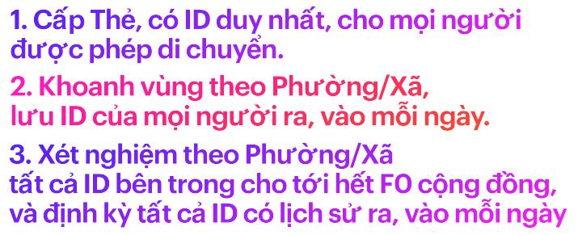

#Chống dịch và phát triển kinh tế theo Phường/Xã bằng Thẻ Lệnh.

Thẻ Lệnh là một chiến lược truy quét F0 theo Phường/Xã, chia thành nhiều giai đoạn, mỗi giai đoạn áp dụng đồng thời vài chiến thuật. Đây là chiến lược dài hạn kéo dài 5-10 năm hoặc lâu hơn, được tóm gọn trong 3 câu: 

Cấp Thẻ (ID duy nhất) cho mọi người được phép di chuyển trong vùng dịch 
- Thẻ gia đình để mua hàng, cho mọi gia đình, nhà trọ, phòng trọ,...
- Thẻ làm việc để đi lại, giao hàng,... cho Doanh nghiệp để đưa cho nhân viên
- Thẻ chống dịch để cấp cho cán bộ, nhân viên y tế, dân phòng, tình nguyện viên, nhà báo,...

Sau khi phát hành Thẻ giấy và chuyển tới tất cả Phường/Xã, BCĐ Chống dịch đưa ra các quy định hành chính, kèm nội dung xử phạt, (gọi tắt là **Lệnh**) cho các bên: 

1. Lệnh cho Phường/Xã: đóng dấu và cấp Thẻ cho mọi đối tượng bên trên. 

2. [Lệnh cho chợ, siêu thị,...](https://baotnq.qrcare.vn/#lệnh-cho-siêu-thị-chợ) chỉ bán hàng cho Thẻ gia đình, theo Phường/Xã cấp Thẻ. 

3. [Lệnh cho Doanh nghiệp]: quản lý cấp Thẻ làm việc và liên đới chịu trách nhiệm nếu nhân viên vi phạm. [xem chi tiết](https://baotnq.qrcare.vn/#lệnh-cho-đơn-vị-chủ-quản-doanh-nghiệp-cơ-quan)

4. Lệnh cho Công an, dân phòng: kiểm tra và quét Thẻ.

5. Lệnh cho người dân:
   - đeo Thẻ khi ra đường và quét thẻ tại các điểm đến để **lưu lịch sử đi lại**. 
   - Tuân thủ các Lệnh đưa ra khi tham gia lấy mẫu xét nghiệm 

Triển khai đồng thời các Lệnh trên, sẽ giám sát chéo các đối tượng liên quan, **tăng cường sự tuân thủ và giảm vi phạm**.

Người dân sẽ mua hàng theo Phường/Xã đang sống, việc ra vào Phường/Xã chỉ để làm việc, hoặc chống dịch. Số lượng này khá ít, và mỗi Phương/Xã có đủ nhân lực kiểm tra, phát hiện vi phạm để **kiểm soát tất cả ra vào mỗi ngày**. 

Khi tất cả Phường/Xã kiểm soát được di chuyển ra vào mỗi ngày, đồng nghĩa việc lây lan Covid giữa các Phường được kiểm soát. Trong thời gian đó, tập trung **lấy mẫu xét nghiệm toàn bộ Thẻ trong Phường**, thay vì lấy mẫu toàn dân. 

Mỗi Phường cần hoàn thành truy quét trong 1 ngày, không bỏ sót Thẻ nào, trước khi chuyển sang Phường bên cạnh. Thực hiện liên tục như vậy, toàn vùng dịch sẽ được lấy mẫu sau 12 ngày, vùng nguy cơ cao và vừa lấy mẫu 2 lần. [Xem chi tiết](https://baotnq.qrcare.vn/#giải-pháp-mô-hình-toàn-vùng-dịch-2-lần-sau-12-ngày)

Thẻ Lệnh giúp nâng cao hiệu quả lấy mẫu xét nghiệm: [chi tiết](https://baotnq.qrcare.vn/#truy-quét-hiệu-quả-f0-trong-cộng-đồng-bằng-thẻ-lệnh)
- phân loại nguy cơ theo loại Thẻ và lịch sử di chuyển
- tổ chức việc lấy mẫu khoa học, an toàn
- **phát hiện** cá nhân cố tình tránh né, không tham gia. 

Khi F0 được bóc tách sạch sẽ, dần dần mở rộng các hoạt động kinh tế bên trong Phường/Xã. Việc kiểm soát ra vào được giảm bớt và chuyển sang tự giám sát. **Định kỳ xét nghiệm các Thẻ có lịch sử ra vào**, để phát hiện sớm xâm nhập. 

Nếu phát hiện F0 trong 1 Phường/ Xã từ xét nghiệm định kỳ, Thẻ Lệnh sẽ kích hoạt chế độ ngăn chặn:
- Tổ chức 2 Lớp kiểm soát ra vào để ngăn chặn lây lan. 
- Xét nghiệm tất cả các Thẻ có lịch sử ra vào. Nếu 1 Thẻ là F0 thì Phường nơi F0 đến hoặc đi xem như có F0 cộng đồng. 
- Tập trung truy quét trong các Phường có F0 cộng đồng

Thẻ Lệnh là [chiến lược về an sinh xã hội](https://baotnq.qrcare.vn/#thẻ-lệnh-giúp-an-sinh-xã-hội), trong đó người dân, doanh nghiệp phản ảnh khó khăn, cán bộ Phường/Xã tới tận nơi xác nhận, dựa vào đó cân đối nguồn lực cứu trợ, từ thiện để mọi khó khăn được giải quyết. Và Thẻ Lệnh **giám sát mọi công việc trên**. 

Một số vấn đề an sinh xã hội như: 
- hỗ trợ đúng và kịp thời các gia đình khó khăn. 
- Việc giao hàng tại nhà của siêu thị, chợ được giải quyết bằng đội shipper nội khu. 
- Doanh nghiệp bố trí lại nơi làm việc, khu vực di chuyển của nhân viên để bảm đảm phòng dịch và phát triển kinh doanh bền vững.

Thẻ Lệnh còn là chiến lược phát hiện, ngăn chặn sớm nguy cơ Covid và các đại dịch tương tự khi [xã hội trở lại "bình thường mới"](https://baotnq.qrcare.vn/#xã-hội-bình-thường-mới). Thẻ Lệnh giúp điều chỉnh việc di chuyển của cộng đồng, hình thành một số thói quen tốt cho mọi người, như đeo và quét Thẻ tại điểm đến, hướng tới mục tiêu "sinh hoạt và làm việc trong một khu vực an toàn".

**Khác biệt của Thẻ Lệnh** ở các điểm sau: 

1. Lệnh là **sự cân bằng lợi ích** giữa của các bên, là giám sát chéo để loại bỏ tư tưởng vi phạm, là ảnh hưởng ngầm để tăng tuân thủ và giảm vi phạm.

1. Thẻ là **sự kết hợp sáng tạo** giữa cái chung (Phôi thẻ) và cái riêng (ID), đời thường và công nghệ, trực quan vật lý và ảo hoá online, sự quen thuộc của giấy,bút và mới mẻ của qrcode,smartphone. 

1. Phân chia theo Phường/Xã (chứ không phải tổ dân phố, hẻm dân cư hay theo Quận/Huyện)
    - Là khu vực nhỏ nhất, đủ khả năng đáp ứng nhu yếu phẩm cho người dân bên trong. 
    - Đủ chức năng và nhân lực để cấp Thẻ, kiểm soát mọi ra vào, và truy quét toàn bộ Thẻ trong 1 ngày. 

4. **Phát hiện bất thường** từ số liệu thu thập để ngăn chặn nguy cơ. 

Để bắt đầu tìm hiểu chi tiết, cần xem xét một vấn đề quan trọng mà các biện pháp hiện tại đang bỏ sót: là **dữ liệu di chuyển quá ít so với thực tế**. Giải quyết được vấn đề này, sẽ giúp chúng ta hình dung về tình hình hiện tại, khu vực nào đang gặp khó khăn và cần làm gì để chống dịch hiệu quả hơn. 

1. [Vấn đề:](https://baotnq.qrcare.vn/#vấn-đề)
    1. [Dữ liệu di chuyển quá ít, chưa sát với thực tế](https://baotnq.qrcare.vn/#dữ-liệu-di-chuyển-quá-ít-chưa-sát-với-thực-tế)
2. [Cách giải quyết](https://baotnq.qrcare.vn/#cách-giải-quyết)
    1. [Cấp Thẻ cho mọi đối tượng được phép di chuyển.](https://baotnq.qrcare.vn/#cấp-thẻ-cho-mọi-đối-tượng-được-phép-di-chuyển)
    2. [Thu thập số liệu di chuyển bằng quét Thẻ](https://baotnq.qrcare.vn/#thu-thập-số-liệu-di-chuyển-bằng-quét-thẻ)
3. [Phát triển thành Chiến lược chống dịch](https://baotnq.qrcare.vn/#phát-triển-thành-chiến-lược-chống-dịch)
    1. [Điều chỉnh việc di chuyển của mọi người bằng Lệnh](https://baotnq.qrcare.vn/#điều-chỉnh-việc-di-chuyển-của-mọi-người-bằng-lệnh)
    2. [Tăng tuân thủ, giảm vi phạm bằng Thẻ Lệnh](https://baotnq.qrcare.vn/#tăng-tuân-thủ-giảm-vi-phạm-bằng-thẻ-lệnh)
    3. [Truy quét hiệu quả F0 trong cộng đồng bằng Thẻ Lệnh](https://baotnq.qrcare.vn/#truy-quét-hiệu-quả-f0-trong-cộng-đồng-bằng-thẻ-lệnh)
4. [Thẻ Lệnh giúp an sinh xã hội.](https://baotnq.qrcare.vn/#thẻ-lệnh-giúp-an-sinh-xã-hội)
    1. [Hỗ trợ đúng gia đình khó khăn qua Thẻ](https://baotnq.qrcare.vn/#hỗ-trợ-đúng-gia-đình-khó-khăn-qua-thẻ)
    2. [Giúp người dân có thu nhập bằng Shipper Nội khu](https://baotnq.qrcare.vn/#giúp-người-dân-có-thu-nhập-bằng-shipper-nội-khu)
5. [Xã hội "bình thường mới"](https://baotnq.qrcare.vn/#xã-hội-bình-thường-mới)
    1. [Phát hiện sớm nguy cơ trong vùng "bình thường mới"](https://baotnq.qrcare.vn/#phát-hiện-sớm-nguy-cơ-trong-vùng-bình-thường-mới)
    2. [Bức tranh "bình thường mới" với Thẻ Lệnh.](https://baotnq.qrcare.vn/#bức-tranh-bình-thường-mới-với-thẻ-lệnh)
    3. [Tính nhân văn của Thẻ Lệnh](https://baotnq.qrcare.vn/#tính-nhân-văn-của-thẻ-lệnh)
    4. [Sống và làm việc trong cùng khu vực](https://baotnq.qrcare.vn/#sống-và-làm-việc-trong-cùng-khu-vực)

Tham khảo đầy đủ tại https://baotnq.qrcare.vn 
Hoặc liên hệ: Quốc Bảo: quocbao@vinaas.com
