# Lệnh bài: chống dịch và phát triển kinh tế theo khu vực

<!-- @import "[TOC]" {cmd="toc" depthFrom=2 depthTo=6 orderedList=false} -->

<!-- code_chunk_output -->

- [Triển khai thực tế:](#triển-khai-thực-tế)
  - [Triển khai Thẻ Gia đình](#triển-khai-thẻ-gia-đình)
    - [Cách sử dụng:](#cách-sử-dụng)
    - [Thời gian triển khai](#thời-gian-triển-khai)
    - [Hỗ trợ các gia đình khó khăn](#hỗ-trợ-các-gia-đình-khó-khăn)
    - [Tổ chức dịch vụ nội khu](#tổ-chức-dịch-vụ-nội-khu)
  - [Lệnh bài cho cá nhân](#lệnh-bài-cho-cá-nhân)
    - [Các loại thẻ đi làm](#các-loại-thẻ-đi-làm)
    - [Thẻ đi làm tại điểm cố định](#thẻ-đi-làm-tại-điểm-cố-định)
    - [Trách nhiệm của Đơn vị chủ quản](#trách-nhiệm-của-đơn-vị-chủ-quản)
    - [Giám sát chéo thẻ đi làm](#giám-sát-chéo-thẻ-đi-làm)
    - [Tổ chức đội shipper trong từng Phường / Xã](#tổ-chức-đội-shipper-trong-từng-phường-xã)
  - [So sánh với giải pháp đang có](#so-sánh-với-giải-pháp-đang-có)
    - [Bất cập của phiếu ra đường, thẻ đi chợ](#bất-cập-của-phiếu-ra-đường-thẻ-đi-chợ)
    - [Giấy thông hành](#giấy-thông-hành)
    - [Khai báo tại chốt kiểm dịch](#khai-báo-tại-chốt-kiểm-dịch)
  - [Áp dụng vào tình hình ở tp HCM](#áp-dụng-vào-tình-hình-ở-tp-hcm)
    - [Xây dựng bản đồ chống dịch](#xây-dựng-bản-đồ-chống-dịch)
    - [Duy trì chất lượng của đội y tế](#duy-trì-chất-lượng-của-đội-y-tế)
    - [Sử dụng hết các năng lực truyền, nhận “lệnh”](#sử-dụng-hết-các-năng-lực-truyền-nhận-lệnh)
  - [Chiến thuật Quạt 3 cánh để khoanh vùng và truy quét toàn bộ](#chiến-thuật-quạt-3-cánh-để-khoanh-vùng-và-truy-quét-toàn-bộ)
      - [“Phần chưa nhận lệnh” : rủi ro lây lan lớn nhất](#phần-chưa-nhận-lệnh-rủi-ro-lây-lan-lớn-nhất)
- [Tham khảo thêm](#tham-khảo-thêm)
  - [Hệ miễn dịch của cơ thể](#hệ-miễn-dịch-của-cơ-thể)
  - [Hệ miễn dịch quốc gia](#hệ-miễn-dịch-quốc-gia)
  - [Ý tưởng để phát triển "hệ thống lệnh bài"](#ý-tưởng-để-phát-triển-hệ-thống-lệnh-bài)
  - [Biểu tượng của sự tuân thủ](#biểu-tượng-của-sự-tuân-thủ)
  - [Cấu trúc hệ thống quyết định hành vi bên trong](#cấu-trúc-hệ-thống-quyết-định-hành-vi-bên-trong)

<!-- /code_chunk_output -->

## Triển khai thực tế: 

### Triển khai Thẻ Gia đình

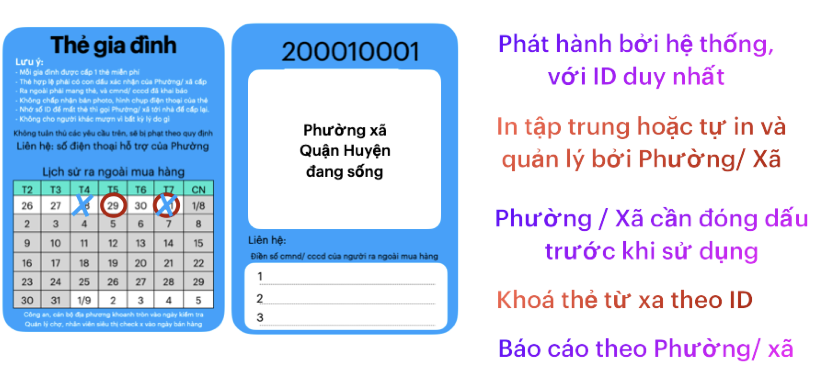 

**Các bên có thể tương tác**

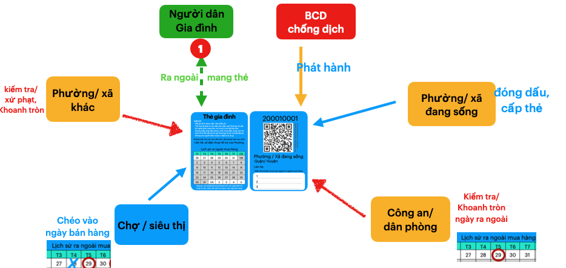

#### Cách sử dụng:
- Khi cấp thẻ cho gia đình, cán bộ Phường ghi số cmnd, cccd vào thẻ 
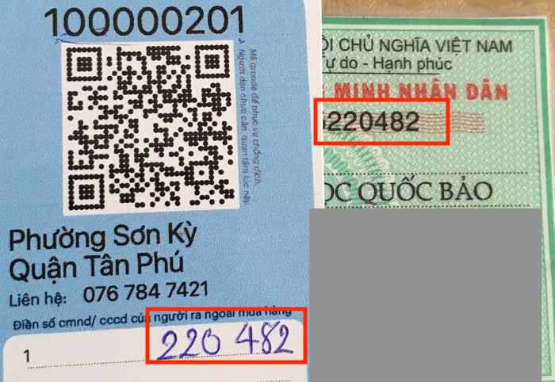

- Công an, dân phòng sẽ khoanh tròn vào ngày kiểm tra (nên dùng bút màu đỏ)

- Quản lý chợ, nhân viên siêu thị sẽ gạch chéo vào ngày mua hàng (nên dùng bút màu xanh)
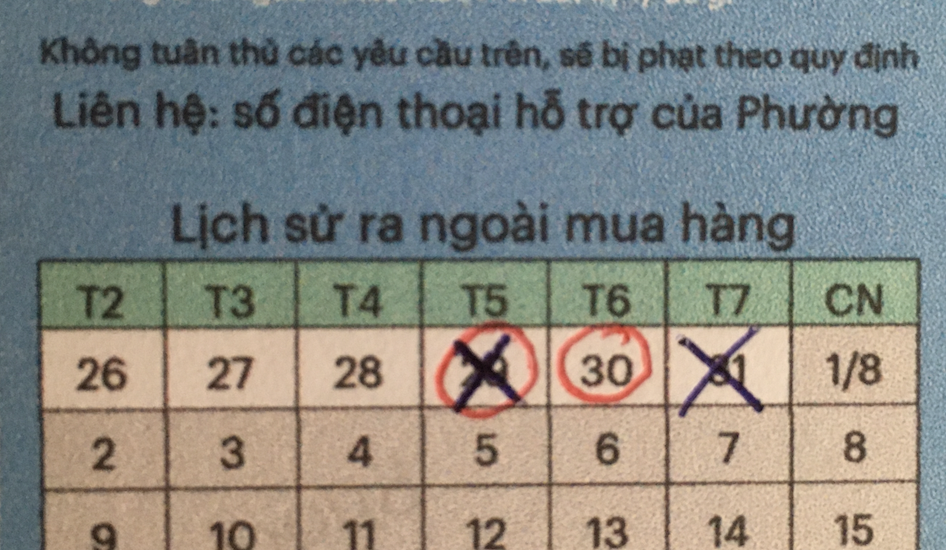
   - ngày 27.07: có kiểm tra và mua hàng
   - ngày 30.07: có kiểm tra, ko có mua hàng
   - ngày 31.07: có mua hàng, ko bị kiểm tra
  
- hướng dẫn người dân bị phạt khi nào.

#### Thời gian triển khai 
**Phát hành trong 2,3 ngày**

- Hệ thống sinh ID và xuất file pdf 
- In ấn tập trung, chuyển tới từng Phường / Xã trong thành phố 

**Đưa tới từng gia đình: trong 2,3 ngày**

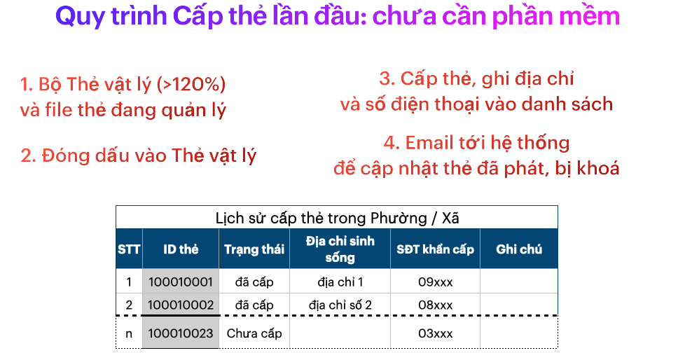

**Tuần đầu tiên triển khai**
- Cảnh báo nhắc nhở 1,2 ngày đầu tiên
- Tiến hành kiểm tra, xử phạt 

**Quy định cho siêu thị/ chợ**
- hướng dẫn thực hiện
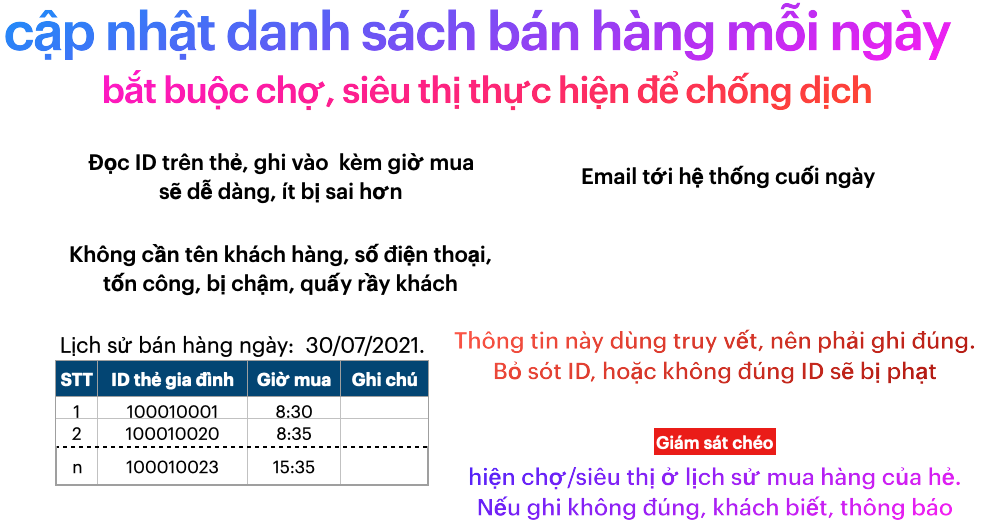

- cách giám sát nhân viên siêu thị, chợ không tuân thủ

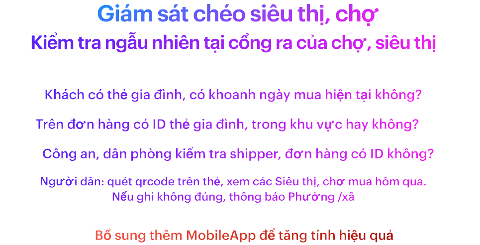

**Nâng cao hiệu quả các tuần tiếp theo**

- Cán bộ tới từng nhà dân để đôn đốc hướng dẫn

- Cập nhật các siêu thị, chợ phục vụ,... trong tờ hướng dẫn để ưu tiên đặt mua tại nhà. 

- Cán bộ sẽ dùng App để quét Thẻ gia đình, xác nhận đã tới từng gia đình, gặp chủ hộ và hướng dẫn.

 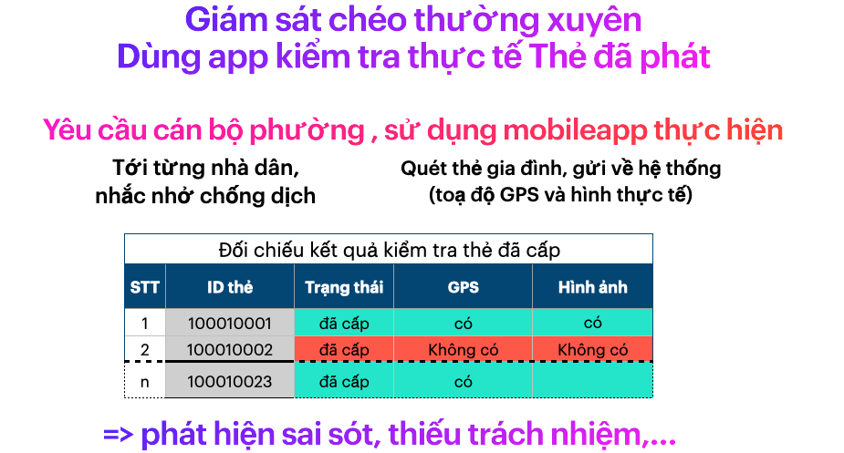

**Cơ chế giám sát chéo**

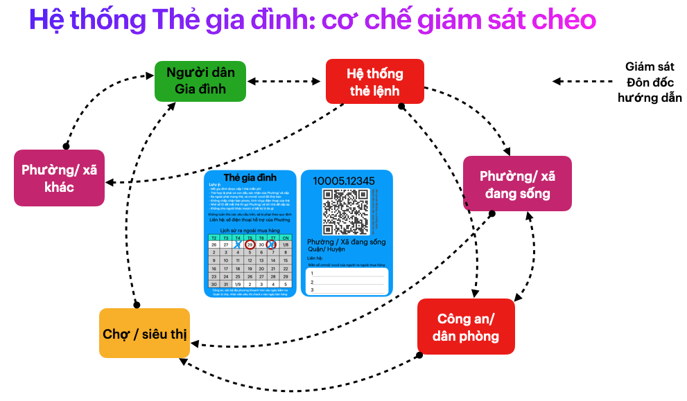
#### Hỗ trợ các gia đình khó khăn

- Các gia đình khó khăn, có thể phản ánh bằng cách gọi điện tới Phường/ Xã cung cấp ID, hoặc quét thẻ qrcode gửi trực tiếp tới hệ thống.

- Thông báo cán bộ Phường dựa trên ID, tới tận nhà để hỗ trợ

- Các nhà hảo tâm, từ thiện cũng có thể gửi trực tiếp theo ID này 

#### Tổ chức dịch vụ nội khu
- Đội shipper nội khu, mang lại thu nhập cho các cá nhân muốn tham gia. Cán bộ Phường/ xã tới tận nhà đánh giá hoàn cảnh, cam kết trước khi gửi tới Siêu thị, chợ. Tham khảo [Đội shipper trong từng Phường / Xã](#tổ-chức-đội-shipper-trong-từng-phường-xã)

- Tổ chức các địa điểm giải trí, có kiểm soát phòng dịch tốt để các gia đình, luân phiên theo ngày tới tham gia. Thu phí hợp lý để cân bằng với chi phí chống dịch. 

   
### Lệnh bài cho cá nhân
> gồm 2 loại chính

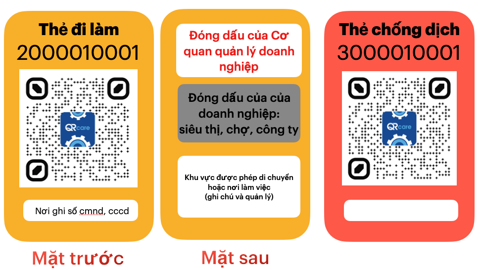

- Thẻ đi làm: nhân viên siêu thị, chợ, nhân viên giao hàng, đi làm tại nhà máy, ...

- Thẻ chống dịch: cán bộ địa phương, tình nguyện viên, đội ngũ y tế, ...

#### Các loại thẻ đi làm

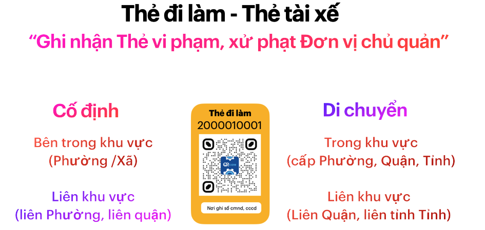

**Chỗ làm việc cố định**
- nhân viên tại siêu thị, chợ,
- công nhân tại nhà máy sản xuất
- cán bộ tại cơ quan, doanh nghiệp thiết yếu

**Thường xuyên di chuyển**
- shipper giao hàng, văn thư 
- tài xế xe giao hàng 

Chia thành 2 loại bên trong và liên khu vực. 
#### Thẻ đi làm tại điểm cố định

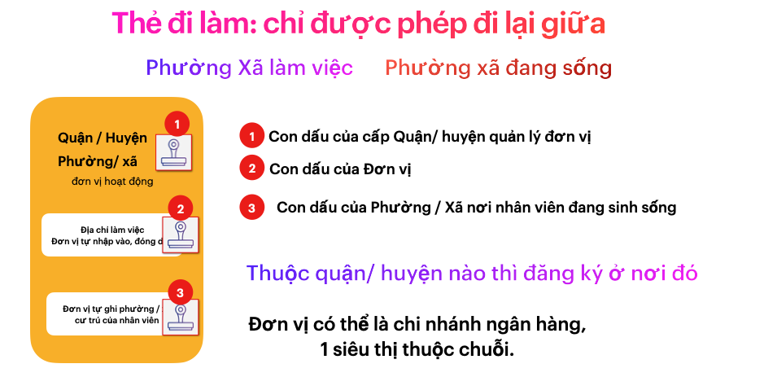

**Quy trình triển khai**
- Cấp phôi thẻ cho từng Quận/ huyện:
    - sô phôi nhiều hơn nhu cầu, để dự phòng tình huống phát sinh
    - đóng dấu cho thẻ cần sử dụng , cập nhật phôi chưa sử dụng 
- Mỗi đơn vị gửi đăng ký số lượng nhân viên cần
    - được cấp nhiều hơn 20% số lượng cần
    - đóng dấu trước khi sử dụng
- Ghi cmnd/cccd và Phường xã cư trú vào thẻ, đóng dấu đưa nhân viên
    - cần quản lý nhân viên theo Phường / xã cư trú.

- Mỗi nhân viên cần Phường/ Xã xác nhận trước khi đi làm
- Thẻ không sử dụng, thu hồi và thông báo ID cho quận huyện để khóa thẻ từ xa. 

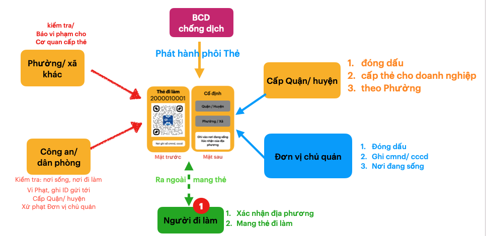

#### Trách nhiệm của Đơn vị chủ quản
- Quản lý thẻ cấp cho nhân viên, thu hồi và khoá thẻ các nhân viên nghỉ việc

- Đóng phạt khi có nhân viên vi phạm. Hoặc ngừng hoạt động nếu sai phạm kéo dài, không khắc phục

- Đóng phí xét nghiệm thường xuyên cho nhân viên. 
  - di chuyển càng xa, càng phải xét nghiệm thường xuyên 

- Doanh nghiệp chuỗi như Ngân hàng, siêu thị, đơn vị vận chuyển ..., cần sắp xếp, bố trí nhân viên theo khu vực sinh sống để hạn chế đi lại, hạn chế chi phí xét nghiệm. 
#### Giám sát chéo thẻ đi làm
> xử phạt Đơn vị chủ quản để có trách nhiệm trong đăng ký và quản lý nhân viên.
> Hạn chế xử phạt người mang Thẻ đi làm, khiến họ lẫn trốn, không thành khẩn khai báo, gây khó khăn cho ngăn chặn covid. 

- Công an, cán bộ địa phương phát hiện vi phạm, gửi về hệ thống

- Chính quyền cấp quận/ huyện quản lý đơn vị có trách nhiệm xử phạt nghiêm và giám sát việc tái phạm. 

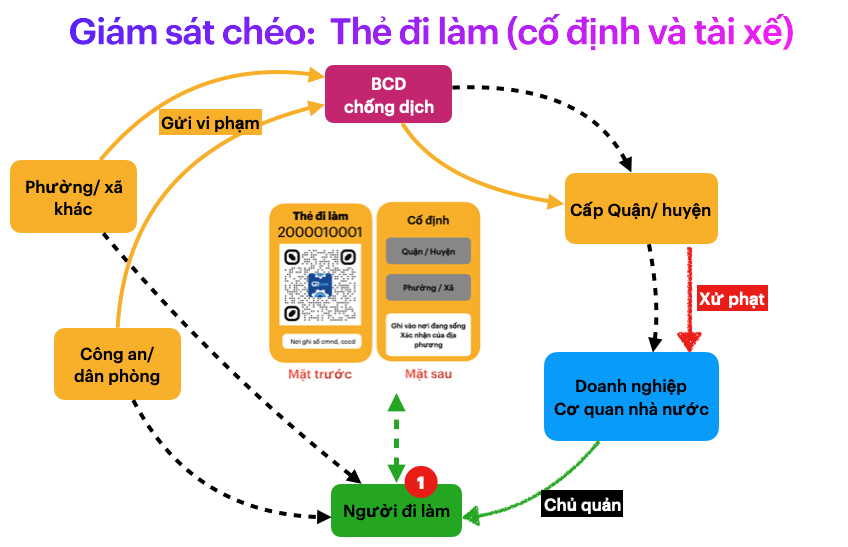
#### Tổ chức đội shipper trong từng Phường / Xã
> làm việc, di chuyển bên trong khu vực 

- đội shipper này là người dân sống bên trong, được Phường / xã xác nhận có đủ điều kiện tham gia.
- Siêu thị, chợ sẽ trả phí giao hàng cho đội shipper này, cũng như trả phí liên quan như tiêm vacxin, xét nghiệm. 

Rất nhiều lợi ích:
- Mang lại thu nhập cho các cá nhân mất thu nhập, chưa có việc làm. 
- Giải quyết được khủng hoảng về đội ngũ shipper
- hạn chế covid lay lan. 

### So sánh với giải pháp đang có
#### Bất cập của phiếu ra đường, thẻ đi chợ

- https://tienphong.vn/ha-noi-phat-phieu-ra-duong-cho-nguoi-dan-trong-thoi-gian-gian-cach-xa-hoi-post1359794.tpo

- https://vnexpress.net/ha-noi-se-phat-phieu-di-cho-toan-thanh-pho-4331589.html
- 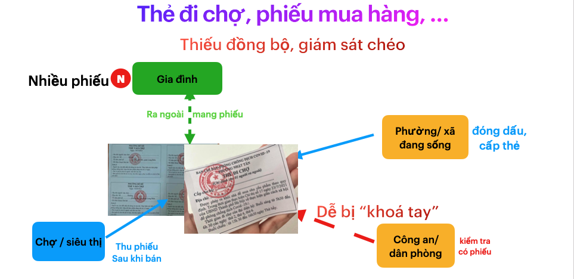

#### Giấy thông hành

- Giải pháp cho Thẻ đi làm: chỗ làm cố định và công việc di chuyển 
- Cập nhật sau
#### Khai báo tại chốt kiểm dịch 

- khai báo y tế là 1 việc cần thiết, nhưng khá tốn thời gian của tất cả mọi người. Chưa kể gây ách tắt tại chốt kiểm dịch. 

- Giải pháp: **tự giác quét Thẻ tại điểm Checkpoint**

- Chi tiết thực hiện: cập nhật sau
### Áp dụng vào tình hình ở tp HCM

> Một số lưu ý khi triển khai quét mẫu toàn vùng

#### Xây dựng bản đồ chống dịch

Có khoảng 500 điểm lấy mẫu, rải rác khắp vùng dịch HCM.

Mỗi địa điểm cần bố trí theo tiêu chuẩn chung về an toàn 

Tiêu chuẩn này thiết lập ban đầu và dựa vào dữ liệu thu thập, cải thiện dần dần: gồm tổ chức khoa học các địa điểm tập trung lấy mẫu, địa điểm hậu cần, và tuyến đường di chuyển của đội lấy mẫu. 

Gợi ý về tiêu chuẩn: **Cố định, Theo luồng, CHECKPOINT.**

Cố định: địa điểm lấy mẫu và danh sách 1000 Thẻ cần lấy. Việc cố định sẽ tạo thói quen cho các lần lấy sau, hạn chế tối đa các Thẻ đi lộn địa điểm, gây khó khăn không đáng có.

Phân luồng thành 3 đợt: sáng , chiều, tối và các Thẻ đi đúng theo đợt, ví dụ sử dụng số cuối cùng trên ID của mỗi thẻ
  - nếu là 0,1,2,3 đi buổi sáng, 4,5,6,7 vào buổi chiều, 9,10 vào buổi tối. 
  - buổi tối cần ít thẻ nhất, để dự phòng các Thẻ đi trễ ở buổi sáng, chiều.

Thiết lập luồng di chuyển hợp lý, có hướng dẫn phân luồng từ xa, và các vị trí CHECKPOINT Thẻ trước khi vào trong. 

Ưu tiên việc đi bộ, hạn chế tập trung bãi giữ xe. 

Thiết lập các CHECKPOINT theo Thẻ, để tự động để thu thập dữ liệu, hoàn thiện các đợt sau.
  - CHECKPOINT là các điểm yêu cầu mỗi người đi qua cần quét qrcode trên Thẻ. Nếu không có smartphone, wifi, sử dụng thiết bị chung của ban tổ chức.

Chia các cá nhân mang “Thẻ công vụ” màu đỏ thành nhiều chức năng:

Đội lấy mẫu tập trung, Đội lấy mẫu tại nhà, Đội nhắc nhở các thẻ “quên”, …

Cập nhật hình ảnh thực Tế

Yêu cầu Thẻ công vụ là cán bộ địa phương, chụp hình thực tế địa điểm cách bố. trí phân luồng, gửi về hệ thống.
Đội phân tích tập trung ở Bộ chỉ huy, dựa trên hình ảnh, dữ liệu thu thập, tối ưu việc bố trí trận địa
“Ra lệnh” cho các Thẻ màu đỏ địa phương, điều chỉnh theo bố trí mới cũng như liên tục cập nhật bất cập thực tế.
Mọi thứ cần chuẩn bị 1,2 ngày trước khi tổ chức lấy mẫu tập trung. 

Việc xây bản đồ trận địa kết hợp với đưa thẻ tới 3 triệu gia đình sẽ diễn ra trong vòng 1 tuần. 
Có như vậy mới kịp với tinh hình hiện tại và bắt đầu trận đánh sớm nhất. 

Chia thành 3 khu vực: cao, trung, thấp trong đó,  vùng cao có số “lệnh bài” gấp đôi trung, thấp.

#### Duy trì chất lượng của đội y tế

Do việc lấy mẫu diễn ra liên tục trong ít nhất 12 ngày, cần dự phòng các nguồn lực để bảo đảm chất lượng.

Nhân sự lấy mẫu cần chia thành ca, luân phiên thực hiện nghỉ ngơi
Nhân sự lấy mẫu cần huấn luyện nội bộ để nâng cao kỹ năng
Tổ chức tuyến di chuyển hợp lý giữa các điểm lấy mẫu
Lập các điểm nghỉ ngơi gần nơi điểm lấy mẫu, và cho đội ngủ tập trung trước ngày thực hiện.

#### Sử dụng hết các năng lực truyền, nhận “lệnh”

có rất nhiều cơ chế truyền, nhận, đánh giá tỉ lệ nhận “lệnh” thông qua giác quan của mỗi người, và cả thiết bị công nghệ, nếu biết sử dụng sẽ là công cụ mạnh mẽ, hiệu quả.

**Truyền lệnh**
Tổng quát từ xa qua các kênh truyền thông đại chúng, hoặc sms, Zalo,…
Chi tiết lệnh tới từng khu vực: từ cấp quận huyện đến tổ dân phố cho Thẻ gia đình, thông qua đơn vị làm việc: Thẻ đi làm
Nhắc nhở, đôn đốc bởi cán bộ địa phương
gọi điện đến từng cá nhân
**Nhận lệnh**: cần báo chí, địa phương hướng dẫn các nhận biết
- dựa trên màu sắc, thông tin khu vực, hay đơn vị làm việc 
- dựa trên ID của thẻ để mỗi cá nhân
- dùng quét qrcode để tra cứu thông tin

**Xác định Tỉ lệ đã / chưa nhận lệnh**

ví dụ: truyền lệnh yêu cầu sẽ xét nghiệm tập trung, mọi cá nhân liên quan cần quét qrcode để xác nhận. Dựa vào tỉ lệ, sẽ biết việc thông báo có cần cải thiện hay không, như mọi người chưa biết thông báo, biết nhưng chưa hiểu, hiểu sai, …

Phản hồi dựa trên quét mã qrcode bởi mỗi cá nhân, hay tại điểm Checkpoint
dùng kiểm tra cheó bởi nhân sự khác để đánh giá phản hồi

**Phản ánh các vi phạm**
mỗi thẻ là một đơn vị giám sát, hỗ trợ, hướng dẫn

**Liên lạc trực tiếp, tập nơi:**
- tìm tới địa chỉ của từng thẻ: tốn công nhưng rất hiệu quả.
- gọi điện tới số điện thoại của thẻ: cho thẻ công vụ, 

### Chiến thuật Quạt 3 cánh để khoanh vùng và truy quét toàn bộ

đây là 1 gợi ích, thực tế có nhiều cách hiệu quả, hợp lý hơn.

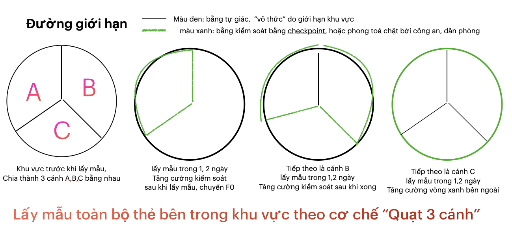

Tiêu chí để phân biệt thắng thua.

“trận đánh” trong ngày chỉ xem là thắng lợi khi có trên 99% Thẻ tham gia, và dưới <95% xem như thất bại. Số còn thiếu 1% sẽ có các Đội Cơ động kết hợp với địa phương để truy quét tận nhà.

“trận đánh gia đình” sẽ tiến hành xét nghiệm cho 500,000 Thẻ gia đình, tập trung tại 500 địa tại các phường / xã trên thành phố.

Dựa trên thông tin nhận biết trên Thẻ, mỗi người dân sẽ đến địa điểm vào khung giờ quy đi, và được phân luông từ xa.

Tại điểm đầu có đặt Checkpoint để quét qrcode trên thẻ, ngay khi quét ID của thẻ được gửi về hệ thống và cập nhật tới các bộ phận cần sử dụng.

Cán bộ Phường, tổ dân phố,.. sẽ nhắc nhở từng nhà trong danh sách đi xét nghiệm.
Số gia đình khó khăn trong di chuyển, sẽ có đội lấy mẫu cơ động tới xử lý.

##### “Phần chưa nhận lệnh” : rủi ro lây lan lớn nhất

Một công dụng khác của hệ thống lệnh bài, nhưng rất quan trọng là quét được “Phần chưa nhận lệnh”. 

Ở đây không chỉ là số Thẻ chưa tham gia, (1% còn lại cuối trận đánh), mà còn đánh giá được các Phường / Xã nào còn “gia đình bị bỏ sót”. 
Thẻ chưa tham gia, có thể lần theo Thẻ để truy quét, nhưng “gia đình bị bỏ sót” nằm ngoài hệ thống, dữ liệu, và rất dễ bỏ quên.

**"Gia đình bị bỏ sót”** có thể là: người thuê trọ, người lao động tự do, không thuộc diện “gia đình”,… cần hướng dẫn, đôn đốc Phường / xã chú ý để các đối tượng này, để nâng cao “Chất lượng của cấp đia phương”, trên toàn bộ khu vực.

Và với Thẻ đi làm” số lượng ít hơn, có thể xét nhiệm toàn bộ một lần, nhưng việc quan trọng vẫn là giám sát, phát hiện các “cá nhân di chuyển lén lút”

Ngoài việc có kết quả chiến lợi, khi đánh trận cần hạn chế tốn thất cho giữa những người tham gia, và rút ra bài học từ thu thập dữ liệu cho trận đánh tiếp theo.

**Hạn chế tổn thất:**
là hạn chế lây lan covid giữa những người tham gia, hạn chế việc lấy mẫu không đúng, không đạt yêu cầu, đội lấy mẫu bị vét kiệt sức, chất lượng suy giảm cho trận đánh ngày mai. 

Có nhiều cách để làm điều này xoay quanh việc điều tiết Thẻ tham gia.

**Thu thập dữ liệu** trong trận đánh giúp cải thiện hiệu quả các trận đánh tiếp theo, hạn chế tổn thất và nhất là làm tăng niềm tin của người dân khi tham gia lấy mẫu lần sau.

thực hiện trên tinh thần: hướng dẫn để mọi người dùng Thẻ để “tự động nhập liệu”. Thiết lập những cách thu thập đơn giản, những điểm nhập cố định, dễ nhận biết, và hướng dẫn dễ hiểu mang lại hiệu quả lớn với chi phí thấp. Không cần bày vẽ cách máy móc, công nghệ tân tiến, làm không đúng cách sẽ càng phản tác dụng. 

**Cập nhật bản đồ kết quả, cải thiện cho các lần tiếp theo**

Kết quả trận đánh cần công bố cho mọi người biết, ít nhất là những người tham gia.

 - tỉ lệ lấy mẫu trên tổng số tham gia, 
 - tỉ lệ bị sót, cần bổ sung ngày sau.
 - kết quả F0 phát hiện.

Theo tôi, mọi người cần biết thông tin này, tổng hợp theo khu vực trên Bản đồ trận địa. Việc này tạo ra tâm lý rất lớn với những người dân quan tâm về cuộc chiến.

Họ thường là người tuân thủ, nhưng dễ lo lắng với thông tin từ mạng xã hội chia sẻ,…
Còn số không quan tâm tới kết quả, đa phần là đối tượng nguy cơ cao.

Phân biệt được 2 nhóm này, sẽ dễ dàng rất nhiều trong việc quét sạch covid

## Tham khảo thêm 

### Hệ miễn dịch của cơ thể

Chúng ta đều biết, một cơ thể có hệ miễn dịch tốt sẽ nhanh chóng phát hiện xâm nhập, phát tín hiệu để đội quân bạch cầu tập trung tiêu diệt, trước khi virus kịp làm cơ thể thương tật hoặc ngưng hoạt động vĩnh viễn (chết).

Hiện tại hệ miễn dịch của mỗi người khá chậm chạp trong việc nhận biết Covid. Vì vậy, cần tiêm vacxin để hệ miễn dịch được luyện tập, tăng khả năng phát hiện. Đồng thời cơ thể cũng cần luyện tập thường xuyên tăng cường sức mạnh của đội quân bạch cầu. 

Tuy nhiên, với một cơ thể khoẻ mạnh, ngay cả không tiêm vacxin, đa số trường hợp hệ miễn dịch vẫn đủ sức chiến thắng covid với tỉ lệ trên 90%. 

Nhưng trên phương diện một cộng đồng, một quốc gia, tỉ lệ bị đảo ngược lại, với các quốc gia bị xâm nhập, trên 90% là thất bại trong việc ngăn chặn, kiểm soát covid. 

### Hệ miễn dịch quốc gia 

Nếu xem quốc gia là một cơ thể sống, thì "hệ miễn dịch quốc gia" chính là khả năng chiến đấu, đẩy lùi covid ra khỏi quốc gia đó. 

Trong cơ thể sống này, mỗi gia đình xem như là tế bào, những người đi làm là hồng cầu, và đội ngũ chống dịch (đội lấy mẫu, xét nghiệm, chính quyền địa phương) là đội quân bạch cầu, chính phủ sẽ là bộ não và nền kinh tế là sức khoẻ của cơ thể này. 

Khi hình dung như trên, thì việc hầu hết các quốc gia thất bại trong cuộc chiến với covid là khá hợp lý, vì các quốc gia này đều thiếu các yếu tố then chốt của một hệ miễn dịch hiệu quả.

1. **Thiếu cơ chế cảnh báo sớm**: khi đã phát hiện thì dịch đã lây lan, ăn sâu vào cộng đồng bên trong. 

3. **Cơ thể suy kiệt**: giãn cách kéo dài, hạn chế di chuyển, tụ tập trên diện rộng, làm ngưng trệ nền kinh tế, khiến cho sức đề kháng càng giảm đi.

4. **Thiếu cơ chế hạn chế lây lan, kiểm soát bùng phát**: làm tổn hại tới cơ quan quan trọng nhất là hệ thống y tế cộng đồng. 

2. **Việc tập trung tiêu diệt chưa hiệu quả**: thiếu cơ chế điều khiển linh hoạt, chưa phát huy mọi nguồn lực đang có, và bỏ sót kẻ thù. 

Việc tiêm vacxin toàn dân, giải pháp mà tới lúc này, chưa quốc gia nào dám khẳng định là hiệu quả đối với biến thể Delta, và các biến thể khác trong tương lai, có thể xem là hi vọng duy nhất trong việc xây dựng miễn dịch cộng đồng (là một hệ miễn dịch cuả quốc gia đủ mạnh để chống covid). 

Nhưng còn có cách khác để cải thiện hệ miễn dịch quốc gia. Đó là nâng cao đồng thời 4 yếu tố nêu trên bằng "hệ thống lệnh bài", một liều vacxin để tạo kháng thể covid cho hệ miễn dịch cuả quốc gia. 

### Ý tưởng để phát triển "hệ thống lệnh bài"

- Xem mỗi Phường / Xã trong quốc gia là một cơ thể. 
- Khi nhiễm bệnh, để cơ thể nghỉ ngơi, tập trung truy quét covid. Khi tạm khoẻ, để cơ thể vận động từ từ, giải toả tâm lý và phát triển kinh tế cục bộ và phối hợp các cơ thể khác xung quanh. 
- Cần trang bị "khẩu trang", cơ chế hạn chế xâm nhập cho mỗi cơ thể, luyện tập khả năng phát hiện nguy cơ thường xuyên, ngay cả khi đã khỏi bệnh. 
- Một hệ thống cảnh báo sớm, phát tín hiệu để mọi người tăng cường đeo khẩu trang. Chia thành 2 đội: khoẻ mạnh thì hỗ trợ cô lập, dập dịch, đội yếu thì không cho tiếp xúc.

Với ý tưởng này, Việt nam sẽ là ngôi nhà của trên 10,000 cơ thể này. Và để bắt đầu, chúng ta cần tìm hiểu

### Biểu tượng của sự tuân thủ

Khẩu trang là 1 biểu tượng về sự tuân thủ nơi công cộng. Chúng ta dễ dàng sử dụng khẩu trang, và dễ nhận biết gười không đeo khẩu trang, đeo không đúng cách, hoặc lúc đeo lúc không khi ra ngoài hay tụ tập nơi công cộng.

Lệnh bài cũng là 1 biểu tượng của sự tuân thủ khi ra ngoài. Hơn nữa, còn thể hiện sự đồng lòng, sẵn sàng tham gia chống dịch của người mang thẻ.

### Cấu trúc hệ thống quyết định hành vi bên trong
  
**Dịch covid là 1 cấu  trúc hệ thống**
 
 Nếu phân tích kỹ, thì dịch covid là 1 cấu trúc hệ thống. 
 
 - “lây qua tiếp xúc, có khả năng lây sau 2,3 ngày và thời gian ủ bệnh tới 14-21 ngày,…” là 1 cấu trúc
 - hệ thống ở đây là việc tiếp xúc, di chuyển của mọi người trong việt nam và cả thế giới. 
 
 Cấu trúc hệ thống mới xuất hiện này, khiến chúng ta thay đổi hành vi rất nhiều như đeo khẩu trang khi tiếp xúc, hạn chế di chuyển, tụ tập,…

**Cấu trúc hệ thống đối kháng với covid**

- Tạo miễn dịch cộng đồng bằng cách tiêm Vacxin là 1 cấu trúc hệ thống đối kháng covid
- Xét nghiệm, tách F0 ra khỏi cộng đồng là 1 cấu trúc hệ thống đối kháng tương tự.

**Cấu trúc hạn chế lay lan Covid**

**Mọi người đeo khẩu trang khi ra ngoài, tiếp xúc** là 1 cấu trúc hệ thống hạn chế lây lan 

**Chỉ thị 16** cũng có thể xem là 1 cấu trúc, và khi áp dụng trên toàn hệ thống, như vùng dịch ở tp HCM, sẽ thay đổi hành vi của mọi người: hạn chế di chuyển nhất có thể, để hạn chế lây lan cuả covid. Điều này đã giúp Việt Nam chúng ta 3 lần chiến thắng covid. 