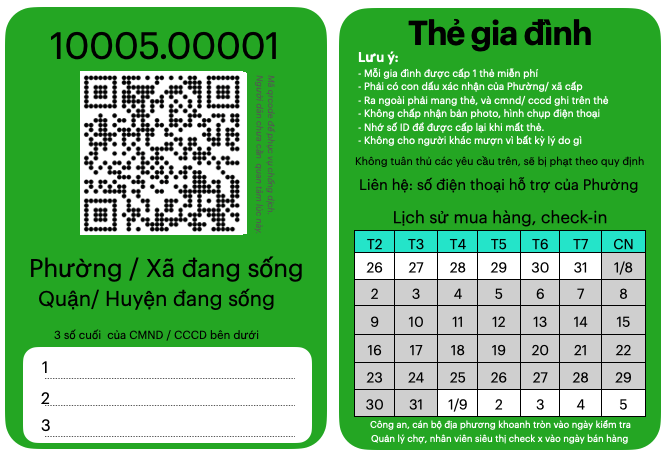
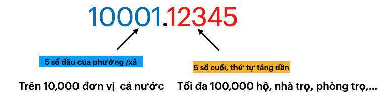
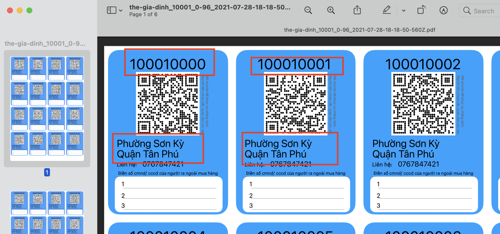
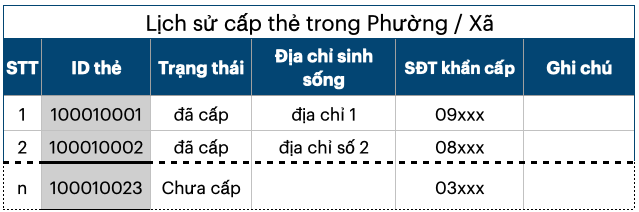

# Thẻ gia đình: cân bằng lượt mua hàng theo khung giờ, theo khu vực.

<!-- @import "[TOC]" {cmd="toc" depthFrom=2 depthTo=6 orderedList=false} -->

<!-- code_chunk_output -->

- [Cân bằng lượt mua hàng](#cân-bằng-lượt-mua-hàng)
  - [ID tăng dần, theo từng Phường / Xã](#id-tăng-dần-theo-từng-phường-xã)
  - [Cân bằng dựa trên số cuối cùng của ID](#cân-bằng-dựa-trên-số-cuối-cùng-của-id)
  - [5 khung giờ mua hàng](#5-khung-giờ-mua-hàng)
  - [Bất cập của phiếu ra đường, thẻ đi chợ](#bất-cập-của-phiếu-ra-đường-thẻ-đi-chợ)
- [Triển khai nhanh chóng sau 7 ngày](#triển-khai-nhanh-chóng-sau-7-ngày)
  - [Bước 1 (1,2 ngày) Phát hành phôi thẻ](#bước-1-12-ngày-phát-hành-phôi-thẻ)
  - [Bước 2 (1 ngày): Chuyển phôi thẻ tới từng Phường / Xã](#bước-2-1-ngày-chuyển-phôi-thẻ-tới-từng-phường-xã)
  - [Bước 3 (2,3 ngày): Cấp thẻ cho mọi gia đình](#bước-3-23-ngày-cấp-thẻ-cho-mọi-gia-đình)
  - [Bước 4: Kiểm tra khi ra ngoài, mua hàng](#bước-4-kiểm-tra-khi-ra-ngoài-mua-hàng)
  - [Bước 5: Mua hàng tại Chợ, Siêu thị,...](#bước-5-mua-hàng-tại-chợ-siêu-thị)
  - [Bước 5.1 Đặt hàng tại nhà qua ID](#bước-51-đặt-hàng-tại-nhà-qua-id)
- [Phục vụ chống dịch](#phục-vụ-chống-dịch)
  - [Hạn chế xếp hàng, tụ tập mua hàng](#hạn-chế-xếp-hàng-tụ-tập-mua-hàng)
    - [3 lệnh cơ bản: để hạn chế tụ tập, mua hàng](#3-lệnh-cơ-bản-để-hạn-chế-tụ-tập-mua-hàng)
    - [Giới hạn ra ngoài để chống dịch](#giới-hạn-ra-ngoài-để-chống-dịch)
  - [Giám sát chéo](#giám-sát-chéo)
    - [Hướng dẫn, đôn đốc các gia đình tuân thủ phòng dịch](#hướng-dẫn-đôn-đốc-các-gia-đình-tuân-thủ-phòng-dịch)
    - [Trách nhiệm của cán bộ Phường/ Xã](#trách-nhiệm-của-cán-bộ-phường-xã)
    - [Trách nhiệm của nhân viên chợ, siêu thị](#trách-nhiệm-của-nhân-viên-chợ-siêu-thị)
    - [Trách nhiệm của Công an, dân phòng,..](#trách-nhiệm-của-công-an-dân-phòng)
  - [Lịch trình mua hàng, di chuyển theo ID của gia đình](#lịch-trình-mua-hàng-di-chuyển-theo-id-của-gia-đình)
  - [Hỗ trợ các gia đình khó khăn](#hỗ-trợ-các-gia-đình-khó-khăn)
  - [Tổ chức dịch vụ nội khu](#tổ-chức-dịch-vụ-nội-khu)
    - [Tổ chức đội shipper trong từng Phường / Xã](#tổ-chức-đội-shipper-trong-từng-phường-xã)
    - [Các địa điểm dịch vụ tuân thủ 5k](#các-địa-điểm-dịch-vụ-tuân-thủ-5k)
- [So sánh với giải pháp đang có](#so-sánh-với-giải-pháp-đang-có)
  - [Giấy thông hành](#giấy-thông-hành)
  - [Khai báo tại chốt kiểm dịch](#khai-báo-tại-chốt-kiểm-dịch)

<!-- /code_chunk_output -->

## Cân bằng lượt mua hàng

bằng cách cấp cho mỗi nhà 1 tấm thẻ bên dưới. 

 

Mỗi nhà có thể là **hộ gia đình, nhà trọ, phòng trọ 1 hoặc vài người,...** đang sống tách biệt, cần giãn cách theo chỉ thị 16. 

### ID tăng dần, theo từng Phường / Xã 

### Cân bằng dựa trên số cuối cùng của ID

> Dựa vào tổng số thẻ đã phát, và số ID tăng dần

Ví dụ: 1 Phường đã phát được 10.005 thẻ: với ID tăng dần từ 0 tới 10.004. 

- Dựa vào tính chẵn lẻ của ID, sẽ như sau  
    - Id chẵn là 5.003 thẻ, chiếm 50%
    - như vậy ngày chẵn bán cho ID chẵn, ngày lẻ bán cho ID lẻ là sẽ giảm 50% số lượt ra đường mỗi ngày. 

- Dựa vào số cuối cùng của ID, cân bằng 10% tổng số thẻ. 
    - 1001 thẻ có số cuối của ID là 0, chiếm ~10% (1.001/10.005)
    - 1000 thẻ có số cuối của ID là 5, chiếm ~10% (1.000/10.005)
    - dùng tỉ lệ này để cân bằng theo khung giờ mua hàng mỗi ngày. 
    
**Lưu ý:**
- thực tế mỗi Phường sẽ có vài đội, đồng thời tới từng khu phố, cụm dân cư để đi phát. Số thẻ chưa phát hết sẽ được thu lại, khiến cho ID không tăng liên tục.

- Nhưng khi mỗi cụm được chia 1 block tăng liên tiếp. Ví dụ: 200 thẻ từ số 00150 tới 00350, thì cho dù còn dư lại 15,20 thẻ. thì vẫn bảo đảm tỉ lệ cân bằng như trên. 

### 5 khung giờ mua hàng 

> chia 10 khung giờ, gây khó khăn nếu giới hạn 2 ngày 1 lần mua.
Chưa kể thời gian ngắn, khiến mọi người khó đi đúng giờ.

- 1 khung giờ tầm 2h, trong đó 
    - vào cửa trong 1 giờ 30 phút đầu, 
    - và 30 phút còn lại để kết thúc mua hàng.

- mỗi khung giờ cho 2 số cuối cùng của ID. 
- ví dụ:
    - 7h-8h30 cho ID có số cuối cùng là 0 hoặc 1, viết gọn (0,1)
    - 9h-10h30 cho (2,3)
    - 11h-12h30 cho (4,5)
    - 13h-14h30 cho (6,7)
    - 15h-16h30 cho (8,9)

**Hạn chế tiêu cực khi phát thẻ**

Với cách chia trên, mọi người sẽ quan tâm thẻ có ID (0,1) hoặc (6,7) để có khung giờ mua tốt, hàng hoá phong phú.
Dễ phát sinh tiêu cực trong việc chọn thẻ.

Cần linh động sắp lại khung giờ sau 1,2 tuần. Ví dụ: khung giờ 7h-8h30 sẽ đổi thành (4,5) thay vì (0,1)

### Bất cập của phiếu ra đường, thẻ đi chợ

- khó cân bằng khung giờ mua hàng vì thiếu ID 
- thẻ sử dụng 1 lần, tăng chi phí in ấn,  đi phát thẻ,...Các nhà trọ, phòng trọ dễ bị phát thiếu, không đủ thẻ. 

- không kiểm soát được số lượng mỗi phường xã tự phát hành. khó khăn cho việc điều phối hàng hoá. 
- tốn công số hoá thông tin khách hàng (tên, số điện thoại,...) vào hệ thống mỗi ngày
    - không lưu giờ vào cổng chính xác.

- 

- https://tienphong.vn/ha-noi-phat-phieu-ra-duong-cho-nguoi-dan-trong-thoi-gian-gian-cach-xa-hoi-post1359794.tpo

- https://vnexpress.net/ha-noi-se-phat-phieu-di-cho-toan-thanh-pho-4331589.html

## Triển khai nhanh chóng sau 7 ngày

### Bước 1 (1,2 ngày) Phát hành phôi thẻ

> số phôi nên nhiều hơn thực tế tầm 20-30%

- Xuất ra phôi thẻ theo từng Phường / Xã dứoi dạng file pdf
  - mặt trước sinh ra bởi hệ thống

  - mặt sau cho phép điều chỉnh nội dung, lịch mua hàng
  
- in ấn và cắt thành từng tấm thẻ

### Bước 2 (1 ngày): Chuyển phôi thẻ tới từng Phường / Xã

- Số lượng phôi nhiều hơn nhu cầu tầm 20%
- Mỗi phường tự đóng dấu lên Thẻ cần sử dụng

### Bước 3 (2,3 ngày): Cấp thẻ cho mọi gia đình
- Khi cấp, cán bộ Phường ghi số cmnd, cccd vào thẻ 

- Danh sách thẻ đã phát: có thể ghi trên giấy, hoặc dùng app để thực hiên

  - In sẵn danh sách như bên dưới, ghi thông tin gia đình đã cấp thẻ. 
  

  - dùng app sẽ cần trang bị 3G, smartphone và sẽ hơi bất tiện khi mặc đồ chống dịch

- cập nhật vào hệ thống các thẻ đã cấp, các thẻ chưa.
### Bước 4: Kiểm tra khi ra ngoài, mua hàng
- Công an, dân phòng,... khi kiểm tra thẻ
    - sẽ khoanh tròn vào ngày kiểm tra 
    - nên dùng màu đỏ)

- chú thích hình: 
   - ngày 27.07: có kiểm tra và mua hàng
   - ngày 30.07: có kiểm tra, ko có mua hàng
   - ngày 31.07: có mua hàng, ko bị kiểm tra

- cảnh cáo, xử phạt các trường hợp vi phạm. Ra ngoài, mua hàng quá số lần quy định.

- Nếu có smartphone, có thể cài app, đăng nhập tài khoản để quét thẻ, kết hợp với khoanh tròn.

### Bước 5: Mua hàng tại Chợ, Siêu thị,...

**Phân luồng tại bãi giữ xe**

> giúp bãi xe thông thoáng, bớt tụ tập tại cổng ra vào

- Đặt biển báo nhắc nhở từ xa: có thẻ, đúng quy định mới được vào

- hạn chế kiểm tra lúc cao điểm từng thẻ tại cửa ra vào:
    - khó khăn nếu phải quay đầu xe
    - kiểm tra chậm, dễ gây tắc nghẽn, 
    - Nên cho kiểm tra chi tiết khi đã qua cửa, và mời các vi phạm quay đầu xe ra lại.

**Kiểm tra tại cổng vào chợ, cửa vào siêu thị**

- Quản lý chợ, nhân viên siêu thị sẽ ghi nhận danh sách bên dưới
    

- Nếu có thiết bị Checkpoint, 
    - chỉ cần quét thẻ, sẽ tự động ghi vào danh sách
    - thiết bị cũng hiển thị tổng số khách đang trong chợ 

**Xác nhận mua hàng**
- tại cổng ra của chợ, siêu thị, nhân viên sẽ và gạch chéo vào ngày mua hàng trên thẻ của người đã mua. 

- Tuỳ chọn: Để hạn chế khách vào mà không mua, có thể thông báo và gạch chéo lúc vào cổng.

**Cập nhật danh sách tới chợ, siêu thị trong ngày**

- Gửi bản danh sách, hoặc file về Phường/ Xã để cập nhật vào hệ thống. 

### Bước 5.1 Đặt hàng tại nhà qua ID
> có chính sách ưu tiên, để hạn chế xếp hàng, mua hàng
- khách gọi điện siêu thị, hoặc chợ (cử nhân viên tiếp nhận đơn hàng tại nhà)

- cung cấp ID, và tiến hành đặt hàng
- Siêu thị, chợ kiểm tra ID trước khi xử lý đơn hàng.
- nếu vượt quá số lần mua, có thể gọi lại thông báo: xử lý đơn hàng vào ngày tiếp theo thay vì huỷ đơn. 

**Nhận hàng tại nhà**: 

- đơn hàng đi giao phải có ID 
- Đưa thẻ trùng ID để nhận hàng

> Công an, dân phòng có thể kiểm tra shipper khi giao hàng. Nếu không có ID sẽ bị phạt. 

**Nhận hàng tại siêu thị, chợ** : 
> để giảm tải cho đội giao nhận
- gọi điện thông báo cho khách hàng khi đã chuẩn bị xong.
- khách hàng mang thẻ, trùng ID để ra nhận hàng.

## Phục vụ chống dịch 

### Hạn chế xếp hàng, tụ tập mua hàng 
> Điều tiết dựa trên ID, khu vực 

> Tổng số được phân đều theo số cuối cùng của ID. 
> số 0 chiếm 10% tổng số thẻ (0->9)

#### 3 lệnh cơ bản: để hạn chế tụ tập, mua hàng

1. bán hàng cho Thẻ trong Phường / xã
2. khung giờ mua theo số cuối cùng của ID 
    - tham khảo:[5 khung giờ mua hàng](#5-khung-giờ-mua-hàng)
3. 1 ngày ra ngoài 1 lần

Giải thích: 

- Việc cho phép mua hàng mỗi ngày sẽ giảm tâm lý lo lắng, tích trữ. ít tìm cách vi phạm. 
- Giới hạn mua theo Phường không gây nhiều khó khăn lắm. Cho dù không mua được hàng, nhưng người dân sẽ không cố gắng chạy qua Phường khác để tìm mua. 

#### Giới hạn ra ngoài để chống dịch
> Giữ nguyên đặt tại nhà, giới hạn ra ngoài mua 

Giới hạn: 2 ngày, 1 lần mua có 2 cách thực hiện. 

- Linh động, hiệu quả hơn với giới hạn: không được mua hàng 2 ngày liên tiếp.
  - **không được bán cho thẻ đã mua hàng ngày hôm qua**
  - ví dụ: ngày 11 đã mua, ngày 13 chưa cần, thì ngày 14 vẫn đi được, nên sẽ chờ tới 14 mua luôn (sau 3 ngày)

- ID số lẻ đi ngày lẻ, số chẵn đi ngày chẵn (cách này không tôi
  - ví dụ: ngày 11 đã mua, ngày 13 chưa cần, nhưng phải chờ tới ngày 15 mới được. Và đa số sẽ đi mua ngày 13 (sau 2 ngày).

> Không nên giới hạn quá 3 ngày / 1 lần. Sẽ gây tâm lý hoang mang, tích trữ không cần thiết và tìm cách vi phạm.

### Giám sát chéo

**Các bên có thể tương tác**

**Cơ chế giám sát chéo**

#### Hướng dẫn, đôn đốc các gia đình tuân thủ phòng dịch 

- Cán bộ tới từng nhà dân để đôn đốc hướng dẫn

- Cập nhật các siêu thị, chợ phục vụ,... trong tờ hướng dẫn để ưu tiên đặt mua tại nhà. 

#### Trách nhiệm của cán bộ Phường/ Xã 

Kiểm tra việc các cán bộ thực sự đã tới từng gia đình, gặp chủ hộ và hướng dẫn.

 

#### Trách nhiệm của nhân viên chợ, siêu thị

Định kỳ kiểm tra việc tuân thủ của nhân viên
- có từ chối khách không mang thẻ, thẻ không đúng ko?
    - kiểm tra ngẫu nhiên khách đang xếp hàng, trong chợ, hay ra mang hàng ra khỏi chợ 
- có cheó vào thẻ khi đã bán hàng không: 
    - kiểm tra ngẫu nhiên khách ra khỏi chợ, siêu thị 

- có ID trên đơn hàng không?
    - tại điểm giao hàng tại siêu thị
    - lúc shipper đi giao hàng.

  
#### Trách nhiệm của Công an, dân phòng,..

- Có khoanh tròn thẻ sau khi kiểm tra
- có xử lý các thẻ thuộc khu vực khác,...

### Lịch trình mua hàng, di chuyển theo ID của gia đình
> phục vụ truy vết nhanh chóng
> đánh giá hiệu quả của việc kiểm tra, giám sát

- Lịch sử mua hàng tại các điểm bán, thông tin điểm bán được lưu đầy đủ trên thẻ. (quét qrcode để xem)
- xem lịch sư trên app bằng cách quét thẻ.
- Hệ thống dashboard phân tích, giúp phát hiện tiêu cực
    - bán hàng cho ID ngoài khu vực?
    - ID mua nhiều lần tại nhiều siêu thị mỗi ngày?
    - nhiều ID có toạ đô GPS gần nhau? 

- giám sát chéo dựa trên lịch sử này .
### Hỗ trợ các gia đình khó khăn

- Các gia đình khó khăn, có thể phản ánh bằng cách gọi điện tới Phường/ Xã cung cấp ID, hoặc quét thẻ qrcode gửi trực tiếp tới hệ thống.

- Thông báo cán bộ Phường dựa trên ID, tới tận nhà để hỗ trợ

- Điều tiết hàng từ thiện, hàng cứu trợ tới từng gia đình khó khăn, dựa theo ID và xác nhận của Phường xã
    - xác nhận đã nhận hàng bằng quẹt thẻ, gửi hình thực tế,...
### Tổ chức dịch vụ nội khu

- hạn chế nhu cầu vào, ra của Phường / xã

#### Tổ chức đội shipper trong từng Phường / Xã
> làm việc, di chuyển bên trong khu vực 

- đội shipper này là người dân sống bên trong, được Phường / xã xác nhận có đủ điều kiện tham gia.
- Cán bộ Phường/ xã tới tận nhà đánh giá hoàn cảnh, cam kết trước khi gửi tới Siêu thị, chợ.

- Siêu thị, chợ sẽ trả phí giao hàng cho đội shipper này, cũng như trả phí liên quan như tiêm vacxin, xét nghiệm. 

Rất nhiều lợi ích:
- Mang lại thu nhập cho các cá nhân mất thu nhập, chưa có việc làm. 
- Giải quyết được khủng hoảng về đội ngũ shipper
- hạn chế covid lay lan. 

#### Các địa điểm dịch vụ tuân thủ 5k 

- Tổ chức các địa điểm giải trí, có kiểm soát phòng dịch tốt để các gia đình, luân phiên theo ngày tới tham gia. 

- đặt thiết bị Checkpoint ở cổng vào, cổng ra khu dịch vụ
- giới hạn số lượng tối đa khách bên trong khu 

- Thu phí hợp lý để cân bằng với chi phí chống dịch. 

## So sánh với giải pháp đang có

### Giấy thông hành

- Giải pháp cho Thẻ đi làm: chỗ làm cố định và công việc di chuyển 
- Cập nhật sau
### Khai báo tại chốt kiểm dịch 

- khai báo y tế là 1 việc cần thiết, nhưng khá tốn thời gian của tất cả mọi người. Chưa kể gây ách tắt tại chốt kiểm dịch. 

- Giải pháp: **tự giác quét Thẻ tại điểm Checkpoint**

- Chi tiết thực hiện: cập nhật sau